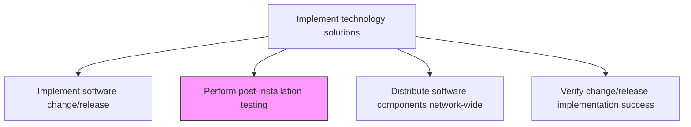
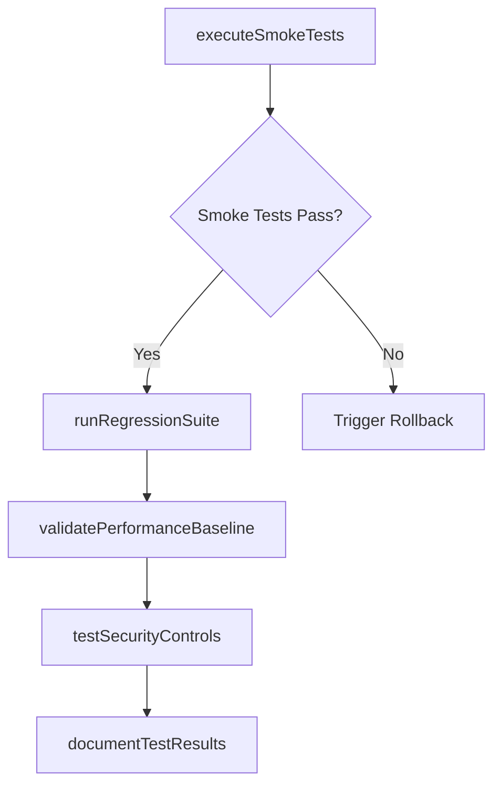

# Perform post-installation testing

> Business-as-Code definition for executing validation and smoke tests after software installation to confirm that deployed changes function correctly and meet expected performance and reliability standards.

## Overview

Perform testing after installation to confirm expected performance is met.

## Process Hierarchy



## GraphDL

```yaml
perform:
  object: Post-installation Testing
  actor: QAEngineer
  result: PostInstallTestReport
```

## Actions

| Action | Description |
|--------|-------------|
| executeSmokeTests | Run critical path smoke tests to confirm basic functionality after deployment |
| runRegressionSuite | Execute automated regression tests to verify existing functionality is unaffected |
| validatePerformanceBaseline | Compare post-deployment performance metrics against pre-deployment baselines |
| testSecurityControls | Verify security configurations and access controls are correctly applied |
| documentTestResults | Record all test results, failures, and observations in the deployment record |

## Events

| Event | Description |
|-------|-------------|
| smokeTestsExecuted | Critical path smoke tests completed |
| regressionSuiteCompleted | Automated regression test suite executed |
| performanceBaselineValidated | Performance metrics compared against baselines |
| securityControlsTested | Security configurations and access controls verified |
| testResultsDocumented | All test results recorded in the deployment record |

## Searches

| Search | Description |
|--------|-------------|
| getTestResults | Retrieve post-installation test results filtered by suite, status, or severity |
| getTestFailures | List failed test cases with error details and affected components |
| getPerformanceComparison | Get pre vs. post-deployment performance comparison data |

## Process Flow



## RACI Matrix

| Activity | Responsible | Accountable | Consulted | Informed |
|----------|-------------|-------------|-----------|----------|
| executeSmokeTests | QAEngineer | QAManager | ReleaseEngineer | ReleaseManager |
| runRegressionSuite | QAEngineer | QAManager | ApplicationDevelopers | ProjectManager |
| validatePerformanceBaseline | PerformanceEngineer | QAManager | InfrastructureTeam | ITOperations |

## Related Processes

| Process | Relationship |
|---------|-------------|
| 8.6.4.5 Implement software change/release | Upstream - post-install testing follows software deployment |
| 8.6.4.8 Verify change/release implementation success | Downstream - test results feed success verification |
| 8.6.4.9 Execute roll-back plan | Contingency - rollback triggered if tests fail |

## Related Departments

| Department | Role |
|-----------|------|
| Quality Assurance | Executes smoke, regression, and performance tests |
| IT Security | Validates security controls post-deployment |
| IT Operations | Monitors system behavior during testing |

## Related Occupations

| Occupation | Involvement |
|-----------|-------------|
| QA Engineer | Executes post-installation test suites |
| Performance Engineer | Validates performance baselines and thresholds |
| Security Tester | Verifies security configurations after deployment |

## KPIs

| KPI | Description | Unit |
|-----|-------------|------|
| Smoke Test Pass Rate | Percentage of smoke tests passing after deployment | % |
| Regression Test Pass Rate | Percentage of regression tests passing post-deployment | % |
| Performance Deviation | Deviation from pre-deployment performance baseline | % |
| Test Execution Time | Total time to complete post-installation test suite | Minutes |

## Usage

```typescript
import { performPostInstallationTesting } from '@headlessly/perform-post-installation-testing'

const testing = performPostInstallationTesting()

// Get post-installation test results
const results = await testing.getTestResults({
  deploymentId: 'dep-2024-1103',
  suite: 'smoke',
  status: 'failed'
})

// Get performance comparison
const perfComparison = await testing.getPerformanceComparison({
  deploymentId: 'dep-2024-1103',
  metrics: ['responseTime', 'throughput', 'errorRate']
})
```
