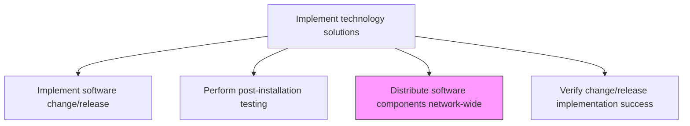
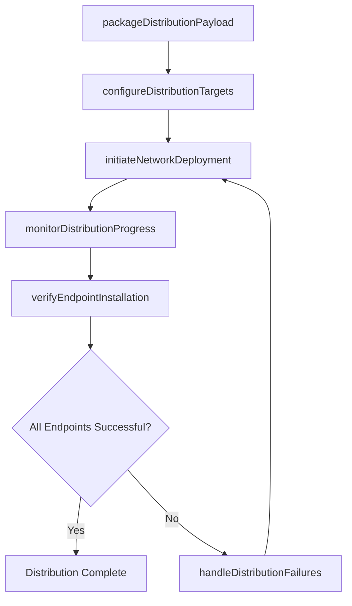

# Distribute software components network-wide

> Business-as-Code definition for distributing software releases, patches, and updates across the enterprise network to all target endpoints, servers, and client devices using automated deployment tools.

## Overview

Distributing and implementing the release of changed IT solutions. Administer, implement, and install the releases onto internal systems. Provide methods for installing releases on client users.

## Process Hierarchy



## GraphDL

```yaml
distribute:
  object: Software Components Network-wide
  actor: SoftwareDistributionEngineer
  result: DistributionReport
```

## Actions

| Action | Description |
|--------|-------------|
| packageDistributionPayload | Assemble software binaries, patches, and installers into distribution packages |
| configureDistributionTargets | Define target groups of servers, workstations, and devices for software distribution |
| initiateNetworkDeployment | Push distribution packages to target endpoints through automated deployment tools |
| monitorDistributionProgress | Track real-time installation progress across all target endpoints |
| verifyEndpointInstallation | Confirm successful installation and version compliance on each endpoint |
| handleDistributionFailures | Identify and remediate endpoints where distribution failed |

## Events

| Event | Description |
|-------|-------------|
| distributionPayloadPackaged | Software distribution packages assembled and staged |
| distributionTargetsConfigured | Target endpoint groups defined for deployment |
| networkDeploymentInitiated | Distribution packages pushed to target endpoints |
| distributionProgressMonitored | Installation progress tracked across endpoints |
| endpointInstallationVerified | Successful installation confirmed on target endpoints |
| distributionFailuresHandled | Failed endpoint installations identified and remediated |

## Searches

| Search | Description |
|--------|-------------|
| getDistributionStatus | Retrieve distribution progress by endpoint group, location, or status |
| getFailedEndpoints | List endpoints where software distribution failed with error details |
| getVersionCompliance | Get software version compliance data across the network |
| getDistributionHistory | Access distribution history for a specific software component |

## Process Flow



## RACI Matrix

| Activity | Responsible | Accountable | Consulted | Informed |
|----------|-------------|-------------|-----------|----------|
| packageDistributionPayload | SoftwareDistributionEngineer | ReleaseManager | ApplicationTeam | SecurityTeam |
| initiateNetworkDeployment | SoftwareDistributionEngineer | ReleaseManager | NetworkTeam | ServiceDeskManager |
| monitorDistributionProgress | SoftwareDistributionEngineer | ReleaseManager | ITOperations | ProjectManager |

## Related Processes

| Process | Relationship |
|---------|-------------|
| 8.6.4.5 Implement software change/release | Upstream - software change deployed before network-wide distribution |
| 8.6.4.8 Verify change/release implementation success | Downstream - distribution success feeds overall verification |
| 8.7.7.3 Install/configure/upgrade infrastructure components | Related - infrastructure updates follow similar distribution patterns |

## Related Departments

| Department | Role |
|-----------|------|
| Software Distribution | Manages packaging, deployment, and monitoring of software distribution |
| Network Operations | Ensures network bandwidth and connectivity for large-scale deployments |
| Endpoint Management | Manages client device configurations and patching |

## Related Occupations

| Occupation | Involvement |
|-----------|-------------|
| Software Distribution Engineer | Packages and deploys software across the network |
| Endpoint Management Specialist | Manages client device software compliance |
| Network Engineer | Ensures network capacity for distribution activities |

## KPIs

| KPI | Description | Unit |
|-----|-------------|------|
| Distribution Success Rate | Percentage of target endpoints successfully receiving the update | % |
| Distribution Throughput | Number of endpoints updated per hour | Count/Hour |
| Failed Endpoint Recovery Time | Average time to remediate failed endpoint installations | Hours |
| Network-Wide Compliance | Percentage of network endpoints running the required software version | % |

## Usage

```typescript
import { distributeSoftwareComponentsNetworkWide } from '@headlessly/distribute-software-components-network-wide'

const distribution = distributeSoftwareComponentsNetworkWide()

// Check distribution status
const status = await distribution.getDistributionStatus({
  packageId: 'pkg-security-patch-2024-11',
  groupBy: 'location'
})

// Get failed endpoints
const failures = await distribution.getFailedEndpoints({
  packageId: 'pkg-security-patch-2024-11',
  errorType: 'installation'
})
```
