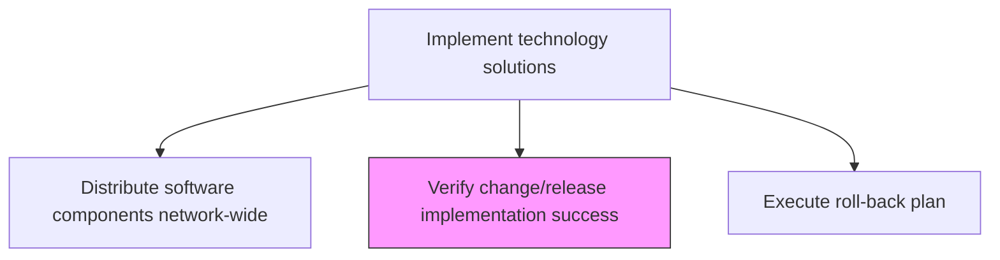
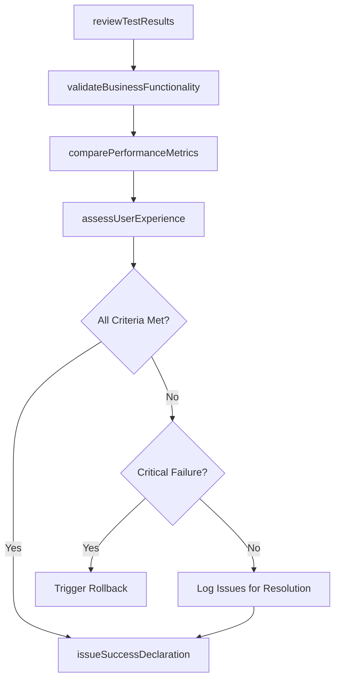

# Verify change/release implementation success

> Business-as-Code definition for confirming that an IT change or release has achieved its intended objectives, meets all success criteria, and is operating within acceptable parameters in the production environment.

## Overview

Confirming that the release has met expectations.

## Process Hierarchy



## GraphDL

```yaml
verify:
  object: Change/release Implementation Success
  actor: ReleaseVerificationLead
  result: SuccessVerificationReport
```

## Actions

| Action | Description |
|--------|-------------|
| reviewTestResults | Analyze post-installation and smoke test results against success criteria |
| validateBusinessFunctionality | Confirm business processes and workflows function correctly with the deployed change |
| comparePerformanceMetrics | Measure post-deployment performance against service level targets |
| assessUserExperience | Evaluate end-user experience and initial feedback following deployment |
| issueSuccessDeclaration | Formally declare the change/release implementation as successful |

## Events

| Event | Description |
|-------|-------------|
| testResultsReviewed | Post-deployment test results analyzed against success criteria |
| businessFunctionalityValidated | Business processes confirmed working with deployed changes |
| performanceMetricsCompared | Post-deployment performance validated against SLA targets |
| userExperienceAssessed | End-user feedback and experience evaluated |
| successDeclared | Change/release formally declared successful |

## Searches

| Search | Description |
|--------|-------------|
| getVerificationStatus | Retrieve success verification status for a change or release |
| getSuccessCriteria | List defined success criteria with validation status |
| getPerformanceVsSLA | Get post-deployment performance metrics compared to SLA targets |
| getUserFeedback | Access end-user feedback collected after deployment |

## Process Flow



## RACI Matrix

| Activity | Responsible | Accountable | Consulted | Informed |
|----------|-------------|-------------|-----------|----------|
| reviewTestResults | ReleaseVerificationLead | ReleaseManager | QATeam | ProjectManager |
| validateBusinessFunctionality | BusinessAnalyst | ReleaseManager | BusinessUnitLeads | ChangeManager |
| issueSuccessDeclaration | ReleaseVerificationLead | ITDirector | ChangeAdvisoryBoard | AllStakeholders |

## Related Processes

| Process | Relationship |
|---------|-------------|
| 8.6.4.6 Perform post-installation testing | Upstream - test results feed success verification |
| 8.6.3.7 Document IT change/release outcome | Downstream - success status documented in change record |
| 8.6.4.9 Execute roll-back plan | Contingency - rollback triggered if verification fails |

## Related Departments

| Department | Role |
|-----------|------|
| Release Management | Coordinates verification activities and issues success declaration |
| Quality Assurance | Provides test results and analysis for verification |
| Business Units | Validates business functionality and provides user feedback |

## Related Occupations

| Occupation | Involvement |
|-----------|-------------|
| Release Verification Lead | Coordinates success verification across all criteria |
| Business Analyst | Validates business process functionality |
| QA Lead | Reviews and presents test results |

## KPIs

| KPI | Description | Unit |
|-----|-------------|------|
| Success Declaration Rate | Percentage of deployments formally declared successful | % |
| Verification Cycle Time | Average time from deployment to success declaration | Hours |
| SLA Compliance Rate | Percentage of performance metrics meeting SLA targets post-deployment | % |
| User Satisfaction Score | Average user satisfaction rating after deployment | Score (1-5) |

## Usage

```typescript
import { verifyChangeReleaseImplementationSuccess } from '@headlessly/verify-change-release-implementation-success'

const verification = verifyChangeReleaseImplementationSuccess()

// Get verification status
const status = await verification.getVerificationStatus({
  releaseId: 'rel-2024-q4-003',
  environment: 'production'
})

// Compare performance against SLAs
const perfVsSla = await verification.getPerformanceVsSLA({
  releaseId: 'rel-2024-q4-003',
  metrics: ['availability', 'responseTime', 'errorRate']
})
```
