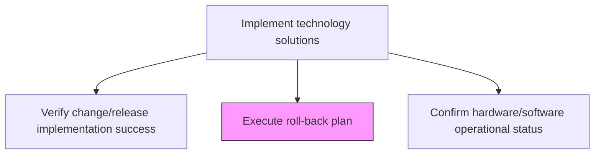
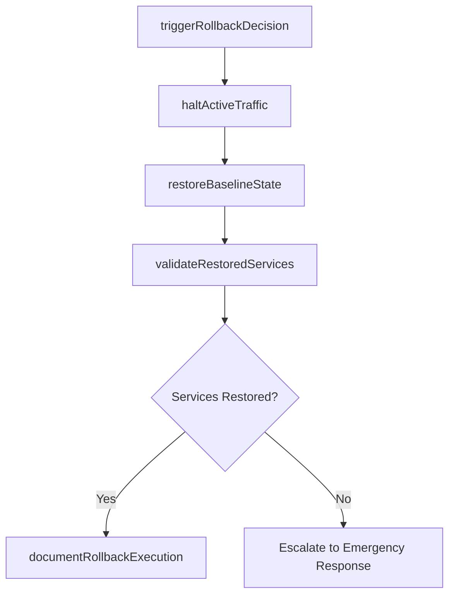

# Execute roll-back plan

> Business-as-Code definition for executing the pre-defined roll-back plan to restore systems to their previous stable state when a deployment fails to meet operational expectations or causes critical issues.

## Overview

Execution of plan to return to the previous operating state if the change/release impedes operational expectations.

## Process Hierarchy



## GraphDL

```yaml
execute:
  object: Roll-back Plan
  actor: RollbackCoordinator
  result: RollbackExecutionRecord
```

## Actions

| Action | Description |
|--------|-------------|
| triggerRollbackDecision | Evaluate rollback criteria and formally authorize the rollback execution |
| haltActiveTraffic | Stop incoming traffic and disable service endpoints to prevent data corruption |
| restoreBaselineState | Revert application code, configurations, and database to pre-deployment baseline |
| validateRestoredServices | Confirm restored services are functioning at pre-deployment performance levels |
| documentRollbackExecution | Record rollback details, root cause, timeline, and post-rollback status |

## Events

| Event | Description |
|-------|-------------|
| rollbackDecisionTriggered | Rollback formally authorized based on trigger criteria |
| activeTrafficHalted | Service endpoints disabled and traffic stopped |
| baselineStateRestored | Systems reverted to pre-deployment baseline state |
| restoredServicesValidated | Restored services confirmed functioning correctly |
| rollbackExecutionDocumented | Rollback details and root cause recorded |

## Searches

| Search | Description |
|--------|-------------|
| getRollbackHistory | Retrieve rollback execution records filtered by release, date, or cause |
| getRollbackStatus | Get real-time rollback execution status for an active rollback |
| getBaselineState | Access the pre-deployment baseline state for a specific release |
| getRollbackRootCause | Retrieve root cause analysis for completed rollbacks |

## Process Flow



## RACI Matrix

| Activity | Responsible | Accountable | Consulted | Informed |
|----------|-------------|-------------|-----------|----------|
| triggerRollbackDecision | RollbackCoordinator | ReleaseManager | ChangeAdvisoryBoard | ITDirector |
| restoreBaselineState | ReleaseEngineer | RollbackCoordinator | DatabaseAdmin | ITOperations |
| validateRestoredServices | QAEngineer | RollbackCoordinator | ApplicationTeam | ServiceDeskManager |
| documentRollbackExecution | RollbackCoordinator | ReleaseManager | IncidentManager | AllStakeholders |

## Related Processes

| Process | Relationship |
|---------|-------------|
| 8.6.2.7 Manage IT roll-back procedures | Upstream - roll-back procedures define the execution plan |
| 8.6.4.8 Verify change/release implementation success | Upstream - failed verification triggers rollback |
| 8.6.3.7 Document IT change/release outcome | Downstream - rollback outcome documented in change record |

## Related Departments

| Department | Role |
|-----------|------|
| Release Engineering | Executes rollback scripts and restores baseline state |
| IT Operations | Monitors system health during and after rollback |
| Database Administration | Restores database to pre-deployment state |

## Related Occupations

| Occupation | Involvement |
|-----------|-------------|
| Rollback Coordinator | Leads rollback decision and coordinates execution |
| Release Engineer | Executes technical rollback procedures |
| Database Administrator | Manages database restoration activities |

## KPIs

| KPI | Description | Unit |
|-----|-------------|------|
| Rollback Execution Time | Total time from rollback decision to service restoration | Minutes |
| Rollback Success Rate | Percentage of rollbacks that fully restore previous state | % |
| Rollback Frequency | Number of rollbacks per deployment cycle | Count |
| Service Restoration Time | Time from rollback initiation to full service availability | Minutes |

## Usage

```typescript
import { executeRollBackPlan } from '@headlessly/execute-roll-back-plan'

const rollback = executeRollBackPlan()

// Get rollback execution status
const status = await rollback.getRollbackStatus({
  releaseId: 'rel-2024-q4-003',
  environment: 'production'
})

// Retrieve rollback history
const history = await rollback.getRollbackHistory({
  dateRange: { start: '2024-01-01', end: '2024-12-31' },
  cause: 'performance-degradation'
})
```
