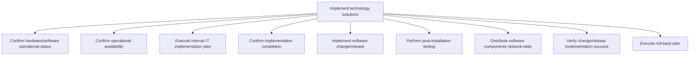
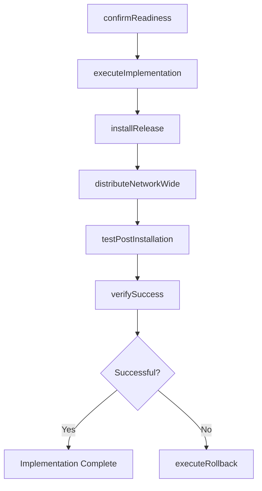

# Implement technology solutions

> Business-as-Code definition for executing the technical implementation of IT solutions, including operational readiness confirmation, software installation, post-installation testing, network-wide distribution, verification, and rollback execution.

## Overview

Deploy the identified solutions for information technology important for healthy business operations. Confirm status and operational availability of IT resources. Perform testing and distribution of change. Execute roll-back protocol if necessary.

## Process Hierarchy



## GraphDL

```yaml
implement:
  object: Technology Solutions
  actor: DeploymentEngineer
  result: ImplementationRecord
```

## Actions

| Action | Description |
|--------|-------------|
| confirmReadiness | Verify hardware and software operational status before deployment |
| executeImplementation | Carry out the IT implementation plan in the target environment |
| installRelease | Deploy the software change or release to production systems |
| testPostInstallation | Run post-installation tests to validate deployment success |
| distributeNetworkWide | Push software components across the enterprise network |
| verifySuccess | Confirm the change or release meets expected outcomes |
| executeRollback | Revert to the previous operating state if implementation fails |

## Events

| Event | Description |
|-------|-------------|
| readinessConfirmed | Hardware and software operational status verified |
| implementationExecuted | IT implementation plan completed in the target environment |
| releaseInstalled | Software change or release deployed to production |
| postInstallationTested | Post-installation validation tests completed |
| distributedNetworkWide | Software components pushed across the network |
| successVerified | Change or release confirmed as meeting expected outcomes |
| rollbackExecuted | System reverted to previous operating state |

## Searches

| Search | Description |
|--------|-------------|
| findImplementations | List implementations filtered by status, date, or environment |
| getReadinessChecklist | Retrieve pre-deployment readiness checklist for a service |
| getTestResults | Get post-installation test results for a deployment |
| findRollbacks | List rollback events with root cause details |

## Process Flow



## RACI Matrix

| Activity | Responsible | Accountable | Consulted | Informed |
|----------|-------------|-------------|-----------|----------|
| confirmReadiness | SystemsAdministrator | DeploymentEngineer | InfrastructureTeam | ReleaseManager |
| executeImplementation | DeploymentEngineer | ReleaseManager | QATeam | ServiceDesk |
| testPostInstallation | QAEngineer | QALead | DeploymentEngineer | ServiceOwner |
| executeRollback | DeploymentEngineer | ReleaseManager | InfrastructureTeam | ChangeManager |

## Sub-Processes

| ID | Name | Description |
|----|------|-------------|
| 8.6.4.1 | Confirm hardware/software operational status | Confirm if hardware/software are operating as per the expectation. |
| 8.6.4.2 | Confirm operational availability | Confirm if operational activities of IT services could be performed. |
| 8.6.4.3 | Execute internal IT implementation plan | Executing IT implementation plan to make the IT services and solutions available for internal use. |
| 8.6.4.4 | Confirm implementation completion | Confirming the completion of IT implementation. |
| 8.6.4.5 | Implement software change/release | Executing changes in software and services as per change/release schedule. |
| 8.6.4.6 | Perform post-installation testing | Perform testing after installation to confirm expected performance is met. |
| 8.6.4.7 | Distribute software components network-wide | Distributing and implementing the release of changed IT solutions. Administer, implement, and instal |
| 8.6.4.8 | Verify change/release implementation success | Confirming that the release has met expectations. |
| 8.6.4.9 | Execute roll-back plan | Execution of plan to return to the previous operating state if the change/release impedes operationa |

## Related Processes

| Process | Relationship |
|---------|-------------|
| 8.6.3 Manage change deployment control | Upstream - provides approved changes for implementation |
| 8.6.5 Perform service and solution rollout | Downstream - implemented solutions proceed to rollout |
| 8.6.2 Plan service and solution implementation | Upstream - implementation plan guides execution |

## Related Departments

| Department | Role |
|-----------|------|
| IT Operations | Executes implementations and manages infrastructure |
| Quality Assurance | Performs post-installation testing and verification |
| Network Engineering | Distributes software components network-wide |
| Service Desk | Provides support during implementation windows |

## Related Occupations

| Occupation | Involvement |
|-----------|-------------|
| Deployment Engineer | Executes implementation steps and rollback if needed |
| Systems Administrator | Validates hardware and software readiness |
| Network Administrator | Manages network-wide software distribution |

## KPIs

| KPI | Description | Unit |
|-----|-------------|------|
| Implementation Success Rate | Percentage of implementations completed without rollback | % |
| Post-Installation Test Pass Rate | Percentage of post-installation tests passing | % |
| Rollback Frequency | Number of rollbacks per quarter | Count |
| Implementation Downtime | Average unplanned downtime during implementation | Minutes |

## Usage

```typescript
import { implementTechnologySolutions } from '@headlessly/implement-technology-solutions'

const impl = implementTechnologySolutions()

// Confirm readiness
const ready = await impl.confirmReadiness({
  serviceId: 'svc-analytics-platform',
  environment: 'production',
  checks: ['disk-space', 'network', 'dependencies', 'backup']
})

// Execute the implementation
const result = await impl.executeImplementation({
  planId: 'impl-2025-0722',
  changeId: 'CHG-2025-1045',
  environment: 'production'
})

// Verify success
const verification = await impl.verifySuccess({
  implementationId: result.id,
  healthChecks: ['api-response', 'data-integrity', 'performance']
})
```
