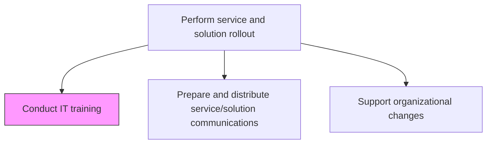
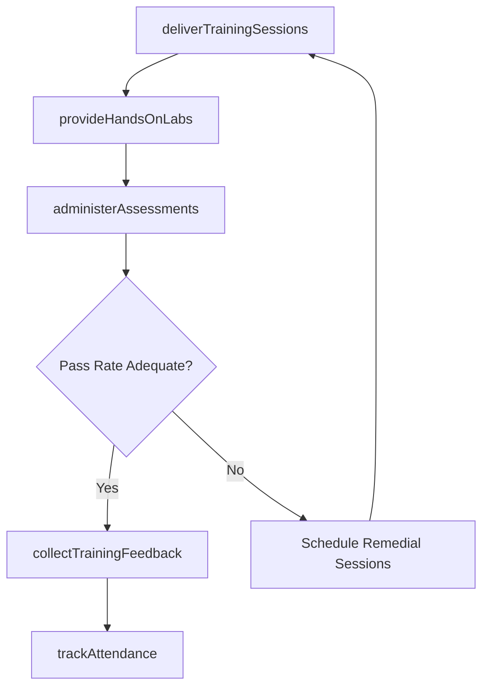

# Conduct IT training

> Business-as-Code definition for delivering IT training sessions to end users, administrators, and support staff during service and solution rollout, ensuring workforce readiness for new technology.

## Overview

Preparing users for changes in IT solutions. Conduct training sessions and engagement activities to familiarize users with the new changes. Implementing the programs for training IT employees.

## Process Hierarchy



## GraphDL

```yaml
conduct:
  object: IT Training
  actor: ITTrainer
  result: TrainingDeliveryRecord
```

## Actions

| Action | Description |
|--------|-------------|
| deliverTrainingSessions | Facilitate instructor-led and virtual training sessions for targeted user groups |
| provideHandsOnLabs | Guide participants through hands-on practice exercises in sandbox environments |
| administerAssessments | Conduct knowledge assessments to validate participant comprehension |
| collectTrainingFeedback | Gather participant feedback on training quality and content relevance |
| trackAttendance | Record attendance and completion status for all training sessions |

## Events

| Event | Description |
|-------|-------------|
| trainingSessionsDelivered | Training sessions facilitated for targeted user groups |
| handsOnLabsCompleted | Participants completed hands-on practice exercises |
| assessmentsAdministered | Knowledge assessments conducted and scored |
| trainingFeedbackCollected | Participant feedback gathered and analyzed |
| attendanceTracked | Attendance and completion status recorded |

## Searches

| Search | Description |
|--------|-------------|
| getTrainingSchedule | Retrieve scheduled training sessions filtered by date, audience, or location |
| getAttendanceRecords | List attendance and completion records for training sessions |
| getAssessmentResults | Access assessment scores and pass/fail rates by session or participant |

## Process Flow



## RACI Matrix

| Activity | Responsible | Accountable | Consulted | Informed |
|----------|-------------|-------------|-----------|----------|
| deliverTrainingSessions | ITTrainer | ITTrainingManager | SubjectMatterExperts | ReleaseManager |
| administerAssessments | ITTrainer | ITTrainingManager | BusinessUnitLeads | HRDepartment |
| collectTrainingFeedback | ITTrainer | ITTrainingManager | QualityTeam | ITDirector |

## Related Processes

| Process | Relationship |
|---------|-------------|
| 8.6.2.5 Develop IT training | Upstream - training content developed before delivery |
| 8.6.5.2 Prepare and distribute service/solution communications | Parallel - training supplements deployment communications |
| 8.6.5.3 Support organizational changes | Related - training supports organizational change adoption |

## Related Departments

| Department | Role |
|-----------|------|
| IT Training | Delivers training sessions and manages participant logistics |
| Human Resources | Tracks training completion and compliance records |
| Business Units | Provides participants and validates training relevance |

## Related Occupations

| Occupation | Involvement |
|-----------|-------------|
| IT Trainer | Facilitates training sessions and hands-on labs |
| Training Coordinator | Manages scheduling, attendance, and logistics |
| Subject Matter Expert | Provides technical guidance during training |

## KPIs

| KPI | Description | Unit |
|-----|-------------|------|
| Training Attendance Rate | Percentage of scheduled participants who attended training | % |
| Assessment Pass Rate | Percentage of participants passing knowledge assessments | % |
| Training Satisfaction Score | Average participant satisfaction rating | Score (1-5) |
| Post-Training Support Tickets | Volume of support tickets from trained users in first 30 days | Count |

## Usage

```typescript
import { conductItTraining } from '@headlessly/conduct-it-training'

const training = conductItTraining()

// Get training schedule for rollout
const schedule = await training.getTrainingSchedule({
  releaseId: 'rel-2024-q4-003',
  audience: 'finance-team',
  dateRange: { start: '2024-11-01', end: '2024-11-30' }
})

// Get assessment results
const results = await training.getAssessmentResults({
  sessionId: schedule[0].id,
  minScore: 70
})
```
