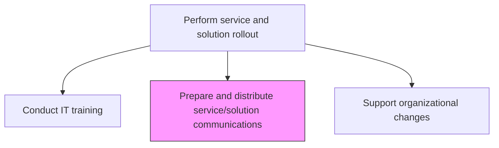
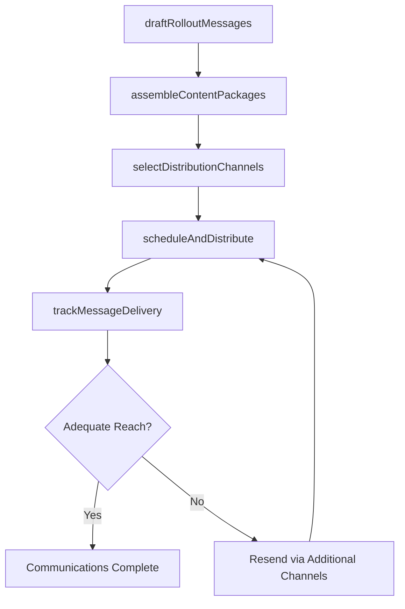

# Prepare and distribute service/solution communications

> Business-as-Code definition for preparing and distributing communications about new or changed IT services and solutions to ensure all stakeholders are informed during rollout.

## Overview

Coordinating communications regarding the changes in IT services and solutions with employees in the organization.

## Process Hierarchy



## GraphDL

```yaml
prepare:
  object: And Distribute Service/solution Communications
  actor: RolloutCommunicationsLead
  result: CommunicationDistributionRecord
```

## Actions

| Action | Description |
|--------|-------------|
| draftRolloutMessages | Compose targeted communications for different stakeholder groups about the service rollout |
| assembleContentPackages | Create release notes, FAQs, quick-start guides, and known-issue lists |
| selectDistributionChannels | Choose appropriate communication channels based on audience and urgency |
| scheduleAndDistribute | Time and distribute communications aligned with rollout phases |
| trackMessageDelivery | Monitor delivery receipts and engagement metrics across channels |

## Events

| Event | Description |
|-------|-------------|
| rolloutMessagesDrafted | Targeted rollout communications composed for stakeholder groups |
| contentPackagesAssembled | Release notes, FAQs, and guides created |
| distributionChannelsSelected | Communication channels chosen for each audience |
| communicationsDistributed | Messages delivered through approved channels |
| messageDeliveryTracked | Delivery receipts and engagement metrics monitored |

## Searches

| Search | Description |
|--------|-------------|
| getRolloutCommunications | Retrieve rollout communications filtered by release, audience, or status |
| getDeliveryMetrics | Get delivery and engagement metrics for distributed communications |
| getContentPackages | Access release notes, FAQs, and guides for a rollout |

## Process Flow



## RACI Matrix

| Activity | Responsible | Accountable | Consulted | Informed |
|----------|-------------|-------------|-----------|----------|
| draftRolloutMessages | RolloutCommunicationsLead | ReleaseManager | BusinessAnalysts | ProjectManager |
| assembleContentPackages | TechnicalWriter | RolloutCommunicationsLead | ApplicationTeam | ServiceDesk |
| scheduleAndDistribute | RolloutCommunicationsLead | ReleaseManager | CorporateCommunications | AllStakeholders |

## Related Processes

| Process | Relationship |
|---------|-------------|
| 8.6.2.6 Create implementation communications | Upstream - implementation comms feed rollout messaging |
| 8.6.5.1 Conduct IT training | Parallel - communications complement training delivery |
| 8.6.5.4 Execute rollout plans | Related - communications align with rollout execution |

## Related Departments

| Department | Role |
|-----------|------|
| Change Management | Coordinates rollout communications strategy |
| Corporate Communications | Provides messaging standards and distribution infrastructure |
| IT Service Management | Supplies release notes and known-issue information |

## Related Occupations

| Occupation | Involvement |
|-----------|-------------|
| Rollout Communications Lead | Drafts and coordinates distribution of rollout messages |
| Technical Writer | Creates release notes, FAQs, and user guides |
| Communications Specialist | Manages distribution channels and engagement tracking |

## KPIs

| KPI | Description | Unit |
|-----|-------------|------|
| Communication Reach | Percentage of target stakeholders who received rollout communications | % |
| Content Engagement Rate | Percentage of recipients who accessed release notes and guides | % |
| Communication Timeliness | Percentage of communications delivered on schedule with rollout phases | % |

## Usage

```typescript
import { prepareAndDistributeServiceSolutionCommunications } from '@headlessly/prepare-and-distribute-service-solution-communications'

const comms = prepareAndDistributeServiceSolutionCommunications()

// Get rollout communications
const messages = await comms.getRolloutCommunications({
  releaseId: 'rel-2024-q4-003',
  audience: 'end-users',
  status: 'distributed'
})

// Check delivery metrics
const metrics = await comms.getDeliveryMetrics({
  releaseId: 'rel-2024-q4-003',
  channel: 'email'
})
```
