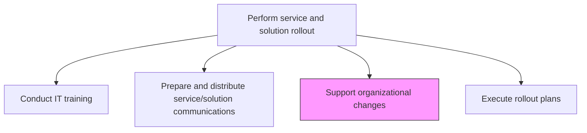
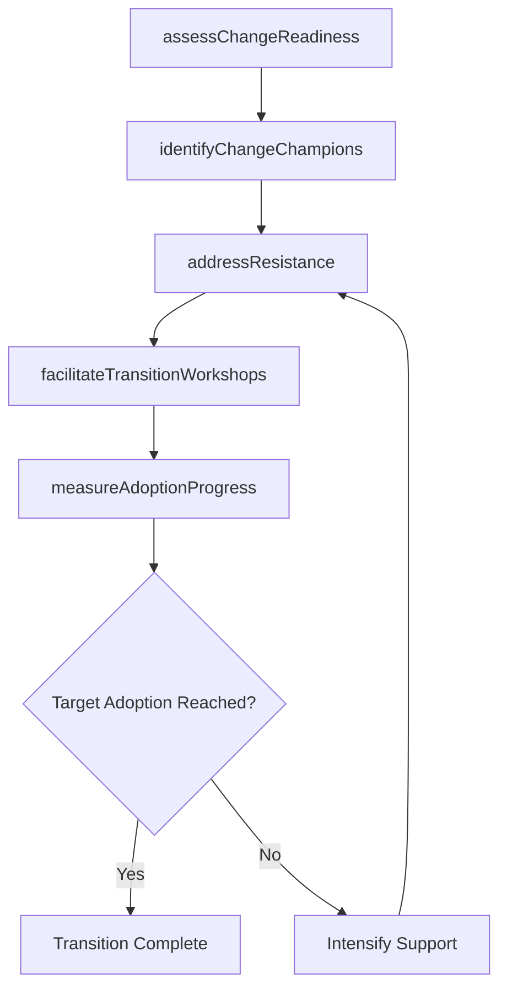

# Support organizational changes

> Business-as-Code definition for facilitating organizational change management activities that help employees adopt new IT services and solutions, addressing resistance and ensuring smooth transitions.

## Overview

Creating a strategy for providing support for organizational changes. Providing support to users of IT services and solutions.

## Process Hierarchy



## GraphDL

```yaml
support:
  object: Organizational Changes
  actor: OrganizationalChangeManager
  result: ChangeAdoptionReport
```

## Actions

| Action | Description |
|--------|-------------|
| assessChangeReadiness | Evaluate organizational readiness for the upcoming technology change |
| identifyChangeChampions | Recruit influential users to advocate for and support the change |
| addressResistance | Identify sources of resistance and develop targeted interventions |
| facilitateTransitionWorkshops | Conduct workshops to guide teams through process and workflow changes |
| measureAdoptionProgress | Track adoption metrics and user engagement with new services |

## Events

| Event | Description |
|-------|-------------|
| changeReadinessAssessed | Organizational readiness for technology change evaluated |
| changeChampionsIdentified | Influential user advocates recruited and onboarded |
| resistanceAddressed | Sources of resistance identified and interventions applied |
| transitionWorkshopsFacilitated | Workshops conducted for process and workflow transitions |
| adoptionProgressMeasured | Adoption metrics and user engagement tracked |

## Searches

| Search | Description |
|--------|-------------|
| getChangeReadiness | Retrieve organizational readiness assessment results by department or team |
| getAdoptionMetrics | Access adoption progress metrics filtered by service, department, or time period |
| getResistanceIssues | List identified resistance points with status of interventions |

## Process Flow



## RACI Matrix

| Activity | Responsible | Accountable | Consulted | Informed |
|----------|-------------|-------------|-----------|----------|
| assessChangeReadiness | OrganizationalChangeManager | ChangeDirector | BusinessUnitLeads | HRDirector |
| addressResistance | OrganizationalChangeManager | ChangeDirector | ChangeChampions | ITDirector |
| measureAdoptionProgress | OrganizationalChangeManager | ChangeDirector | BusinessAnalysts | ExecutiveSponsor |

## Related Processes

| Process | Relationship |
|---------|-------------|
| 8.6.5.1 Conduct IT training | Parallel - training supports organizational change adoption |
| 8.6.5.2 Prepare and distribute service/solution communications | Parallel - communications reinforce change messaging |
| 8.6.5.5 Provide rollout support | Downstream - support resources address adoption barriers |

## Related Departments

| Department | Role |
|-----------|------|
| Organizational Change Management | Leads change readiness, resistance management, and adoption tracking |
| Human Resources | Supports workforce transition and role adjustments |
| Business Units | Provides change champions and participates in transition workshops |

## Related Occupations

| Occupation | Involvement |
|-----------|-------------|
| Organizational Change Manager | Leads change adoption and resistance management |
| Change Champion | Advocates for technology change within their team |
| HR Business Partner | Supports workforce transition and role adjustments |

## KPIs

| KPI | Description | Unit |
|-----|-------------|------|
| Change Readiness Score | Composite readiness score based on organizational assessment | Score (1-10) |
| Adoption Rate | Percentage of target users actively using the new service | % |
| Resistance Resolution Rate | Percentage of identified resistance points resolved | % |
| Time to Full Adoption | Duration from rollout to target adoption level | Weeks |

## Usage

```typescript
import { supportOrganizationalChanges } from '@headlessly/support-organizational-changes'

const changeManagement = supportOrganizationalChanges()

// Assess change readiness
const readiness = await changeManagement.getChangeReadiness({
  releaseId: 'rel-2024-q4-003',
  department: 'finance'
})

// Track adoption metrics
const adoption = await changeManagement.getAdoptionMetrics({
  serviceId: 'new-crm-platform',
  period: 'last-30-days'
})
```
