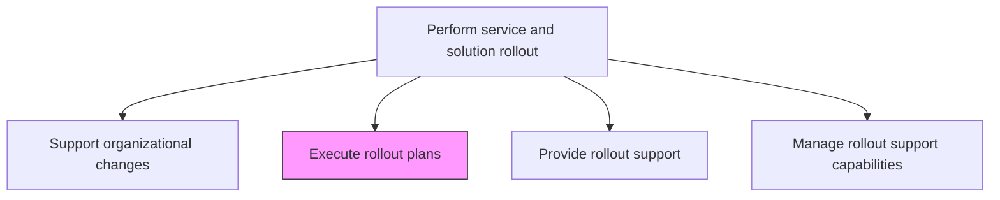
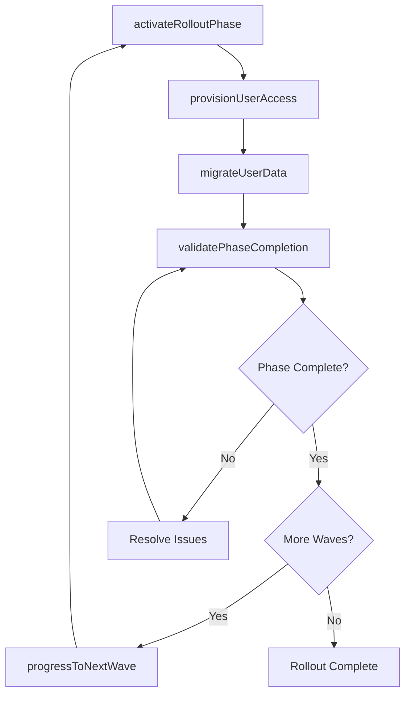

# Execute rollout plans

> Business-as-Code definition for executing the phased rollout plan that delivers new or changed IT services and solutions to targeted user groups according to the defined sequence and schedule.

## Overview

Executing a plan for introducing the IT services and solutions to the organization's end user base.

## Process Hierarchy



## GraphDL

```yaml
execute:
  object: Rollout Plans
  actor: RolloutManager
  result: RolloutExecutionLog
```

## Actions

| Action | Description |
|--------|-------------|
| activateRolloutPhase | Initiate the next rollout phase according to the approved sequence |
| provisionUserAccess | Enable access permissions and credentials for the target user group |
| migrateUserData | Transfer user-specific data and configurations to the new service |
| validatePhaseCompletion | Confirm all rollout criteria are met for the current phase |
| progressToNextWave | Advance the rollout to the next user group or region |

## Events

| Event | Description |
|-------|-------------|
| rolloutPhaseActivated | Next rollout phase initiated per approved sequence |
| userAccessProvisioned | Access permissions enabled for target user group |
| userDataMigrated | User data and configurations transferred to new service |
| phaseCompletionValidated | Rollout criteria met for current phase |
| nextWaveProgressed | Rollout advanced to next user group or region |

## Searches

| Search | Description |
|--------|-------------|
| getRolloutProgress | Retrieve rollout execution progress by phase, wave, or region |
| getRolloutPhases | List rollout phases with status, dates, and target groups |
| getUserMigrationStatus | Get migration status for users in the current rollout wave |

## Process Flow



## RACI Matrix

| Activity | Responsible | Accountable | Consulted | Informed |
|----------|-------------|-------------|-----------|----------|
| activateRolloutPhase | RolloutManager | ReleaseManager | ITOperations | BusinessUnitLeads |
| provisionUserAccess | IdentityAdmin | RolloutManager | SecurityTeam | ServiceDeskManager |
| validatePhaseCompletion | RolloutManager | ReleaseManager | QATeam | ProjectManager |

## Related Processes

| Process | Relationship |
|---------|-------------|
| 8.6.2.2 Define implementation schedule and roll-out sequence | Upstream - schedule defines rollout execution plan |
| 8.6.5.5 Provide rollout support | Parallel - support provided during rollout execution |
| 8.6.5.7 Monitor and record rollout issues | Downstream - issues tracked during rollout execution |

## Related Departments

| Department | Role |
|-----------|------|
| Release Management | Coordinates rollout phase execution and progression |
| Identity and Access Management | Provisions user access during rollout waves |
| Data Management | Manages user data migration activities |

## Related Occupations

| Occupation | Involvement |
|-----------|-------------|
| Rollout Manager | Leads rollout execution and phase progression |
| Identity Administrator | Provisions user access and credentials |
| Data Migration Specialist | Executes user data migration tasks |

## KPIs

| KPI | Description | Unit |
|-----|-------------|------|
| Phase Completion Rate | Percentage of rollout phases completed on schedule | % |
| User Provisioning Success Rate | Percentage of users successfully provisioned during rollout | % |
| Data Migration Accuracy | Percentage of user data migrated without errors | % |
| Rollout Velocity | Number of users successfully rolled out per day | Users/Day |

## Usage

```typescript
import { executeRolloutPlans } from '@headlessly/execute-rollout-plans'

const rollout = executeRolloutPlans()

// Get rollout progress
const progress = await rollout.getRolloutProgress({
  releaseId: 'rel-2024-q4-003',
  groupBy: 'region'
})

// Check user migration status
const migration = await rollout.getUserMigrationStatus({
  wave: 'wave-3-emea',
  status: 'pending'
})
```
