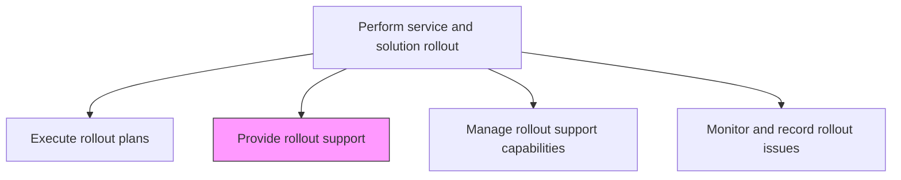
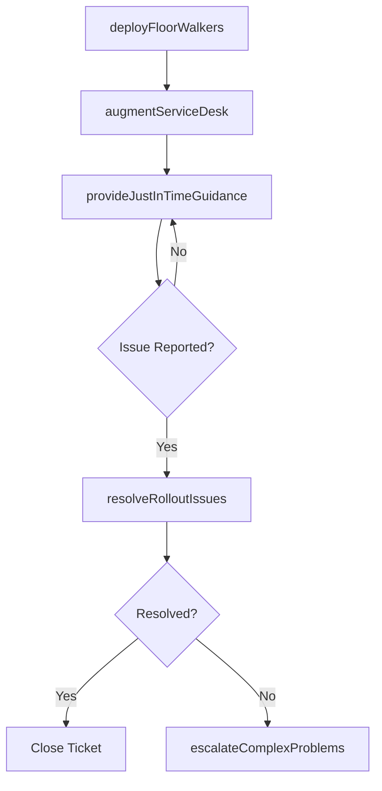

# Provide rollout support

> Business-as-Code definition for providing dedicated support to users during the rollout of new IT services and solutions, including help desk augmentation, on-site support, and issue resolution.

## Overview

Establishing services for providing support to users of IT services and solutions for rollout. Define the plethora of services by which the organization assists users of technology products.

## Process Hierarchy



## GraphDL

```yaml
provide:
  object: Rollout Support
  actor: RolloutSupportLead
  result: SupportDeliveryRecord
```

## Actions

| Action | Description |
|--------|-------------|
| deployFloorWalkers | Station support staff in user areas to provide immediate hands-on assistance |
| augmentServiceDesk | Add dedicated rollout support staff to the service desk for increased capacity |
| resolveRolloutIssues | Diagnose and resolve user-reported issues specific to the new service |
| escalateComplexProblems | Escalate unresolved issues to development or infrastructure teams |
| provideJustInTimeGuidance | Offer real-time guidance and quick-reference materials to users |

## Events

| Event | Description |
|-------|-------------|
| floorWalkersDeployed | On-site support staff stationed in user areas |
| serviceDeskAugmented | Additional rollout support capacity added to service desk |
| rolloutIssuesResolved | User-reported rollout issues diagnosed and fixed |
| complexProblemsEscalated | Unresolved issues forwarded to specialist teams |
| justInTimeGuidanceProvided | Real-time guidance delivered to users during rollout |

## Searches

| Search | Description |
|--------|-------------|
| getRolloutSupportTickets | Retrieve support tickets specific to the rollout filtered by status or category |
| getSupportStaffDeployment | List deployed support staff locations and availability |
| getEscalatedIssues | Access escalated rollout issues with resolution status |

## Process Flow



## RACI Matrix

| Activity | Responsible | Accountable | Consulted | Informed |
|----------|-------------|-------------|-----------|----------|
| deployFloorWalkers | RolloutSupportLead | ServiceDeskManager | RolloutManager | BusinessUnitLeads |
| resolveRolloutIssues | RolloutSupportAnalyst | RolloutSupportLead | ApplicationTeam | RolloutManager |
| escalateComplexProblems | RolloutSupportLead | ServiceDeskManager | DevelopmentTeam | IncidentManager |

## Related Processes

| Process | Relationship |
|---------|-------------|
| 8.6.5.4 Execute rollout plans | Parallel - support provided during rollout execution |
| 8.6.5.6 Manage rollout support capabilities | Related - capabilities determine support capacity |
| 8.7.8.1 Triage IT issues/requests | Downstream - rollout issues feed normal service desk operations |

## Related Departments

| Department | Role |
|-----------|------|
| IT Service Desk | Provides first-line support augmented for rollout |
| Application Support | Resolves application-specific rollout issues |
| Field Support | Deploys floor walkers for on-site user assistance |

## Related Occupations

| Occupation | Involvement |
|-----------|-------------|
| Rollout Support Lead | Coordinates support staff deployment and escalation |
| Rollout Support Analyst | Diagnoses and resolves user-reported rollout issues |
| Floor Walker | Provides immediate on-site assistance to users |

## KPIs

| KPI | Description | Unit |
|-----|-------------|------|
| First-Contact Resolution Rate | Percentage of rollout issues resolved at first contact | % |
| Average Resolution Time | Mean time to resolve rollout support tickets | Hours |
| Support Satisfaction Score | User satisfaction rating for rollout support received | Score (1-5) |
| Escalation Rate | Percentage of rollout tickets escalated to specialist teams | % |

## Usage

```typescript
import { provideRolloutSupport } from '@headlessly/provide-rollout-support'

const support = provideRolloutSupport()

// Get rollout support tickets
const tickets = await support.getRolloutSupportTickets({
  releaseId: 'rel-2024-q4-003',
  status: 'open',
  category: 'access-issue'
})

// Check support staff deployment
const staff = await support.getSupportStaffDeployment({
  location: 'building-a-floor-3',
  date: '2024-11-15'
})
```
