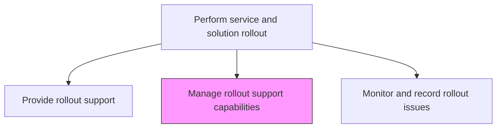
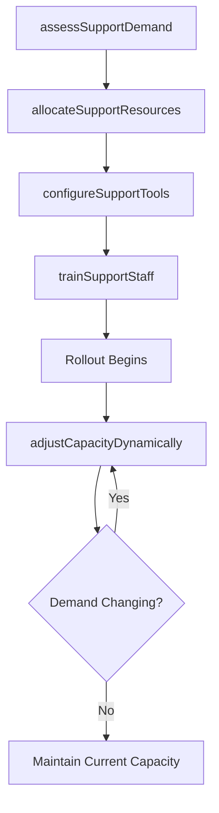

# Manage rollout support capabilities

> Business-as-Code definition for managing the resources, tools, and staffing capabilities needed to provide effective support during IT service and solution rollout activities.

## Overview

Managing the necessary skills and competencies required to efficiently provide IT resolution for rollout through the support structure. Identify the gaps and needs in support structure.

## Process Hierarchy



## GraphDL

```yaml
manage:
  object: Rollout Support Capabilities
  actor: SupportCapabilityManager
  result: SupportCapabilityPlan
```

## Actions

| Action | Description |
|--------|-------------|
| assessSupportDemand | Forecast support volume and complexity based on rollout scope and user population |
| allocateSupportResources | Assign support staff, tools, and infrastructure to meet forecast demand |
| configureSupportTools | Set up ticketing systems, knowledge bases, and collaboration tools for rollout support |
| trainSupportStaff | Prepare support personnel with knowledge of the new service features and known issues |
| adjustCapacityDynamically | Scale support resources up or down based on real-time demand patterns |

## Events

| Event | Description |
|-------|-------------|
| supportDemandAssessed | Support volume and complexity forecasted for rollout |
| supportResourcesAllocated | Staff, tools, and infrastructure assigned to rollout support |
| supportToolsConfigured | Ticketing and knowledge base systems set up for rollout |
| supportStaffTrained | Support personnel prepared with new service knowledge |
| capacityDynamicallyAdjusted | Support resources scaled based on real-time demand |

## Searches

| Search | Description |
|--------|-------------|
| getSupportCapacity | Retrieve current support capacity and utilization metrics |
| getSupportDemandForecast | Access support volume forecasts for rollout phases |
| getStaffReadiness | List support staff readiness status and training completion |

## Process Flow



## RACI Matrix

| Activity | Responsible | Accountable | Consulted | Informed |
|----------|-------------|-------------|-----------|----------|
| assessSupportDemand | SupportCapabilityManager | ServiceDeskDirector | RolloutManager | ITDirector |
| allocateSupportResources | SupportCapabilityManager | ServiceDeskDirector | HRDepartment | FinanceTeam |
| trainSupportStaff | ITTrainer | SupportCapabilityManager | ApplicationTeam | RolloutSupportLead |

## Related Processes

| Process | Relationship |
|---------|-------------|
| 8.6.5.5 Provide rollout support | Downstream - capabilities enable support delivery |
| 8.7.5.2 Determine required support resource levels | Related - ongoing support planning applies similar methods |
| 8.6.5.7 Monitor and record rollout issues | Related - issue patterns inform capacity adjustments |

## Related Departments

| Department | Role |
|-----------|------|
| IT Service Management | Plans and manages support capabilities for rollout |
| Human Resources | Supports staffing allocation and temporary resource acquisition |
| IT Training | Prepares support staff with required knowledge |

## Related Occupations

| Occupation | Involvement |
|-----------|-------------|
| Support Capability Manager | Forecasts demand and allocates support resources |
| Service Desk Manager | Oversees support tool configuration and staff readiness |
| IT Trainer | Trains support staff on new service features |

## KPIs

| KPI | Description | Unit |
|-----|-------------|------|
| Support Capacity Utilization | Percentage of allocated support capacity actively used | % |
| Staff Readiness Rate | Percentage of support staff completing rollout-specific training | % |
| Demand Forecast Accuracy | Deviation between forecasted and actual support volume | % |
| Resource Scaling Response Time | Time to adjust support capacity when demand changes | Hours |

## Usage

```typescript
import { manageRolloutSupportCapabilities } from '@headlessly/manage-rollout-support-capabilities'

const capabilities = manageRolloutSupportCapabilities()

// Get support capacity
const capacity = await capabilities.getSupportCapacity({
  releaseId: 'rel-2024-q4-003',
  metric: 'utilization'
})

// Check staff readiness
const readiness = await capabilities.getStaffReadiness({
  releaseId: 'rel-2024-q4-003',
  status: 'not-trained'
})
```
