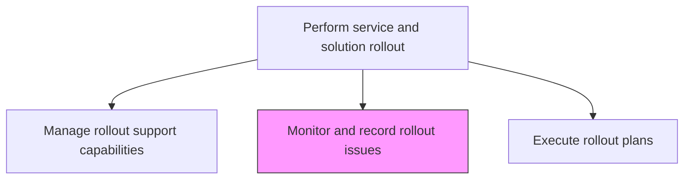
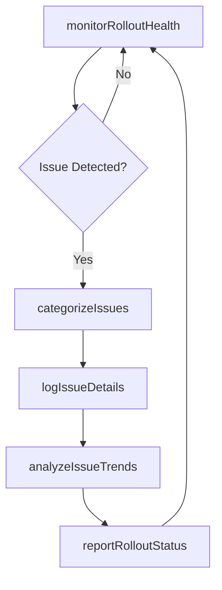

# Monitor and record rollout issues

> Business-as-Code definition for tracking, recording, and analyzing issues that arise during IT service and solution rollout to enable rapid resolution and continuous improvement of future deployments.

## Overview

Track and record any issues being faced due to rollout. Define methodology of assessment for measuring and monitoring issues.

## Process Hierarchy



## GraphDL

```yaml
monitor:
  object: And Record Rollout Issues
  actor: RolloutIssueTracker
  result: RolloutIssueLog
```

## Actions

| Action | Description |
|--------|-------------|
| monitorRolloutHealth | Continuously track system health, error rates, and user-reported problems during rollout |
| categorizeIssues | Classify rollout issues by type, severity, affected component, and user group |
| logIssueDetails | Record detailed issue information including reproduction steps and impact scope |
| analyzeIssueTrends | Identify patterns and recurring themes across rollout issues |
| reportRolloutStatus | Produce rollout status reports with issue summaries for stakeholders |

## Events

| Event | Description |
|-------|-------------|
| rolloutHealthMonitored | System health and error rates tracked during rollout |
| issuesCategorized | Rollout issues classified by type, severity, and component |
| issueDetailsLogged | Detailed issue information recorded |
| issueTrendsAnalyzed | Patterns and recurring themes identified across issues |
| rolloutStatusReported | Status reports produced with issue summaries |

## Searches

| Search | Description |
|--------|-------------|
| getRolloutIssues | Retrieve rollout issues filtered by severity, category, or status |
| getIssueTrends | Access trend analysis of rollout issues over time |
| getRolloutHealthDashboard | Get real-time rollout health metrics and issue counts |

## Process Flow



## RACI Matrix

| Activity | Responsible | Accountable | Consulted | Informed |
|----------|-------------|-------------|-----------|----------|
| monitorRolloutHealth | RolloutIssueTracker | RolloutManager | ITOperations | ServiceDeskManager |
| analyzeIssueTrends | RolloutIssueTracker | RolloutManager | QATeam | ReleaseManager |
| reportRolloutStatus | RolloutIssueTracker | RolloutManager | ProjectManager | ExecutiveSponsor |

## Related Processes

| Process | Relationship |
|---------|-------------|
| 8.6.5.5 Provide rollout support | Upstream - support activities generate issues to monitor |
| 8.6.5.4 Execute rollout plans | Related - issue monitoring runs in parallel with rollout execution |
| 8.6.3.7 Document IT change/release outcome | Downstream - rollout issues feed outcome documentation |

## Related Departments

| Department | Role |
|-----------|------|
| IT Service Management | Monitors and reports on rollout health and issue trends |
| Quality Assurance | Analyzes issue patterns and provides improvement recommendations |
| IT Operations | Monitors system health metrics during rollout |

## Related Occupations

| Occupation | Involvement |
|-----------|-------------|
| Rollout Issue Tracker | Monitors, categorizes, and reports on rollout issues |
| QA Analyst | Analyzes issue trends and patterns |
| Operations Analyst | Monitors real-time system health during rollout |

## KPIs

| KPI | Description | Unit |
|-----|-------------|------|
| Issue Detection Time | Average time from issue occurrence to detection | Minutes |
| Issue Categorization Accuracy | Percentage of issues correctly categorized on first attempt | % |
| Rollout Issue Density | Number of issues per 100 users rolled out | Count |
| Status Report Timeliness | Percentage of status reports delivered on schedule | % |

## Usage

```typescript
import { monitorAndRecordRolloutIssues } from '@headlessly/monitor-and-record-rollout-issues'

const issueMonitor = monitorAndRecordRolloutIssues()

// Get rollout issues
const issues = await issueMonitor.getRolloutIssues({
  releaseId: 'rel-2024-q4-003',
  severity: 'critical',
  status: 'open'
})

// Get issue trends
const trends = await issueMonitor.getIssueTrends({
  releaseId: 'rel-2024-q4-003',
  groupBy: 'category',
  period: 'daily'
})
```
