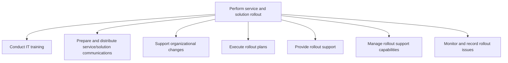
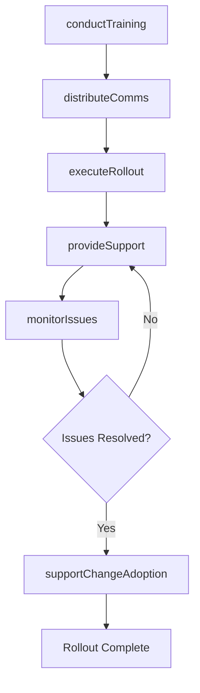

# Perform service and solution rollout

> Business-as-Code definition for executing the organizational rollout of IT services and solutions, including user training, stakeholder communication, change support, rollout execution, support provisioning, and issue monitoring.

## Overview

Strategizing and executing changes in IT solutions and services. Create a plan for deploying the changes. Communicate with stakeholders about the changes. Administer and implement the changes. Train the resources who will be affected by these changes. Install changes and verify their effect.

## Process Hierarchy



## GraphDL

```yaml
perform:
  object: Service And Solution Rollout
  actor: RolloutManager
  result: RolloutReport
```

## Actions

| Action | Description |
|--------|-------------|
| conductTraining | Deliver training sessions to prepare end users for the new service |
| distributeComms | Prepare and send rollout communications to stakeholders |
| supportChangeAdoption | Provide change management support during organizational transition |
| executeRollout | Carry out the phased rollout plan across user groups |
| provideSupport | Offer dedicated support during the rollout period |
| monitorIssues | Track and record issues encountered during rollout |

## Events

| Event | Description |
|-------|-------------|
| trainingConducted | User training sessions completed |
| commsDistributed | Rollout communications sent to stakeholders |
| changeAdoptionSupported | Change management support provided during transition |
| rolloutExecuted | Rollout plan executed across target user groups |
| supportProvided | Dedicated rollout support delivered to users |
| issuesMonitored | Rollout issues tracked and recorded |

## Searches

| Search | Description |
|--------|-------------|
| getRolloutProgress | Get the current rollout completion status by phase or region |
| findRolloutIssues | List issues encountered during rollout filtered by severity |
| getTrainingCompletion | Retrieve training completion rates by user group |
| getSupportMetrics | Get rollout support ticket volumes and resolution rates |

## Process Flow



## RACI Matrix

| Activity | Responsible | Accountable | Consulted | Informed |
|----------|-------------|-------------|-----------|----------|
| conductTraining | TrainingCoordinator | RolloutManager | EndUserRepresentatives | HumanResources |
| distributeComms | CommunicationsLead | RolloutManager | MarketingTeam | ExecutiveTeam |
| executeRollout | RolloutCoordinator | RolloutManager | ITOperations | ServiceDesk |
| monitorIssues | SupportAnalyst | RolloutManager | QATeam | ChangeManager |

## Sub-Processes

| ID | Name | Description |
|----|------|-------------|
| 8.6.5.1 | Conduct IT training | Preparing users for changes in IT solutions. Conduct training sessions and engagement activities to  |
| 8.6.5.2 | Prepare and distribute service/solution communications | Coordinating communications regarding the changes in IT services and solutions with employees in the |
| 8.6.5.3 | Support organizational changes | Creating a strategy for providing support for organizational changes. Providing support to users of  |
| 8.6.5.4 | Execute rollout plans | Executing a plan for introducing the IT services and solutions to the organization's end user base. |
| 8.6.5.5 | Provide rollout support | Establishing services for providing support to users of IT services and solutions for rollout. Defin |
| 8.6.5.6 | Manage rollout support capabilities | Managing the necessary skills and competencies required to efficiently provide IT resolution for rol |
| 8.6.5.7 | Monitor and record rollout issues | Track and record any issues being faced due to rollout. Define methodology of assessment for measuri |

## Related Processes

| Process | Relationship |
|---------|-------------|
| 8.6.4 Implement technology solutions | Upstream - implemented solutions are rolled out to users |
| 8.6.2 Plan service and solution implementation | Upstream - implementation plan includes rollout strategy |
| 8.7 Create and manage support services/solutions | Downstream - rollout transitions to ongoing support |

## Related Departments

| Department | Role |
|-----------|------|
| Training and Development | Delivers end-user training programs |
| Corporate Communications | Manages rollout messaging and stakeholder updates |
| Service Desk | Provides front-line support during rollout |
| Change Management | Facilitates organizational change adoption |

## Related Occupations

| Occupation | Involvement |
|-----------|-------------|
| Rollout Manager | Coordinates the phased rollout across user groups |
| IT Trainer | Delivers training sessions and creates materials |
| Change Management Specialist | Supports organizational transition and adoption |

## KPIs

| KPI | Description | Unit |
|-----|-------------|------|
| User Adoption Rate | Percentage of target users actively using the new service | % |
| Training Completion Rate | Percentage of users who completed rollout training | % |
| Rollout Issue Volume | Number of issues reported during rollout | Count |
| Issue Resolution Time | Average time to resolve rollout issues | Hours |
| User Satisfaction Score | End-user satisfaction with the rollout experience | Score (1-5) |

## Usage

```typescript
import { performServiceAndSolutionRollout } from '@headlessly/perform-service-and-solution-rollout'

const rollout = performServiceAndSolutionRollout()

// Conduct training for affected users
await rollout.conductTraining({
  serviceId: 'svc-new-crm',
  userGroups: ['sales-team', 'support-team'],
  sessions: [
    { date: '2025-07-10', format: 'instructor-led', location: 'HQ' },
    { date: '2025-07-12', format: 'webinar', location: 'remote' }
  ]
})

// Execute the phased rollout
const progress = await rollout.executeRollout({
  serviceId: 'svc-new-crm',
  phase: 'pilot',
  targetGroups: ['sales-team-west']
})

// Monitor rollout issues
const issues = await rollout.findRolloutIssues({
  serviceId: 'svc-new-crm',
  severity: 'high',
  status: 'open'
})
```
