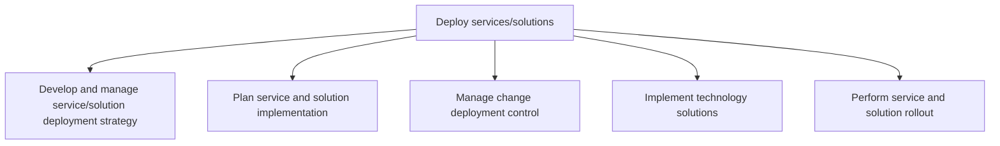
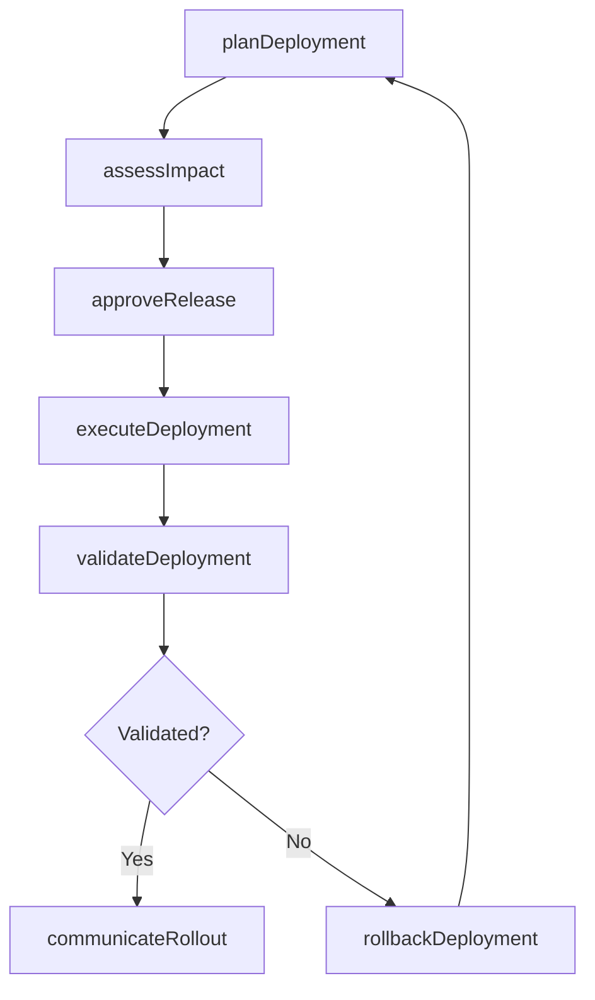

# Deploy services/solutions

> Business-as-Code definition for the controlled deployment of IT services and solutions, encompassing strategy, implementation planning, change control, rollout, and post-deployment verification.

## Overview

Executing IT services/solutions by creating a strategy for deployment. Plan and execute the changes. Plan and administer the release of its IT services and solutions.

## Process Hierarchy



## GraphDL

```yaml
deploy:
  object: Services/solutions
  actor: ReleaseManager
  result: DeploymentRecord
```

## Actions

| Action | Description |
|--------|-------------|
| planDeployment | Create the deployment plan including schedule, resources, and risk mitigation |
| assessImpact | Evaluate the business impact and risk of the deployment |
| approveRelease | Obtain formal approval from the change advisory board |
| executeDeployment | Carry out the deployment steps in the target environment |
| validateDeployment | Verify the deployment was successful through post-installation testing |
| rollbackDeployment | Revert to the previous state if deployment fails validation |
| communicateRollout | Notify stakeholders and end users of the new service availability |

## Events

| Event | Description |
|-------|-------------|
| deploymentPlanned | Deployment plan created and resources allocated |
| impactAssessed | Business impact and risk analysis completed |
| releaseApproved | Change advisory board granted deployment approval |
| deploymentExecuted | Deployment steps completed in the target environment |
| deploymentValidated | Post-installation testing confirmed successful deployment |
| deploymentRolledBack | Deployment reverted to previous version due to failure |
| rolloutCommunicated | Stakeholders notified of the new service availability |

## Searches

| Search | Description |
|--------|-------------|
| findDeployments | List deployments filtered by status, environment, or date range |
| getDeploymentDetails | Retrieve the full deployment record including test results |
| getReleaseSchedule | Get upcoming scheduled releases and maintenance windows |
| findRollbacks | List deployments that required rollback with root cause details |

## Process Flow



## RACI Matrix

| Activity | Responsible | Accountable | Consulted | Informed |
|----------|-------------|-------------|-----------|----------|
| planDeployment | ReleaseManager | VP IT Operations | DevelopmentLead | BusinessStakeholders |
| assessImpact | ChangeAnalyst | ReleaseManager | SecurityTeam | ProjectManager |
| approveRelease | ChangeAdvisoryBoard | CIO | ReleaseManager | ITOperations |
| executeDeployment | DeploymentEngineer | ReleaseManager | InfrastructureTeam | ServiceDesk |
| validateDeployment | QAEngineer | QALead | DeploymentEngineer | ReleaseManager |

## Sub-Processes

| ID | Name | Description |
|----|------|-------------|
| 8.6.1 | Develop and manage service/solution deployment strategy | Creating and implementing a strategy for the deployment of IT service/solution. Define all of the ac |
| 8.6.2 | Plan service and solution implementation | Strategizing and executing changes in IT solutions and services. Create a plan for deploying the cha |
| 8.6.3 | Manage change deployment control | Creating and deploying an architecture for securing the changes deployed in the organization. Create |
| 8.6.4 | Implement technology solutions | Deploy the identified solutions for information technology important for healthy business operations |
| 8.6.5 | Perform service and solution rollout | Strategizing and executing changes in IT solutions and services. Create a plan for deploying the cha |

## Related Processes

| Process | Relationship |
|---------|-------------|
| 8.5 Develop and manage services/solutions | Upstream - provides built services for deployment |
| 8.7 Create and manage support services/solutions | Downstream - receives deployed services for support |
| 8.3 Manage IT resiliency | Parallel - ensures deployments meet resilience requirements |

## Related Departments

| Department | Role |
|-----------|------|
| IT Operations | Executes deployments and manages infrastructure |
| Release Management | Coordinates release schedules and change control |
| Quality Assurance | Validates deployments through post-installation testing |
| Service Desk | Provides first-line support during rollout |
| Change Management | Governs change advisory board approval process |

## Related Occupations

| Occupation | Involvement |
|-----------|-------------|
| Release Manager | Plans and oversees deployment activities |
| DevOps Engineer | Automates and executes deployment pipelines |
| Change Manager | Manages the change approval and compliance process |
| Systems Administrator | Configures target environments and validates readiness |

## KPIs

| KPI | Description | Unit |
|-----|-------------|------|
| Deployment Success Rate | Percentage of deployments that pass validation without rollback | % |
| Mean Time to Deploy | Average elapsed time from approval to production release | Hours |
| Change Failure Rate | Percentage of changes that result in service degradation | % |
| Rollback Frequency | Number of deployments requiring rollback per quarter | Per Quarter |
| Deployment Lead Time | Time from code commit to production deployment | Days |

## Usage

```typescript
import { deployServicesSolutions } from '@headlessly/deploy-services-solutions'

const deployment = deployServicesSolutions()

// Plan a deployment
const plan = await deployment.planDeployment({
  serviceId: 'svc-customer-portal',
  targetEnvironment: 'production',
  scheduledDate: '2025-06-15T02:00:00Z',
  rollbackPlan: true
})

// Execute the deployment
const result = await deployment.executeDeployment({
  planId: plan.id,
  approvalId: 'cab-2025-0612'
})

// Validate deployment success
const validation = await deployment.validateDeployment({
  deploymentId: result.id,
  testSuite: 'smoke-tests'
})
```
