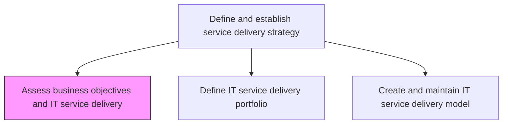
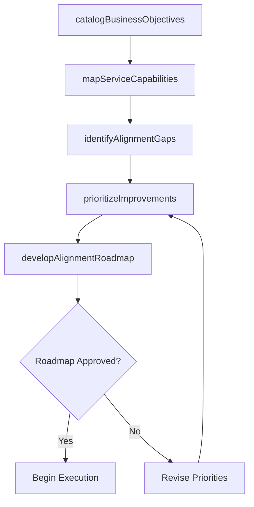

# Assess business objectives and IT service delivery

> Business-as-Code definition for evaluating how IT service delivery capabilities align with organizational business objectives, identifying gaps and opportunities for strategic improvement.

## Overview

Assessing the goals and objectives of IT service delivery and how it contributes to the overall business objectives. Align with the business objectives of the organization.

## Process Hierarchy



## GraphDL

```yaml
assess:
  object: Business Objectives And IT Service Delivery
  actor: ServiceDeliveryStrategist
  result: StrategicAlignmentAssessment
```

## Actions

| Action | Description |
|--------|-------------|
| catalogBusinessObjectives | Document current business goals, priorities, and strategic initiatives requiring IT support |
| mapServiceCapabilities | Inventory existing IT service delivery capabilities and their business alignment |
| identifyAlignmentGaps | Analyze gaps between business objectives and current IT service delivery capabilities |
| prioritizeImprovements | Rank service delivery improvements by business impact and feasibility |
| developAlignmentRoadmap | Create a phased roadmap to close alignment gaps over time |

## Events

| Event | Description |
|-------|-------------|
| businessObjectivesCataloged | Business goals and strategic initiatives documented |
| serviceCapabilitiesMapped | IT service delivery capabilities inventoried |
| alignmentGapsIdentified | Gaps between business objectives and IT capabilities analyzed |
| improvementsPrioritized | Service delivery improvements ranked by impact |
| alignmentRoadmapDeveloped | Phased roadmap created to close alignment gaps |

## Searches

| Search | Description |
|--------|-------------|
| getBusinessObjectives | Retrieve documented business objectives filtered by priority or domain |
| getAlignmentGaps | List identified gaps between business needs and IT service capabilities |
| getAlignmentRoadmap | Access the phased improvement roadmap with milestones |

## Process Flow



## RACI Matrix

| Activity | Responsible | Accountable | Consulted | Informed |
|----------|-------------|-------------|-----------|----------|
| catalogBusinessObjectives | ServiceDeliveryStrategist | CIO | BusinessUnitLeads | ITDirector |
| identifyAlignmentGaps | ServiceDeliveryStrategist | CIO | EnterpriseArchitect | FinanceDirector |
| developAlignmentRoadmap | ServiceDeliveryStrategist | CIO | ITGovernance | ExecutiveTeam |

## Related Processes

| Process | Relationship |
|---------|-------------|
| 8.7.1.2 Define IT service delivery portfolio | Downstream - alignment assessment guides portfolio definition |
| 8.7.1.3 Create and maintain IT service delivery model | Downstream - assessment informs delivery model design |
| 8.1.1 Understand the IT strategy | Upstream - IT strategy provides context for alignment |

## Related Departments

| Department | Role |
|-----------|------|
| IT Strategy | Leads strategic alignment assessment between business and IT |
| IT Service Management | Provides current service delivery capability data |
| Business Planning | Supplies business objectives and strategic priorities |

## Related Occupations

| Occupation | Involvement |
|-----------|-------------|
| Service Delivery Strategist | Conducts alignment analysis and develops roadmaps |
| Enterprise Architect | Maps technical capabilities to business requirements |
| Business Relationship Manager | Facilitates communication between business and IT |

## KPIs

| KPI | Description | Unit |
|-----|-------------|------|
| Strategic Alignment Score | Composite score measuring IT-business alignment | Score (1-10) |
| Gap Closure Rate | Percentage of identified alignment gaps addressed per quarter | % |
| Business Satisfaction with IT | Business stakeholder satisfaction with IT service delivery | Score (1-5) |

## Usage

```typescript
import { assessBusinessObjectivesAndItServiceDelivery } from '@headlessly/assess-business-objectives-and-it-service-delivery'

const alignment = assessBusinessObjectivesAndItServiceDelivery()

// Get alignment gaps
const gaps = await alignment.getAlignmentGaps({
  domain: 'customer-facing',
  severity: 'high'
})

// Access improvement roadmap
const roadmap = await alignment.getAlignmentRoadmap({
  fiscalYear: '2025',
  status: 'approved'
})
```
