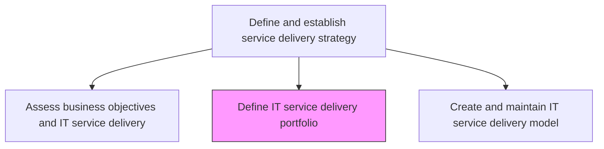
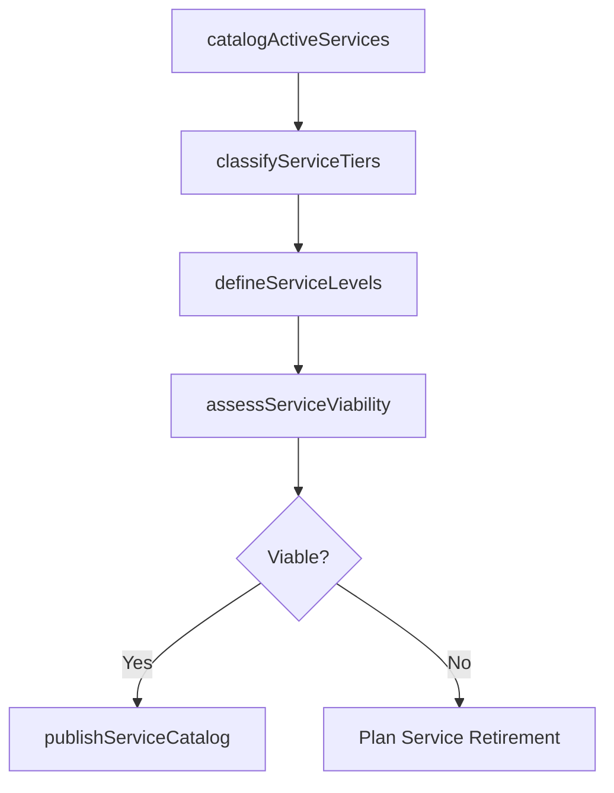

# Define IT service delivery portfolio

> Business-as-Code definition for establishing and maintaining the IT service delivery portfolio that catalogs all services offered, their delivery channels, service levels, and business value.

## Overview

Creating and establishing a repository of IT service delivery offerings.

## Process Hierarchy



## GraphDL

```yaml
define:
  object: IT Service Delivery Portfolio
  actor: ServicePortfolioManager
  result: ServiceDeliveryPortfolio
```

## Actions

| Action | Description |
|--------|-------------|
| catalogActiveServices | Document all active IT services with descriptions, owners, and delivery channels |
| classifyServiceTiers | Categorize services by criticality, complexity, and business value |
| defineServiceLevels | Establish service level targets for availability, performance, and support |
| assessServiceViability | Evaluate the ongoing viability and value of each service in the portfolio |
| publishServiceCatalog | Make the service portfolio available to stakeholders through a service catalog |

## Events

| Event | Description |
|-------|-------------|
| activeServicesCataloged | All active IT services documented with delivery details |
| serviceTiersClassified | Services categorized by criticality and business value |
| serviceLevelsDefined | Service level targets established for each service |
| serviceViabilityAssessed | Ongoing viability of portfolio services evaluated |
| serviceCatalogPublished | Service portfolio published as stakeholder-facing catalog |

## Searches

| Search | Description |
|--------|-------------|
| getServicePortfolio | Retrieve the service delivery portfolio filtered by tier, owner, or status |
| getServiceLevels | Access defined service levels for specific services |
| getServiceViability | Get viability assessment results for portfolio services |

## Process Flow



## RACI Matrix

| Activity | Responsible | Accountable | Consulted | Informed |
|----------|-------------|-------------|-----------|----------|
| catalogActiveServices | ServicePortfolioManager | ITServiceDirector | ServiceOwners | ITOperations |
| defineServiceLevels | ServicePortfolioManager | ITServiceDirector | BusinessUnitLeads | FinanceTeam |
| publishServiceCatalog | ServicePortfolioManager | ITServiceDirector | CommunicationsTeam | AllStakeholders |

## Related Processes

| Process | Relationship |
|---------|-------------|
| 8.7.1.1 Assess business objectives and IT service delivery | Upstream - alignment assessment guides portfolio content |
| 8.7.1.3 Create and maintain IT service delivery model | Downstream - portfolio feeds delivery model design |
| 8.7.1.5 Define IT service delivery sourcing strategy | Related - sourcing strategy applies to portfolio services |

## Related Departments

| Department | Role |
|-----------|------|
| IT Service Management | Manages the service portfolio and catalog |
| IT Finance | Provides cost and value data for service viability assessments |
| IT Operations | Delivers and supports services in the portfolio |

## Related Occupations

| Occupation | Involvement |
|-----------|-------------|
| Service Portfolio Manager | Maintains the service portfolio and conducts viability assessments |
| Service Level Manager | Defines and monitors service level targets |
| Service Catalog Administrator | Publishes and maintains the service catalog |

## KPIs

| KPI | Description | Unit |
|-----|-------------|------|
| Portfolio Coverage | Percentage of business-critical capabilities with defined IT services | % |
| Service Catalog Accuracy | Percentage of catalog entries current and accurate | % |
| Service Viability Score | Average viability score across portfolio services | Score (1-10) |

## Usage

```typescript
import { defineItServiceDeliveryPortfolio } from '@headlessly/define-it-service-delivery-portfolio'

const portfolio = defineItServiceDeliveryPortfolio()

// Get service portfolio
const services = await portfolio.getServicePortfolio({
  tier: 'business-critical',
  status: 'active'
})

// Get service levels
const sla = await portfolio.getServiceLevels({
  serviceId: 'email-service',
  metric: 'availability'
})
```
