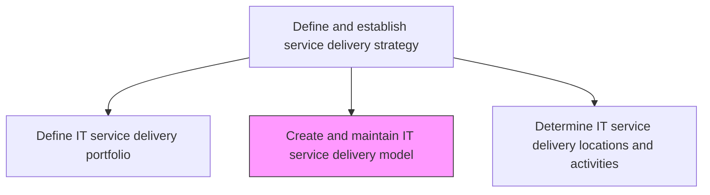
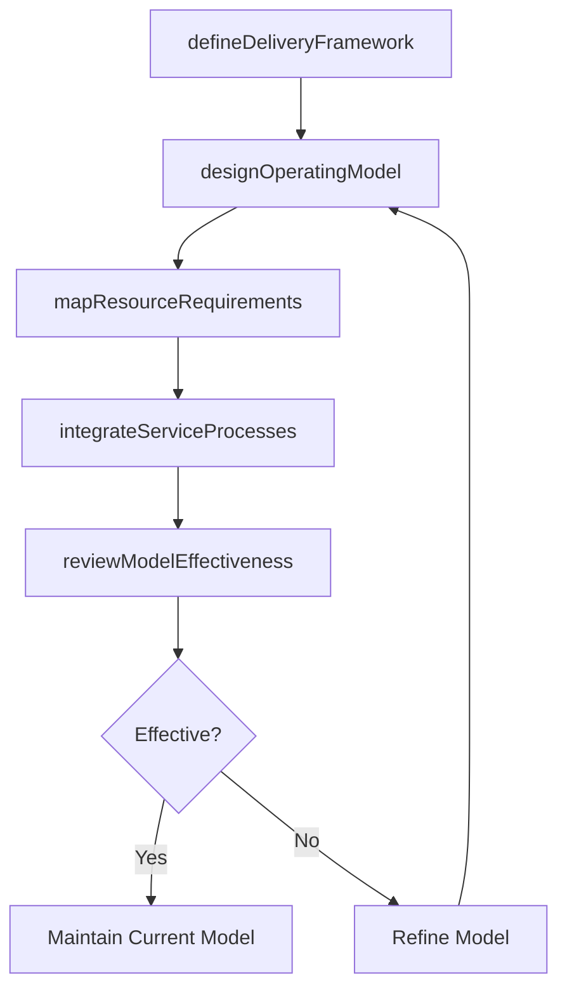

# Create and maintain IT service delivery model

> Business-as-Code definition for designing and maintaining the IT service delivery model that defines how services are structured, resourced, and operated to meet business and performance objectives.

## Overview

Design and maintaining an IT service delivery model that defines the processes and procedures needed to deliver the IT services and solutions.

## Process Hierarchy



## GraphDL

```yaml
create:
  object: And Maintain IT Service Delivery Model
  actor: ServiceDeliveryArchitect
  result: ServiceDeliveryModel
```

## Actions

| Action | Description |
|--------|-------------|
| defineDeliveryFramework | Establish the organizational framework for how IT services are structured and delivered |
| designOperatingModel | Create the operating model defining processes, roles, and governance for service delivery |
| mapResourceRequirements | Identify staffing, tooling, and infrastructure requirements for the delivery model |
| integrateServiceProcesses | Align service delivery processes with ITIL or organizational frameworks |
| reviewModelEffectiveness | Periodically evaluate and update the delivery model based on performance data |

## Events

| Event | Description |
|-------|-------------|
| deliveryFrameworkDefined | Organizational framework for service delivery established |
| operatingModelDesigned | Operating model with processes, roles, and governance created |
| resourceRequirementsMapped | Staffing, tooling, and infrastructure needs identified |
| serviceProcessesIntegrated | Delivery processes aligned with organizational frameworks |
| modelEffectivenessReviewed | Delivery model evaluated and updated |

## Searches

| Search | Description |
|--------|-------------|
| getDeliveryModel | Retrieve the current IT service delivery model with component details |
| getResourceRequirements | Access resource requirements for delivery model components |
| getModelPerformance | Get performance metrics for the current delivery model |

## Process Flow



## RACI Matrix

| Activity | Responsible | Accountable | Consulted | Informed |
|----------|-------------|-------------|-----------|----------|
| defineDeliveryFramework | ServiceDeliveryArchitect | CIO | ITGovernance | BusinessUnitLeads |
| designOperatingModel | ServiceDeliveryArchitect | ITServiceDirector | ProcessOwners | HRDirector |
| reviewModelEffectiveness | ServiceDeliveryArchitect | CIO | ServiceLevelManager | FinanceDirector |

## Related Processes

| Process | Relationship |
|---------|-------------|
| 8.7.1.2 Define IT service delivery portfolio | Upstream - portfolio defines which services the model must deliver |
| 8.7.1.4 Determine IT service delivery locations and activities | Downstream - model drives location and activity decisions |
| 8.7.1.5 Define IT service delivery sourcing strategy | Related - sourcing strategy shapes model resource allocation |

## Related Departments

| Department | Role |
|-----------|------|
| IT Service Management | Designs and maintains the service delivery model |
| IT Governance | Provides governance framework and compliance oversight |
| Human Resources | Supports organizational design and staffing models |

## Related Occupations

| Occupation | Involvement |
|-----------|-------------|
| Service Delivery Architect | Designs and refines the service delivery model |
| Process Owner | Defines and manages delivery processes within the model |
| IT Governance Analyst | Ensures model compliance with governance standards |

## KPIs

| KPI | Description | Unit |
|-----|-------------|------|
| Model Maturity Score | Composite maturity score for the service delivery model | Score (1-5) |
| Process Compliance Rate | Percentage of delivery processes following the defined model | % |
| Resource Utilization Efficiency | Ratio of productive resource usage to total allocation | % |

## Usage

```typescript
import { createAndMaintainItServiceDeliveryModel } from '@headlessly/create-and-maintain-it-service-delivery-model'

const deliveryModel = createAndMaintainItServiceDeliveryModel()

// Get current delivery model
const model = await deliveryModel.getDeliveryModel({
  version: 'current',
  component: 'operating-model'
})

// Get performance metrics
const performance = await deliveryModel.getModelPerformance({
  period: 'last-quarter',
  metric: 'processCompliance'
})
```
