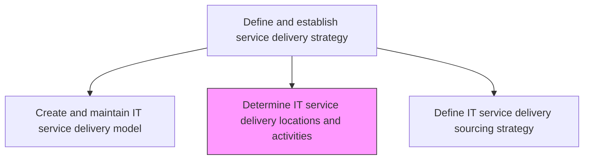
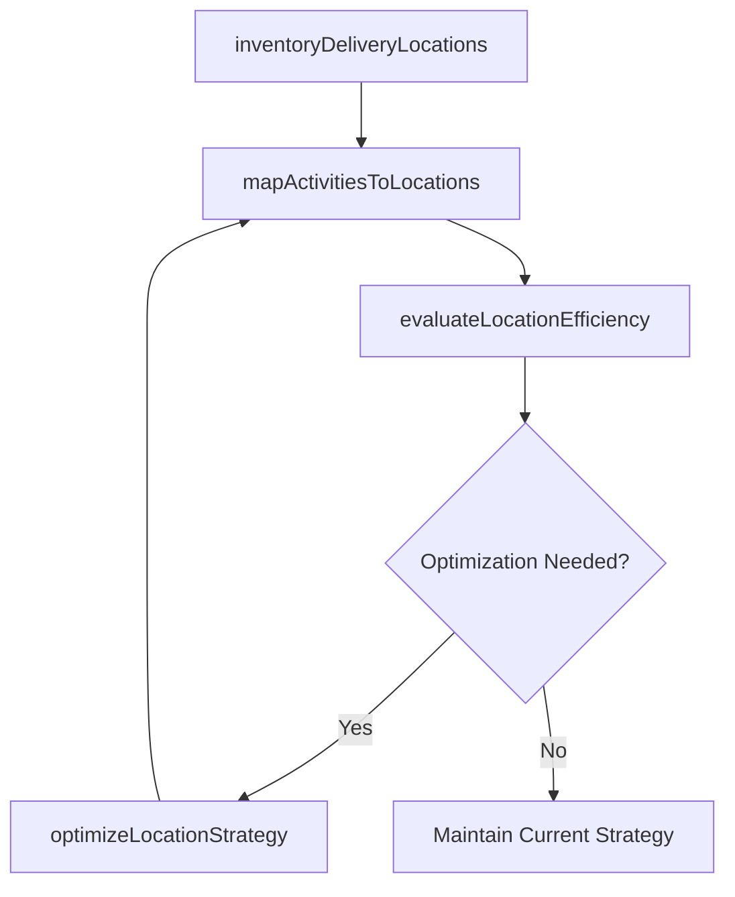

# Determine IT service delivery locations and activities

> Business-as-Code definition for determining the physical and virtual locations from which IT services are delivered and mapping the specific activities performed at each location.

## Overview

Determining locations and types of IT services and solutions which need to be delivered.

## Process Hierarchy



## GraphDL

```yaml
determine:
  object: IT Service Delivery Locations And Activities
  actor: ServiceLocationPlanner
  result: LocationActivityMap
```

## Actions

| Action | Description |
|--------|-------------|
| inventoryDeliveryLocations | Catalog all physical and virtual locations where IT services are delivered |
| mapActivitiesToLocations | Assign specific service delivery activities to each location based on capabilities |
| evaluateLocationEfficiency | Assess cost, quality, and risk metrics for each delivery location |
| optimizeLocationStrategy | Recommend location changes to improve efficiency, coverage, or resilience |

## Events

| Event | Description |
|-------|-------------|
| deliveryLocationsInventoried | Physical and virtual delivery locations cataloged |
| activitiesMappedToLocations | Service delivery activities assigned to locations |
| locationEfficiencyEvaluated | Cost, quality, and risk metrics assessed for locations |
| locationStrategyOptimized | Location improvement recommendations developed |

## Searches

| Search | Description |
|--------|-------------|
| getDeliveryLocations | Retrieve IT service delivery locations with assigned activities |
| getLocationMetrics | Access efficiency and performance metrics for delivery locations |
| getLocationCapabilities | List capabilities and capacity for each delivery location |

## Process Flow



## RACI Matrix

| Activity | Responsible | Accountable | Consulted | Informed |
|----------|-------------|-------------|-----------|----------|
| inventoryDeliveryLocations | ServiceLocationPlanner | ITServiceDirector | FacilitiesManager | CloudArchitect |
| evaluateLocationEfficiency | ServiceLocationPlanner | ITServiceDirector | FinanceTeam | ITOperations |
| optimizeLocationStrategy | ServiceLocationPlanner | CIO | ProcurementTeam | HRDirector |

## Related Processes

| Process | Relationship |
|---------|-------------|
| 8.7.1.3 Create and maintain IT service delivery model | Upstream - delivery model defines location requirements |
| 8.7.1.5 Define IT service delivery sourcing strategy | Related - sourcing decisions affect location strategy |
| 8.7.4.1 Develop IT service delivery strategy | Related - infrastructure planning aligns with location strategy |

## Related Departments

| Department | Role |
|-----------|------|
| IT Service Management | Plans service delivery location strategy |
| Facilities Management | Manages physical data center and office locations |
| Cloud Operations | Manages virtual and cloud-based delivery locations |

## Related Occupations

| Occupation | Involvement |
|-----------|-------------|
| Service Location Planner | Maps activities to locations and optimizes strategy |
| Data Center Manager | Manages physical delivery location operations |
| Cloud Architect | Designs virtual and cloud delivery location topology |

## KPIs

| KPI | Description | Unit |
|-----|-------------|------|
| Location Cost Efficiency | Cost per service transaction by delivery location | Cost/Transaction |
| Geographic Coverage | Percentage of user population within SLA-compliant delivery reach | % |
| Location Resilience Score | Composite resilience score factoring redundancy and failover | Score (1-5) |

## Usage

```typescript
import { determineItServiceDeliveryLocationsAndActivities } from '@headlessly/determine-it-service-delivery-locations-and-activities'

const locations = determineItServiceDeliveryLocationsAndActivities()

// Get delivery locations
const sites = await locations.getDeliveryLocations({
  type: 'data-center',
  region: 'north-america'
})

// Get location metrics
const metrics = await locations.getLocationMetrics({
  locationId: sites[0].id,
  metric: 'costEfficiency'
})
```
