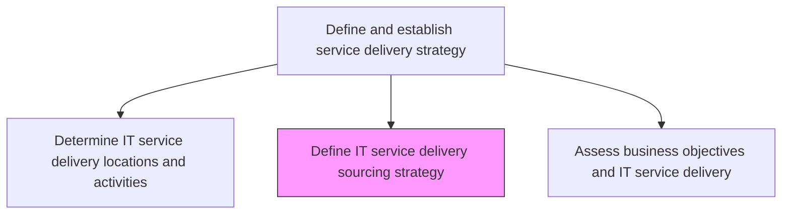
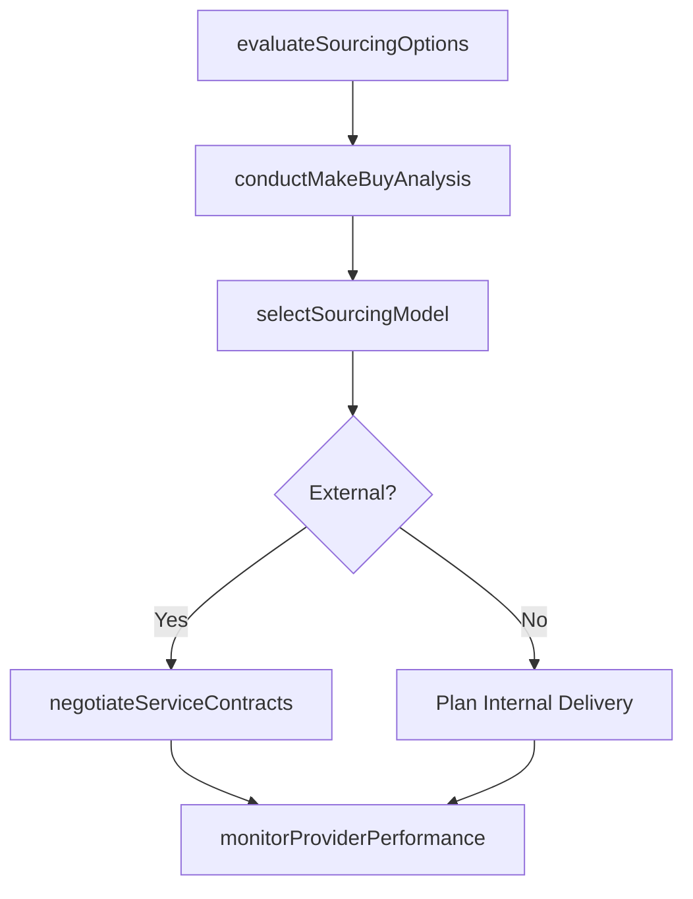

# Define IT service delivery sourcing strategy

> Business-as-Code definition for establishing the sourcing strategy for IT service delivery, determining which services are delivered internally, outsourced, or managed through hybrid models.

## Overview

Defining a strategy for sourcing delivery of IT services and solutions. Examine the pros and cons of various sources that can support the delivery process. Select the most feasible and cost-effective sources.

## Process Hierarchy



## GraphDL

```yaml
define:
  object: IT Service Delivery Sourcing Strategy
  actor: SourcingStrategist
  result: ServiceSourcingStrategy
```

## Actions

| Action | Description |
|--------|-------------|
| evaluateSourcingOptions | Assess in-house, outsourced, and hybrid delivery options for each service |
| conductMakeBuyAnalysis | Perform cost-benefit analysis for internal versus external service delivery |
| selectSourcingModel | Choose the optimal sourcing model for each service based on strategic fit |
| negotiateServiceContracts | Establish contracts and SLAs with selected external service providers |
| monitorProviderPerformance | Track external provider performance against contracted service levels |

## Events

| Event | Description |
|-------|-------------|
| sourcingOptionsEvaluated | In-house, outsourced, and hybrid options assessed for services |
| makeBuyAnalysisCompleted | Cost-benefit analysis for sourcing decisions completed |
| sourcingModelSelected | Optimal sourcing model chosen for each service |
| serviceContractsNegotiated | Provider contracts and SLAs established |
| providerPerformanceMonitored | External provider performance tracked against SLAs |

## Searches

| Search | Description |
|--------|-------------|
| getSourcingStrategy | Retrieve the sourcing strategy for services filtered by type or provider |
| getProviderContracts | Access external provider contracts and SLA terms |
| getProviderPerformance | Get performance data for external service providers |

## Process Flow



## RACI Matrix

| Activity | Responsible | Accountable | Consulted | Informed |
|----------|-------------|-------------|-----------|----------|
| evaluateSourcingOptions | SourcingStrategist | CIO | FinanceDirector | ProcurementTeam |
| selectSourcingModel | SourcingStrategist | CIO | ITServiceDirector | LegalTeam |
| negotiateServiceContracts | ProcurementManager | CIO | LegalTeam | SourcingStrategist |

## Related Processes

| Process | Relationship |
|---------|-------------|
| 8.7.1.4 Determine IT service delivery locations and activities | Upstream - location strategy informs sourcing decisions |
| 8.7.2.4 Develop IT support service sourcing strategy | Parallel - support sourcing aligns with delivery sourcing |
| 8.7.1.2 Define IT service delivery portfolio | Upstream - portfolio defines services to source |

## Related Departments

| Department | Role |
|-----------|------|
| IT Strategy | Develops sourcing strategy aligned with business objectives |
| Procurement | Manages vendor selection and contract negotiation |
| IT Finance | Provides cost analysis for sourcing decisions |

## Related Occupations

| Occupation | Involvement |
|-----------|-------------|
| Sourcing Strategist | Evaluates sourcing options and develops strategy |
| Vendor Manager | Manages provider relationships and performance |
| Procurement Manager | Negotiates contracts and manages vendor onboarding |

## KPIs

| KPI | Description | Unit |
|-----|-------------|------|
| Sourcing Cost Savings | Cost reduction achieved through optimized sourcing decisions | % |
| Provider SLA Compliance | Percentage of external providers meeting contracted SLAs | % |
| Sourcing Mix Ratio | Ratio of internally delivered versus externally sourced services | Ratio |

## Usage

```typescript
import { defineItServiceDeliverySourcingStrategy } from '@headlessly/define-it-service-delivery-sourcing-strategy'

const sourcing = defineItServiceDeliverySourcingStrategy()

// Get sourcing strategy
const strategy = await sourcing.getSourcingStrategy({
  serviceType: 'infrastructure',
  model: 'outsourced'
})

// Get provider performance
const performance = await sourcing.getProviderPerformance({
  providerId: 'cloud-provider-a',
  metric: 'slaCompliance'
})
```
