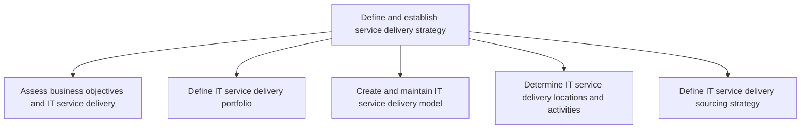
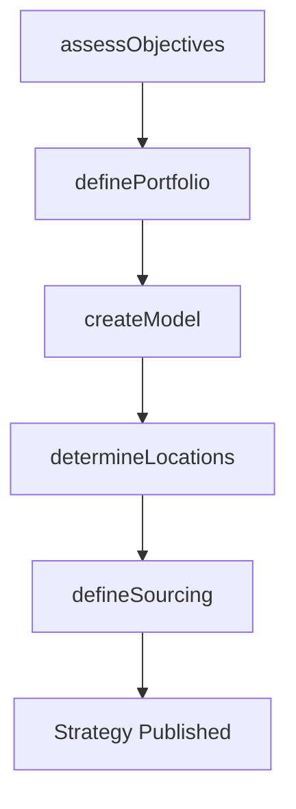

# Define and establish service delivery strategy

> Business-as-Code definition for designing and establishing the IT service delivery strategy, including business objective alignment, portfolio definition, delivery model creation, location planning, and sourcing decisions.

## Overview

Defining and establishing strategy for delivering IT services and solutions to the users. Design an IT service delivery model that defines the processes and procedures needed to deliver the IT services and solutions.

## Process Hierarchy



## GraphDL

```yaml
define:
  object: Service Delivery Strategy
  actor: ServiceDeliveryManager
  result: ServiceDeliveryStrategyDocument
```

## Actions

| Action | Description |
|--------|-------------|
| assessObjectives | Evaluate business objectives and align IT service delivery accordingly |
| definePortfolio | Catalog and define the portfolio of IT service delivery offerings |
| createModel | Design and document the IT service delivery operating model |
| determineLocations | Identify optimal locations and activity distribution for service delivery |
| defineSourcing | Establish the sourcing strategy for internal, outsourced, or hybrid delivery |

## Events

| Event | Description |
|-------|-------------|
| objectivesAssessed | Business objectives evaluated and alignment confirmed |
| portfolioDefined | IT service delivery portfolio defined and documented |
| modelCreated | Service delivery operating model designed and approved |
| locationsDetermined | Delivery locations and activity distribution planned |
| sourcingDefined | Sourcing strategy for service delivery established |

## Searches

| Search | Description |
|--------|-------------|
| getDeliveryPortfolio | List IT service delivery offerings by category or status |
| getDeliveryModel | Retrieve the current service delivery operating model |
| getSourcingStrategy | Get the sourcing strategy details including vendor allocations |

## Process Flow



## RACI Matrix

| Activity | Responsible | Accountable | Consulted | Informed |
|----------|-------------|-------------|-----------|----------|
| assessObjectives | ServiceDeliveryManager | CIO | BusinessUnitLeads | ExecutiveTeam |
| definePortfolio | ServiceDeliveryManager | VP IT Operations | ServiceOwners | Finance |
| createModel | ServiceDeliveryManager | CIO | EnterpriseArchitect | HumanResources |
| defineSourcing | ProcurementLead | ServiceDeliveryManager | VendorManagement | Finance |

## Sub-Processes

| ID | Name | Description |
|----|------|-------------|
| 8.7.1.1 | Assess business objectives and IT service delivery | Assessing the goals and objectives of IT service delivery and how it contributes to the overall busi |
| 8.7.1.2 | Define IT service delivery portfolio | Creating and establishing a repository of IT service delivery offerings. |
| 8.7.1.3 | Create and maintain IT service delivery model | Design and maintaining an IT service delivery model that defines the processes and procedures needed |
| 8.7.1.4 | Determine IT service delivery locations and activities | Determining locations and types of IT services and solutions which need to be delivered. |
| 8.7.1.5 | Define IT service delivery sourcing strategy | Defining a strategy for sourcing delivery of IT services and solutions. Examine the pros and cons of |

## Related Processes

| Process | Relationship |
|---------|-------------|
| 8.7.2 Define and develop service support strategy | Parallel - delivery and support strategies must align |
| 8.7.3 Plan and manage service delivery control | Downstream - strategy governs delivery control planning |
| 8.7.6 Develop and manage service delivery operations | Downstream - strategy defines operational model |

## Related Departments

| Department | Role |
|-----------|------|
| IT Service Management | Designs and owns the service delivery strategy |
| Procurement | Manages vendor sourcing and contracts |
| Finance | Evaluates cost models for delivery options |
| Human Resources | Supports staffing and location decisions |

## Related Occupations

| Occupation | Involvement |
|-----------|-------------|
| IT Service Delivery Manager | Defines and governs the delivery strategy |
| Vendor Manager | Manages outsourcing and partner relationships |
| IT Financial Analyst | Evaluates delivery cost models |

## KPIs

| KPI | Description | Unit |
|-----|-------------|------|
| Portfolio Coverage | Percentage of business functions with defined IT delivery services | % |
| Sourcing Cost Efficiency | IT delivery cost per user per month | Currency |
| Strategy Review Cycle | Frequency of service delivery strategy reviews | Per Year |

## Usage

```typescript
import { defineAndEstablishServiceDeliveryStrategy } from '@headlessly/define-and-establish-service-delivery-strategy'

const delivery = defineAndEstablishServiceDeliveryStrategy()

// Assess alignment with business objectives
const alignment = await delivery.assessObjectives({
  businessUnit: 'Global Operations',
  objectives: ['cost-reduction', 'scalability', '24x7-availability']
})

// Define the delivery portfolio
const portfolio = await delivery.definePortfolio({
  services: ['email', 'collaboration', 'erp-hosting', 'data-analytics'],
  deliveryTiers: ['standard', 'premium', 'enterprise']
})

// Define sourcing strategy
await delivery.defineSourcing({
  model: 'hybrid',
  internalRatio: 0.6,
  vendorPartners: ['cloud-provider-a', 'managed-services-b']
})
```
