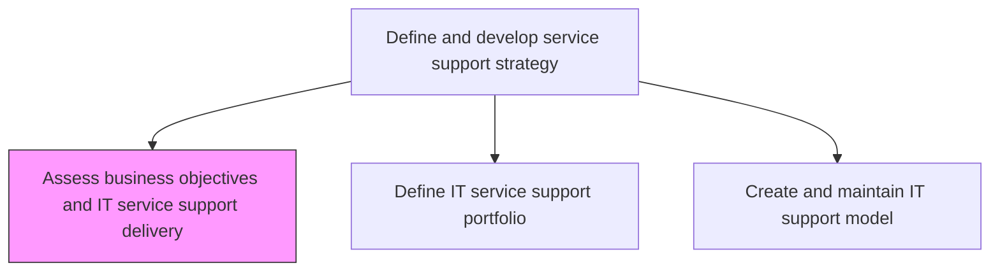
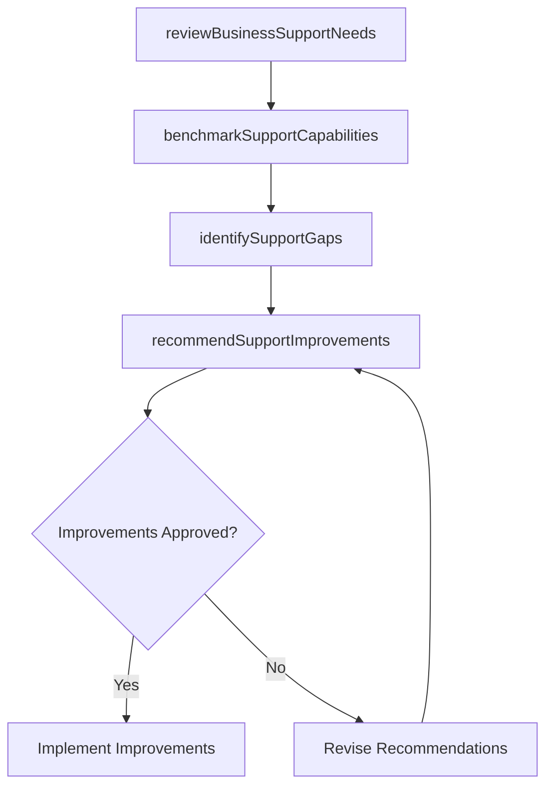

# Assess business objectives and IT service support delivery

> Business-as-Code definition for evaluating how IT service support capabilities align with business objectives, ensuring support structures effectively enable business operations and user productivity.

## Overview

Assessing the goals of IT service support delivery and how it aligns to contribute to the overall business objectives.

## Process Hierarchy



## GraphDL

```yaml
assess:
  object: Business Objectives And IT Service Support Delivery
  actor: SupportStrategyAnalyst
  result: SupportAlignmentAssessment
```

## Actions

| Action | Description |
|--------|-------------|
| reviewBusinessSupportNeeds | Gather business requirements for IT service support from stakeholder groups |
| benchmarkSupportCapabilities | Compare current support capabilities against industry standards and business expectations |
| identifySupportGaps | Analyze gaps between business support needs and current IT support delivery |
| recommendSupportImprovements | Propose improvements to close identified support capability gaps |

## Events

| Event | Description |
|-------|-------------|
| businessSupportNeedsReviewed | Business requirements for IT support gathered from stakeholders |
| supportCapabilitiesBenchmarked | Support capabilities compared against standards and expectations |
| supportGapsIdentified | Gaps between business needs and support capabilities analyzed |
| supportImprovementsRecommended | Improvement proposals developed to close support gaps |

## Searches

| Search | Description |
|--------|-------------|
| getSupportAlignment | Retrieve support alignment assessment results by business area |
| getSupportGaps | List identified gaps between business needs and support capabilities |
| getSupportBenchmarks | Access benchmark comparisons for IT support capabilities |

## Process Flow



## RACI Matrix

| Activity | Responsible | Accountable | Consulted | Informed |
|----------|-------------|-------------|-----------|----------|
| reviewBusinessSupportNeeds | SupportStrategyAnalyst | ITServiceDirector | BusinessUnitLeads | CIO |
| identifySupportGaps | SupportStrategyAnalyst | ITServiceDirector | ServiceDeskManager | ITOperations |
| recommendSupportImprovements | SupportStrategyAnalyst | ITServiceDirector | FinanceTeam | HRDirector |

## Related Processes

| Process | Relationship |
|---------|-------------|
| 8.7.2.2 Define IT service support portfolio | Downstream - assessment guides support portfolio definition |
| 8.7.1.1 Assess business objectives and IT service delivery | Parallel - delivery and support assessments complement each other |
| 8.7.2.5 Establish support service framework | Downstream - assessment informs framework design |

## Related Departments

| Department | Role |
|-----------|------|
| IT Service Management | Leads support strategy assessment and alignment analysis |
| Service Desk Operations | Provides current support capability data and performance metrics |
| Business Units | Articulates support requirements and satisfaction levels |

## Related Occupations

| Occupation | Involvement |
|-----------|-------------|
| Support Strategy Analyst | Conducts alignment analysis and recommends improvements |
| Service Desk Manager | Provides operational support data for assessment |
| Business Relationship Manager | Facilitates stakeholder input on support needs |

## KPIs

| KPI | Description | Unit |
|-----|-------------|------|
| Support Alignment Score | Composite score measuring support-business alignment | Score (1-10) |
| Support Gap Count | Number of identified gaps between needs and capabilities | Count |
| Business Satisfaction with Support | Stakeholder satisfaction with IT support services | Score (1-5) |

## Usage

```typescript
import { assessBusinessObjectivesAndItServiceSupportDelivery } from '@headlessly/assess-business-objectives-and-it-service-support-delivery'

const supportAlignment = assessBusinessObjectivesAndItServiceSupportDelivery()

// Get support alignment assessment
const assessment = await supportAlignment.getSupportAlignment({
  businessArea: 'operations',
  period: 'current-fiscal-year'
})

// Get support gaps
const gaps = await supportAlignment.getSupportGaps({
  severity: 'high',
  status: 'open'
})
```
