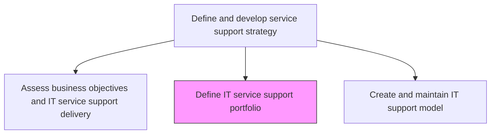
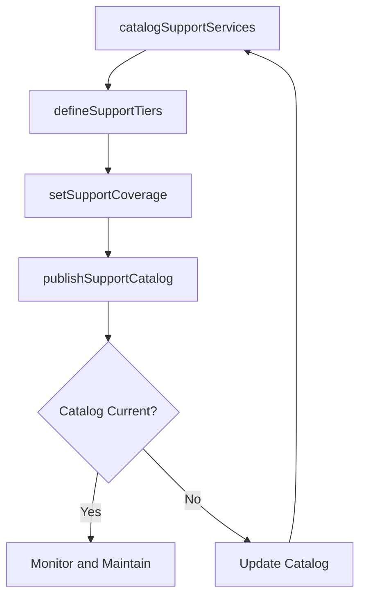

# Define IT service support portfolio

> Business-as-Code definition for defining the portfolio of IT support services offered to the organization, including service descriptions, support tiers, and coverage levels.

## Overview

Defining different IT support services and solutions such as remote support and cloud support. Include planned IT initiatives and ongoing IT services (such as application support).

## Process Hierarchy



## GraphDL

```yaml
define:
  object: IT Service Support Portfolio
  actor: SupportPortfolioManager
  result: SupportServicePortfolio
```

## Actions

| Action | Description |
|--------|-------------|
| catalogSupportServices | Document all IT support services with descriptions, tiers, and coverage hours |
| defineSupportTiers | Establish multi-tier support levels with escalation criteria and response targets |
| setSupportCoverage | Define support coverage hours, geographic scope, and channel availability |
| publishSupportCatalog | Make support service offerings available through a self-service catalog |

## Events

| Event | Description |
|-------|-------------|
| supportServicesCataloged | All IT support services documented with tier and coverage details |
| supportTiersDefined | Multi-tier support levels and escalation criteria established |
| supportCoverageSet | Support hours, geographic scope, and channels defined |
| supportCatalogPublished | Support service catalog published for stakeholders |

## Searches

| Search | Description |
|--------|-------------|
| getSupportPortfolio | Retrieve the support service portfolio filtered by tier or coverage |
| getSupportTiers | Access support tier definitions with escalation criteria |
| getSupportCoverage | Get coverage details for specific support services |

## Process Flow



## RACI Matrix

| Activity | Responsible | Accountable | Consulted | Informed |
|----------|-------------|-------------|-----------|----------|
| catalogSupportServices | SupportPortfolioManager | ITServiceDirector | ServiceDeskManager | ITOperations |
| defineSupportTiers | SupportPortfolioManager | ITServiceDirector | ServiceLevelManager | FinanceTeam |
| publishSupportCatalog | SupportPortfolioManager | ITServiceDirector | CommunicationsTeam | AllStakeholders |

## Related Processes

| Process | Relationship |
|---------|-------------|
| 8.7.2.1 Assess business objectives and IT service support delivery | Upstream - assessment guides portfolio content |
| 8.7.2.3 Create and maintain IT support model | Downstream - portfolio feeds support model design |
| 8.7.1.2 Define IT service delivery portfolio | Parallel - support portfolio complements delivery portfolio |

## Related Departments

| Department | Role |
|-----------|------|
| IT Service Management | Defines and maintains the support service portfolio |
| Service Desk | Delivers support services defined in the portfolio |
| IT Finance | Provides costing data for support service offerings |

## Related Occupations

| Occupation | Involvement |
|-----------|-------------|
| Support Portfolio Manager | Catalogs and maintains support service definitions |
| Service Level Manager | Defines support tier response and resolution targets |
| Service Desk Manager | Validates support coverage and channel availability |

## KPIs

| KPI | Description | Unit |
|-----|-------------|------|
| Support Catalog Completeness | Percentage of IT services with defined support offerings | % |
| Tier Coverage Ratio | Percentage of incidents resolved at first-tier support | % |
| Support Service Accuracy | Percentage of catalog entries matching actual service delivery | % |

## Usage

```typescript
import { defineItServiceSupportPortfolio } from '@headlessly/define-it-service-support-portfolio'

const supportPortfolio = defineItServiceSupportPortfolio()

// Get support portfolio
const services = await supportPortfolio.getSupportPortfolio({
  tier: 'tier-1',
  status: 'active'
})

// Get support tiers
const tiers = await supportPortfolio.getSupportTiers({
  serviceId: 'email-support'
})
```
