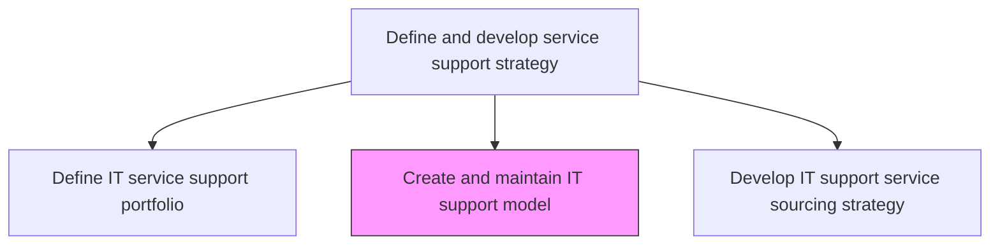
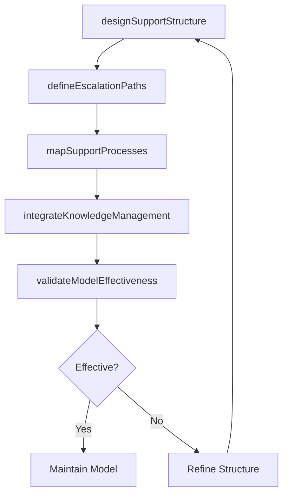

# Create and maintain IT support model

> Business-as-Code definition for creating and maintaining the IT support operating model that defines how support services are structured, staffed, and delivered across the organization.

## Overview

Design and maintaining an IT support model that defines the processes and procedures needed to support users of IT services and solutions.

## Process Hierarchy



## GraphDL

```yaml
create:
  object: And Maintain IT Support Model
  actor: SupportModelArchitect
  result: ITSupportModel
```

## Actions

| Action | Description |
|--------|-------------|
| designSupportStructure | Define the organizational structure for IT support including tiers and specializations |
| defineEscalationPaths | Establish escalation procedures between support tiers and specialist teams |
| mapSupportProcesses | Document standard operating procedures for incident, request, and problem management |
| integrateKnowledgeManagement | Embed knowledge management practices into the support operating model |
| validateModelEffectiveness | Evaluate support model performance and identify areas for improvement |

## Events

| Event | Description |
|-------|-------------|
| supportStructureDesigned | Organizational structure for IT support defined |
| escalationPathsDefined | Escalation procedures between tiers established |
| supportProcessesMapped | Standard operating procedures documented |
| knowledgeManagementIntegrated | Knowledge management embedded in support model |
| modelEffectivenessValidated | Support model performance evaluated |

## Searches

| Search | Description |
|--------|-------------|
| getSupportModel | Retrieve the current IT support model with structural details |
| getEscalationPaths | Access escalation paths and procedures by service or tier |
| getSupportProcesses | Get standard operating procedures for support activities |

## Process Flow



## RACI Matrix

| Activity | Responsible | Accountable | Consulted | Informed |
|----------|-------------|-------------|-----------|----------|
| designSupportStructure | SupportModelArchitect | ITServiceDirector | ServiceDeskManager | HRDirector |
| defineEscalationPaths | SupportModelArchitect | ITServiceDirector | TierLeads | IncidentManager |
| validateModelEffectiveness | SupportModelArchitect | ITServiceDirector | QualityTeam | CIO |

## Related Processes

| Process | Relationship |
|---------|-------------|
| 8.7.2.2 Define IT service support portfolio | Upstream - portfolio defines services the model must support |
| 8.7.2.5 Establish support service framework | Downstream - model feeds framework establishment |
| 8.7.5.5 Define IT escalation mechanisms | Related - escalation design shared between model and operations |

## Related Departments

| Department | Role |
|-----------|------|
| IT Service Management | Designs and maintains the IT support model |
| Service Desk Operations | Operates within the defined support model |
| Knowledge Management | Provides knowledge base practices for the support model |

## Related Occupations

| Occupation | Involvement |
|-----------|-------------|
| Support Model Architect | Designs support structure and escalation procedures |
| Service Desk Manager | Implements the support model in daily operations |
| Knowledge Manager | Integrates knowledge management into support workflows |

## KPIs

| KPI | Description | Unit |
|-----|-------------|------|
| Model Adherence Rate | Percentage of support interactions following the defined model | % |
| Escalation Accuracy | Percentage of escalations routed correctly on first attempt | % |
| Support Model Maturity | Maturity level of the support operating model | Score (1-5) |

## Usage

```typescript
import { createAndMaintainItSupportModel } from '@headlessly/create-and-maintain-it-support-model'

const supportModel = createAndMaintainItSupportModel()

// Get support model
const model = await supportModel.getSupportModel({
  version: 'current',
  component: 'escalation-paths'
})

// Get support processes
const processes = await supportModel.getSupportProcesses({
  category: 'incident-management'
})
```
