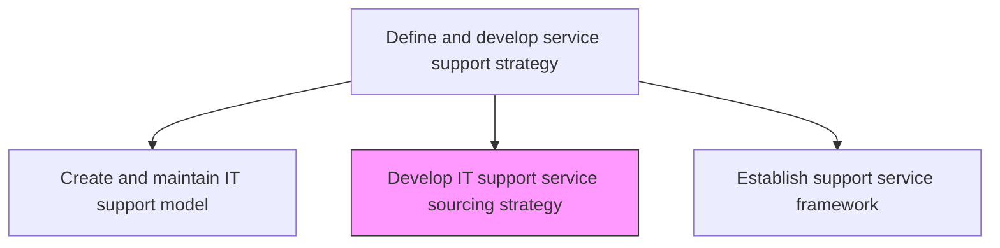
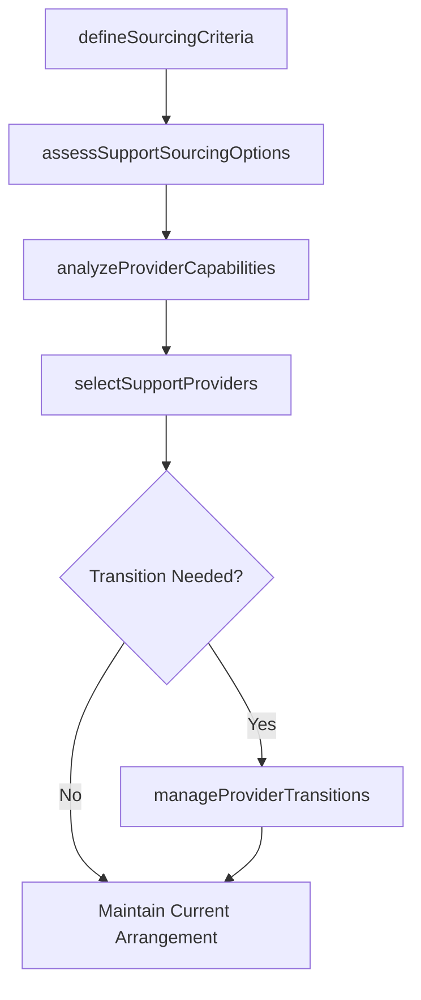

# Develop IT support service sourcing strategy

> Business-as-Code definition for developing the sourcing strategy for IT support services, determining which support functions are delivered internally, outsourced, or through managed service providers.

## Overview

Developing a strategy for sourcing resources to support users of IT services and solutions. Establish sources that will make use of e-mail, live support software online, or a tool where users can log a call or incident in order to retrieve IT support.

## Process Hierarchy



## GraphDL

```yaml
develop:
  object: IT Support Service Sourcing Strategy
  actor: SupportSourcingManager
  result: SupportSourcingStrategy
```

## Actions

| Action | Description |
|--------|-------------|
| assessSupportSourcingOptions | Evaluate internal, outsourced, and co-sourced options for support functions |
| analyzeProviderCapabilities | Review prospective managed service providers against support requirements |
| defineSourcingCriteria | Establish evaluation criteria for support service sourcing decisions |
| selectSupportProviders | Choose optimal providers for outsourced support functions based on criteria |
| manageProviderTransitions | Coordinate transitions when changing support service providers |

## Events

| Event | Description |
|-------|-------------|
| supportSourcingOptionsAssessed | Internal and external support delivery options evaluated |
| providerCapabilitiesAnalyzed | Managed service providers reviewed against requirements |
| sourcingCriteriaDefined | Evaluation criteria for sourcing decisions established |
| supportProvidersSelected | Optimal providers chosen for outsourced support |
| providerTransitionsManaged | Provider transitions coordinated and completed |

## Searches

| Search | Description |
|--------|-------------|
| getSupportSourcingStrategy | Retrieve the support sourcing strategy by function or provider |
| getSupportProviders | List active support service providers with contract details |
| getProviderEvaluations | Access provider evaluation results against sourcing criteria |

## Process Flow



## RACI Matrix

| Activity | Responsible | Accountable | Consulted | Informed |
|----------|-------------|-------------|-----------|----------|
| assessSupportSourcingOptions | SupportSourcingManager | ITServiceDirector | FinanceTeam | ProcurementTeam |
| selectSupportProviders | SupportSourcingManager | CIO | LegalTeam | ServiceDeskManager |
| manageProviderTransitions | SupportSourcingManager | ITServiceDirector | HRDirector | ChangeManager |

## Related Processes

| Process | Relationship |
|---------|-------------|
| 8.7.2.3 Create and maintain IT support model | Upstream - support model defines sourcing requirements |
| 8.7.1.5 Define IT service delivery sourcing strategy | Parallel - delivery sourcing aligns with support sourcing |
| 8.7.5.7 Coordinate with external support providers | Downstream - sourcing strategy guides provider coordination |

## Related Departments

| Department | Role |
|-----------|------|
| IT Service Management | Develops support sourcing strategy and manages provider relationships |
| Procurement | Manages vendor selection, contracts, and negotiations |
| IT Finance | Provides cost-benefit analysis for sourcing decisions |

## Related Occupations

| Occupation | Involvement |
|-----------|-------------|
| Support Sourcing Manager | Evaluates sourcing options and manages provider relationships |
| Vendor Manager | Manages ongoing provider performance and contracts |
| Procurement Specialist | Handles vendor selection and contract negotiation |

## KPIs

| KPI | Description | Unit |
|-----|-------------|------|
| Sourcing Cost Efficiency | Cost per support interaction by sourcing model | Cost/Interaction |
| Provider SLA Achievement | Percentage of outsourced providers meeting SLA targets | % |
| Transition Success Rate | Percentage of provider transitions completed without service disruption | % |

## Usage

```typescript
import { developItSupportServiceSourcingStrategy } from '@headlessly/develop-it-support-service-sourcing-strategy'

const sourcingStrategy = developItSupportServiceSourcingStrategy()

// Get sourcing strategy
const strategy = await sourcingStrategy.getSupportSourcingStrategy({
  function: 'tier-1-support',
  model: 'outsourced'
})

// Get provider evaluations
const evaluations = await sourcingStrategy.getProviderEvaluations({
  providerId: 'managed-desk-co',
  period: 'last-12-months'
})
```
