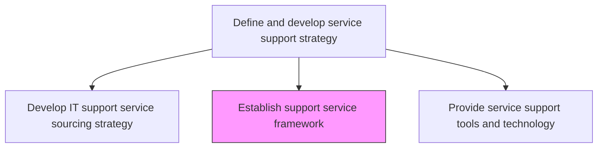
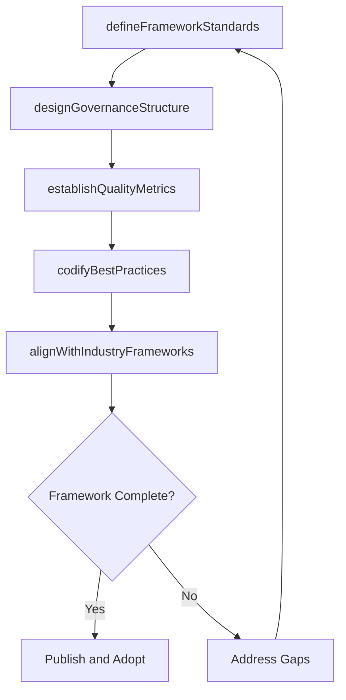

# Establish support service framework

> Business-as-Code definition for establishing the overarching support service framework that defines standards, processes, tools, and governance structures for consistent IT support delivery.

## Overview

Creating an agenda for the rules and regulations of support service that deal with providing support to users of IT services and solutions.

## Process Hierarchy



## GraphDL

```yaml
establish:
  object: Support Service Framework
  actor: SupportFrameworkManager
  result: SupportServiceFramework
```

## Actions

| Action | Description |
|--------|-------------|
| defineFrameworkStandards | Establish standards for incident, request, and problem management processes |
| designGovernanceStructure | Create governance bodies and decision-making processes for support services |
| establishQualityMetrics | Define quality metrics and measurement methodologies for support services |
| codifyBestPractices | Document and formalize best practices for support service delivery |
| alignWithIndustryFrameworks | Map support framework to ITIL, ISO 20000, or other industry standards |

## Events

| Event | Description |
|-------|-------------|
| frameworkStandardsDefined | Support service process standards established |
| governanceStructureDesigned | Governance bodies and decision processes created |
| qualityMetricsEstablished | Quality measurement methodologies defined |
| bestPracticesCodified | Support delivery best practices documented |
| industryFrameworksAligned | Framework mapped to ITIL or other standards |

## Searches

| Search | Description |
|--------|-------------|
| getFrameworkStandards | Retrieve support framework standards by process area |
| getGovernanceStructure | Access governance bodies and decision-making procedures |
| getQualityMetrics | Get defined quality metrics and measurement methods |

## Process Flow



## RACI Matrix

| Activity | Responsible | Accountable | Consulted | Informed |
|----------|-------------|-------------|-----------|----------|
| defineFrameworkStandards | SupportFrameworkManager | ITServiceDirector | ProcessOwners | QualityTeam |
| designGovernanceStructure | SupportFrameworkManager | CIO | ITGovernance | ServiceDeskManager |
| alignWithIndustryFrameworks | SupportFrameworkManager | ITServiceDirector | ComplianceTeam | AuditTeam |

## Related Processes

| Process | Relationship |
|---------|-------------|
| 8.7.2.3 Create and maintain IT support model | Upstream - support model operates within this framework |
| 8.7.2.6 Provide service support tools and technology | Downstream - framework requirements drive tool selection |
| 8.7.5.1 Understand IT support demand patterns | Downstream - framework guides how demand data is used |

## Related Departments

| Department | Role |
|-----------|------|
| IT Governance | Provides governance standards and oversight for the framework |
| IT Service Management | Defines support process standards and quality metrics |
| Quality Assurance | Establishes measurement methodologies and best practices |

## Related Occupations

| Occupation | Involvement |
|-----------|-------------|
| Support Framework Manager | Designs and maintains the support service framework |
| IT Process Owner | Owns specific process areas within the framework |
| Quality Analyst | Defines quality metrics and measurement approaches |

## KPIs

| KPI | Description | Unit |
|-----|-------------|------|
| Framework Adoption Rate | Percentage of support teams operating within the defined framework | % |
| Standard Compliance Rate | Percentage of support processes compliant with framework standards | % |
| Industry Certification Status | Status of industry framework certifications achieved | Status |

## Usage

```typescript
import { establishSupportServiceFramework } from '@headlessly/establish-support-service-framework'

const framework = establishSupportServiceFramework()

// Get framework standards
const standards = await framework.getFrameworkStandards({
  processArea: 'incident-management'
})

// Get quality metrics
const metrics = await framework.getQualityMetrics({
  category: 'resolution-effectiveness'
})
```
