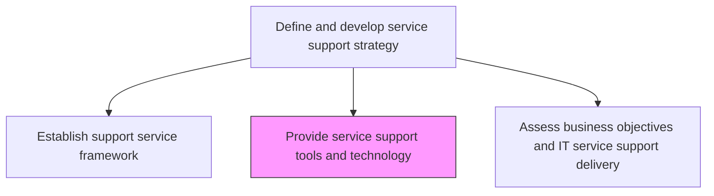
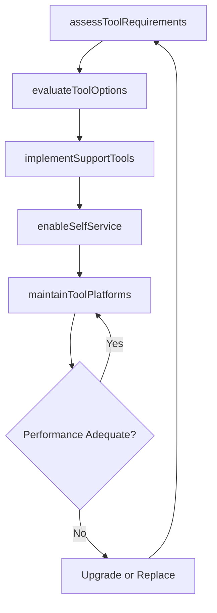

# Provide service support tools and technology

> Business-as-Code definition for selecting, implementing, and maintaining the tools and technology platforms that enable effective IT service support delivery, including ITSM platforms and self-service portals.

## Overview

Providing the tools and techniques to support users of IT services and solutions, and choosing the most appropriate tools and techniques. Evaluate the pros and cons of all the methodologies and tools available. Choose the most efficient and effective methodology.

## Process Hierarchy



## GraphDL

```yaml
provide:
  object: Service Support Tools And Technology
  actor: SupportToolsManager
  result: SupportTechnologyPlan
```

## Actions

| Action | Description |
|--------|-------------|
| assessToolRequirements | Gather requirements for ITSM platforms, ticketing systems, and self-service portals |
| evaluateToolOptions | Compare available tools and platforms against functional and integration requirements |
| implementSupportTools | Deploy and configure selected support tools and integrate with existing systems |
| maintainToolPlatforms | Keep support tools updated, patched, and optimized for performance |
| enableSelfService | Configure self-service portals and automation for common support requests |

## Events

| Event | Description |
|-------|-------------|
| toolRequirementsAssessed | Requirements for support tools and platforms gathered |
| toolOptionsEvaluated | Available tools compared against requirements |
| supportToolsImplemented | Selected tools deployed and configured |
| toolPlatformsMaintained | Support tools updated and optimized |
| selfServiceEnabled | Self-service portals and automation configured |

## Searches

| Search | Description |
|--------|-------------|
| getSupportTools | Retrieve the inventory of support tools and platforms with status |
| getToolPerformance | Access performance metrics for support tool platforms |
| getSelfServiceMetrics | Get usage and effectiveness metrics for self-service portals |

## Process Flow



## RACI Matrix

| Activity | Responsible | Accountable | Consulted | Informed |
|----------|-------------|-------------|-----------|----------|
| assessToolRequirements | SupportToolsManager | ITServiceDirector | ServiceDeskManager | EndUserRepresentatives |
| implementSupportTools | SupportToolsManager | ITServiceDirector | InfrastructureTeam | SecurityTeam |
| maintainToolPlatforms | SupportToolsManager | ITServiceDirector | VendorSupport | ITOperations |

## Related Processes

| Process | Relationship |
|---------|-------------|
| 8.7.2.5 Establish support service framework | Upstream - framework defines tool requirements |
| 8.7.5.3 Maintain service support knowledge repository | Related - knowledge base tools part of support technology |
| 8.7.8.1 Triage IT issues/requests | Downstream - ticketing tools used for triaging |

## Related Departments

| Department | Role |
|-----------|------|
| IT Service Management | Selects and manages support technology platforms |
| IT Infrastructure | Deploys and maintains tool platform infrastructure |
| Application Development | Customizes and integrates support tools with enterprise systems |

## Related Occupations

| Occupation | Involvement |
|-----------|-------------|
| Support Tools Manager | Evaluates, implements, and maintains support technology |
| ITSM Platform Administrator | Configures and administers the ITSM platform |
| Automation Engineer | Builds self-service workflows and automation |

## KPIs

| KPI | Description | Unit |
|-----|-------------|------|
| Tool Uptime | Availability of critical support tools and platforms | % |
| Self-Service Adoption Rate | Percentage of support requests submitted via self-service | % |
| Tool Satisfaction Score | Support staff satisfaction with support tools | Score (1-5) |

## Usage

```typescript
import { provideServiceSupportToolsAndTechnology } from '@headlessly/provide-service-support-tools-and-technology'

const supportTools = provideServiceSupportToolsAndTechnology()

// Get support tools inventory
const tools = await supportTools.getSupportTools({
  category: 'itsm-platform',
  status: 'active'
})

// Get self-service metrics
const selfService = await supportTools.getSelfServiceMetrics({
  portal: 'employee-portal',
  period: 'last-quarter'
})
```
