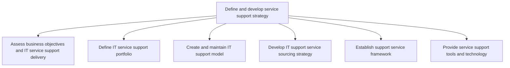
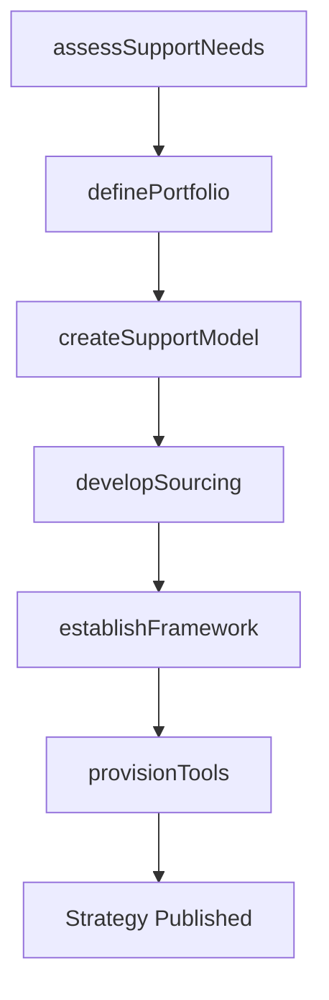

# Define and develop service support strategy

> Business-as-Code definition for designing the IT service support strategy, including support portfolio definition, support model creation, sourcing strategy, framework establishment, and tooling provisioning.

## Overview

Defining and creating a strategy for provision of support to users of IT services and solutions.

## Process Hierarchy



## GraphDL

```yaml
define:
  object: Service Support Strategy
  actor: SupportStrategyManager
  result: SupportStrategyPlan
```

## Actions

| Action | Description |
|--------|-------------|
| assessSupportNeeds | Evaluate business objectives and determine IT support requirements |
| definePortfolio | Catalog support service offerings including remote and cloud support |
| createSupportModel | Design the tiered support model with escalation paths |
| developSourcing | Establish sourcing strategy for internal and external support resources |
| establishFramework | Define the rules, SLAs, and governance for support services |
| provisionTools | Select and deploy support tools and ticketing systems |

## Events

| Event | Description |
|-------|-------------|
| supportNeedsAssessed | IT support requirements evaluated and documented |
| portfolioDefined | Support service offerings cataloged and published |
| supportModelCreated | Tiered support model designed and approved |
| sourcingDeveloped | Support sourcing strategy established |
| frameworkEstablished | Support service framework with SLAs defined |
| toolsProvisioned | Support tools and ticketing systems deployed |

## Searches

| Search | Description |
|--------|-------------|
| getSupportPortfolio | List available support service offerings |
| getSupportModel | Retrieve the current tiered support model |
| getSLADefinitions | Get SLA definitions by service tier or category |

## Process Flow



## RACI Matrix

| Activity | Responsible | Accountable | Consulted | Informed |
|----------|-------------|-------------|-----------|----------|
| assessSupportNeeds | SupportStrategyManager | VP IT Operations | BusinessUnitLeads | ServiceDesk |
| createSupportModel | SupportStrategyManager | CIO | ServiceDeskManager | HumanResources |
| establishFramework | SupportStrategyManager | VP IT Operations | LegalTeam | OperationsTeam |
| provisionTools | ITToolsAdministrator | SupportStrategyManager | VendorManagement | SupportStaff |

## Sub-Processes

| ID | Name | Description |
|----|------|-------------|
| 8.7.2.1 | Assess business objectives and IT service support delivery | Assessing the goals of IT service support delivery and how it aligns to contribute to the overall bu |
| 8.7.2.2 | Define IT service support portfolio | Defining different IT support services and solutions such as remote support and cloud support. Inclu |
| 8.7.2.3 | Create and maintain IT support model | Design and maintaining an IT support model that defines the processes and procedures needed to suppo |
| 8.7.2.4 | Develop IT support service sourcing strategy | Developing a strategy for sourcing resources to support users of IT services and solutions. Establis |
| 8.7.2.5 | Establish support service framework | Creating an agenda for the rules and regulations of support service that deal with providing support |
| 8.7.2.6 | Provide service support tools and technology | Providing the tools and techniques to support users of IT services and solutions, and choosing the m |

## Related Processes

| Process | Relationship |
|---------|-------------|
| 8.7.1 Define and establish service delivery strategy | Parallel - support and delivery strategies must be aligned |
| 8.7.5 Define service support planning | Downstream - support strategy guides support planning |
| 8.7.8 Operate IT user support | Downstream - support strategy defines how user support operates |

## Related Departments

| Department | Role |
|-----------|------|
| Service Desk | Primary consumer of the support strategy |
| IT Service Management | Defines and governs support frameworks |
| Vendor Management | Manages external support provider contracts |
| IT Procurement | Sources support tools and technologies |

## Related Occupations

| Occupation | Involvement |
|-----------|-------------|
| IT Support Manager | Designs the tiered support model and framework |
| Service Desk Manager | Implements the support strategy operationally |
| IT Procurement Specialist | Sources and evaluates support tools |

## KPIs

| KPI | Description | Unit |
|-----|-------------|------|
| Support Portfolio Coverage | Percentage of IT services with defined support offerings | % |
| SLA Definition Completeness | Percentage of support services with documented SLAs | % |
| Tool Adoption Rate | Percentage of support staff using approved tools | % |
| Sourcing Cost Ratio | External support costs as percentage of total support budget | % |

## Usage

```typescript
import { defineAndDevelopServiceSupportStrategy } from '@headlessly/define-and-develop-service-support-strategy'

const support = defineAndDevelopServiceSupportStrategy()

// Assess support needs
const needs = await support.assessSupportNeeds({
  businessUnit: 'Global Operations',
  supportHours: '24x7',
  languages: ['English', 'Spanish', 'Mandarin']
})

// Create the tiered support model
const model = await support.createSupportModel({
  tiers: [
    { level: 1, name: 'Service Desk', slaMinutes: 30 },
    { level: 2, name: 'Technical Support', slaMinutes: 120 },
    { level: 3, name: 'Engineering', slaMinutes: 480 }
  ]
})

// Provision support tools
await support.provisionTools({
  ticketing: 'ServiceNow',
  knowledgeBase: 'Confluence',
  monitoring: 'Datadog'
})
```
