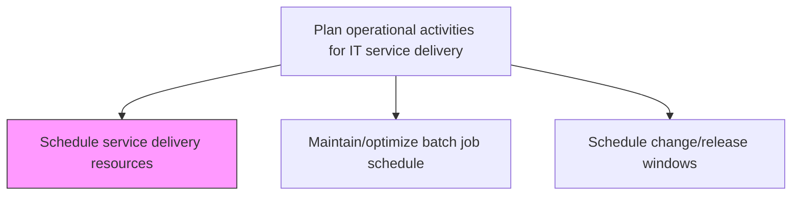
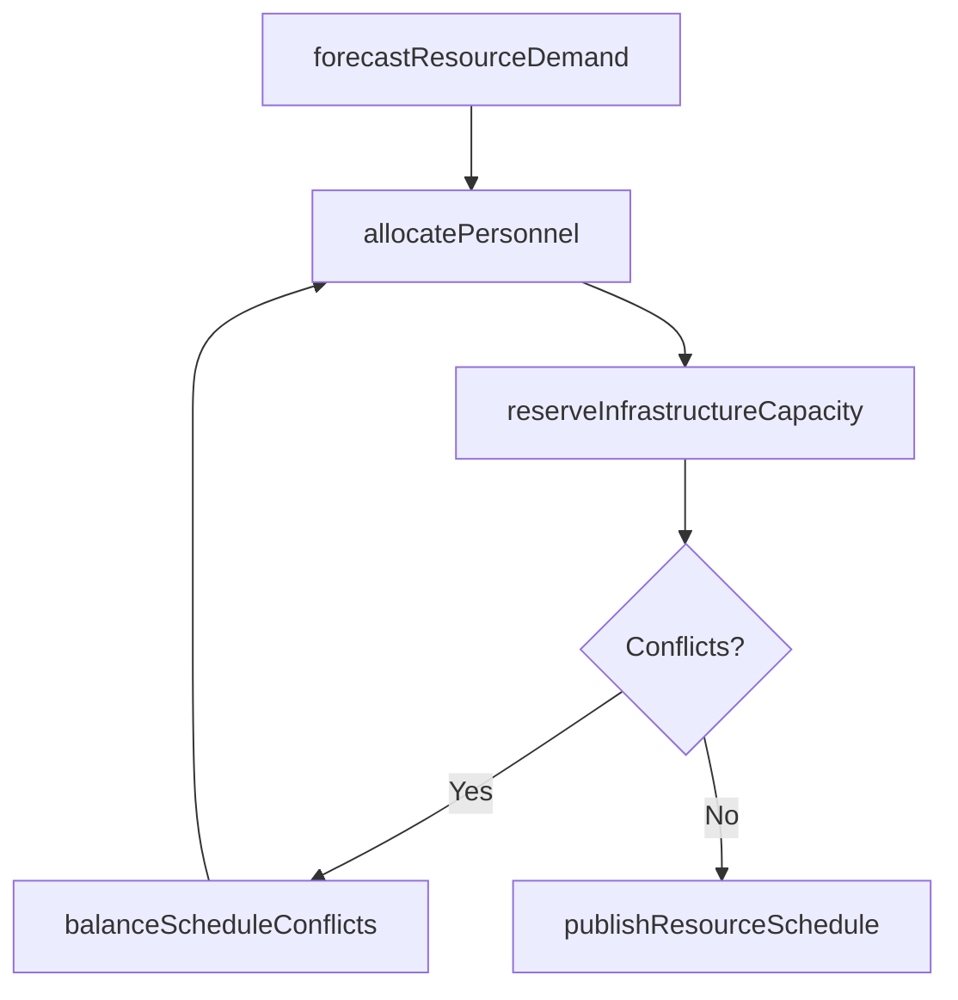

# Schedule service delivery resources

> Business-as-Code definition for scheduling and allocating service delivery resources including personnel, infrastructure capacity, and tools to meet planned IT service demand across operational periods.

## Overview

Scheduling resources to provide service delivery to IT users. Ensure design, development, deployment, and operations are aligned with the business objectives.

## Process Hierarchy



## GraphDL

```yaml
schedule:
  object: Service Delivery Resources
  actor: ResourceScheduler
  result: ResourceSchedule
```

## Actions

| Action | Description |
|--------|-------------|
| forecastResourceDemand | Project resource needs based on service demand patterns and planned activities |
| allocatePersonnel | Assign operations staff to shifts and on-call rotations based on demand forecasts |
| reserveInfrastructureCapacity | Pre-allocate compute, storage, and network capacity for planned workloads |
| balanceScheduleConflicts | Resolve scheduling conflicts between competing resource demands |
| publishResourceSchedule | Distribute the finalized resource schedule to all operational teams |

## Events

| Event | Description |
|-------|-------------|
| resourceDemandForecasted | Resource needs projected based on demand patterns |
| personnelAllocated | Staff assigned to shifts and on-call rotations |
| infrastructureCapacityReserved | Compute, storage, and network capacity pre-allocated |
| scheduleConflictsBalanced | Scheduling conflicts resolved between competing demands |
| resourceSchedulePublished | Finalized resource schedule distributed to teams |

## Searches

| Search | Description |
|--------|-------------|
| getResourceSchedule | Retrieve resource schedules filtered by date range, team, or resource type |
| getResourceAvailability | Check available resource capacity for a given time period |
| getScheduleConflicts | List unresolved scheduling conflicts requiring attention |

## Process Flow



## RACI Matrix

| Activity | Responsible | Accountable | Consulted | Informed |
|----------|-------------|-------------|-----------|----------|
| forecastResourceDemand | ResourceScheduler | ITOperationsManager | CapacityPlanner | ServiceDeliveryManager |
| allocatePersonnel | ResourceScheduler | ITOperationsManager | TeamLeads | HRDepartment |
| publishResourceSchedule | ResourceScheduler | ITOperationsManager | AllOperationsStaff | ServiceDeskManager |

## Related Processes

| Process | Relationship |
|---------|-------------|
| 8.7.3.1.5 Balance operational workloads across available infrastructure components | Related - workload balancing uses scheduled resources |
| 8.7.4.3 Determine ongoing IT infrastructure capabilities | Upstream - infrastructure capabilities constrain resource scheduling |
| 8.7.6.3 Manage service delivery workloads | Downstream - scheduled resources support workload management |

## Related Departments

| Department | Role |
|-----------|------|
| IT Operations | Manages resource scheduling and shift planning |
| Capacity Management | Provides demand forecasts and capacity data |
| Human Resources | Supports personnel allocation and shift compliance |

## Related Occupations

| Occupation | Involvement |
|-----------|-------------|
| Resource Scheduler | Plans and publishes operational resource schedules |
| Capacity Planner | Forecasts resource demand based on service patterns |
| Operations Manager | Approves schedules and resolves escalated conflicts |

## KPIs

| KPI | Description | Unit |
|-----|-------------|------|
| Schedule Adherence | Percentage of shifts and allocations delivered as scheduled | % |
| Resource Utilization Rate | Percentage of allocated resources actively utilized | % |
| Forecast Accuracy | Deviation between forecasted and actual resource demand | % |
| Conflict Resolution Time | Average time to resolve scheduling conflicts | Hours |

## Usage

```typescript
import { scheduleServiceDeliveryResources } from '@headlessly/schedule-service-delivery-resources'

const scheduler = scheduleServiceDeliveryResources()

// Get resource schedule
const schedule = await scheduler.getResourceSchedule({
  dateRange: { start: '2024-12-01', end: '2024-12-31' },
  team: 'infrastructure-ops'
})

// Check resource availability
const availability = await scheduler.getResourceAvailability({
  resourceType: 'compute',
  date: '2024-12-15'
})
```
