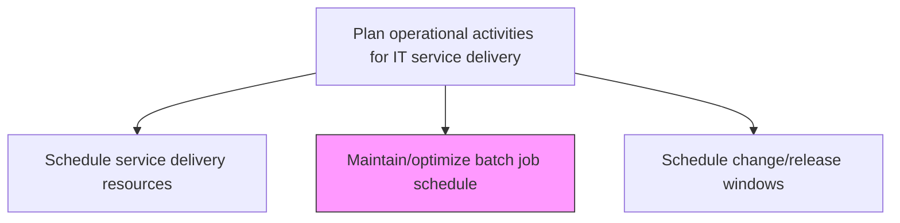
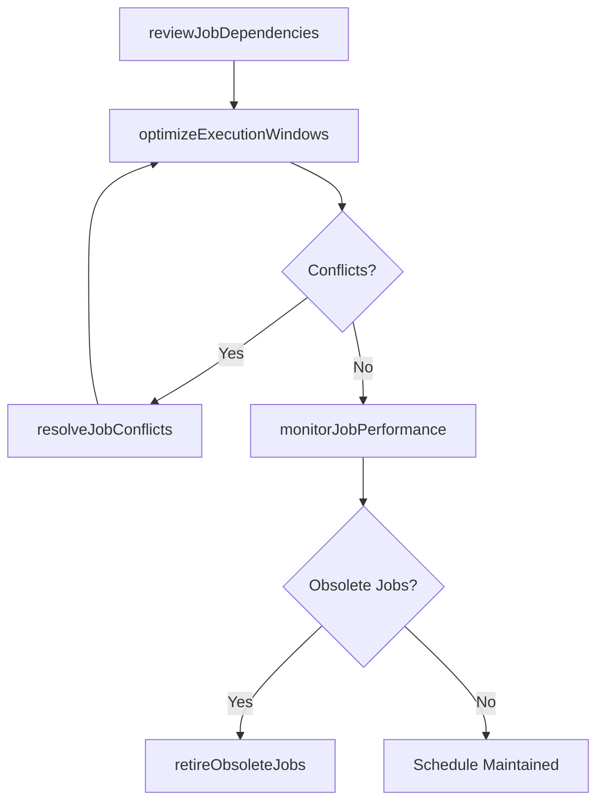

# Maintain/optimize batch job schedule

> Business-as-Code definition for maintaining and optimizing automated batch job schedules to ensure timely execution of recurring data processing, reporting, and system maintenance tasks with minimal resource contention.

## Overview

Maintaining and scheduling batch jobs to run in the background at a certain date and time.

## Process Hierarchy



## GraphDL

```yaml
maintain/optimize:
  object: Batch Job Schedule
  actor: BatchScheduleAdmin
  result: OptimizedBatchSchedule
```

## Actions

| Action | Description |
|--------|-------------|
| reviewJobDependencies | Map dependencies between batch jobs to identify sequencing requirements |
| optimizeExecutionWindows | Adjust job timing to minimize resource contention and maximize throughput |
| resolveJobConflicts | Identify and resolve conflicting job schedules that compete for shared resources |
| monitorJobPerformance | Track batch job execution times, success rates, and resource consumption |
| retireObsoleteJobs | Identify and decommission batch jobs that are no longer required |

## Events

| Event | Description |
|-------|-------------|
| jobDependenciesReviewed | Batch job dependency chains mapped and validated |
| executionWindowsOptimized | Job timing adjusted to reduce contention |
| jobConflictsResolved | Conflicting job schedules identified and remediated |
| jobPerformanceMonitored | Execution times, success rates, and resource usage tracked |
| obsoleteJobsRetired | Unnecessary batch jobs decommissioned |

## Searches

| Search | Description |
|--------|-------------|
| getBatchSchedule | Retrieve the batch job schedule filtered by time window, priority, or job group |
| getJobPerformanceHistory | Access historical execution metrics for specific batch jobs |
| getJobConflicts | List batch job scheduling conflicts and resource contention issues |

## Process Flow



## RACI Matrix

| Activity | Responsible | Accountable | Consulted | Informed |
|----------|-------------|-------------|-----------|----------|
| reviewJobDependencies | BatchScheduleAdmin | ITOperationsManager | ApplicationTeams | DatabaseAdmin |
| optimizeExecutionWindows | BatchScheduleAdmin | ITOperationsManager | CapacityPlanner | InfrastructureTeam |
| retireObsoleteJobs | BatchScheduleAdmin | ApplicationOwners | ChangeManager | ITOperationsManager |

## Related Processes

| Process | Relationship |
|---------|-------------|
| 8.7.3.1.1 Schedule service delivery resources | Upstream - resource schedules constrain batch job timing |
| 8.7.6.2 Run and monitor batch job schedule | Downstream - optimized schedule executed in operations |
| 8.7.6.4 Manage infrastructure performance and capacity | Related - batch jobs impact infrastructure capacity |

## Related Departments

| Department | Role |
|-----------|------|
| IT Operations | Manages batch job scheduling and optimization |
| Application Development | Defines job requirements and dependency chains |
| Database Administration | Provides data processing constraints and requirements |

## Related Occupations

| Occupation | Involvement |
|-----------|-------------|
| Batch Schedule Administrator | Maintains and optimizes the batch job schedule |
| Workload Automation Engineer | Configures automation tooling for batch execution |
| Application Support Analyst | Provides job dependency and timing requirements |

## KPIs

| KPI | Description | Unit |
|-----|-------------|------|
| Batch Job Success Rate | Percentage of batch jobs completing successfully on schedule | % |
| Schedule Optimization Savings | Reduction in total batch processing window after optimization | % |
| Job Contention Rate | Percentage of jobs experiencing resource contention delays | % |
| Obsolete Job Ratio | Percentage of scheduled jobs identified as no longer needed | % |

## Usage

```typescript
import { maintainOptimizeBatchJobSchedule } from '@headlessly/maintain-optimize-batch-job-schedule'

const batchSchedule = maintainOptimizeBatchJobSchedule()

// Get batch schedule
const schedule = await batchSchedule.getBatchSchedule({
  window: 'overnight',
  priority: 'critical'
})

// Get job performance history
const perf = await batchSchedule.getJobPerformanceHistory({
  jobId: 'nightly-etl-pipeline',
  period: 'last-30-days'
})
```
