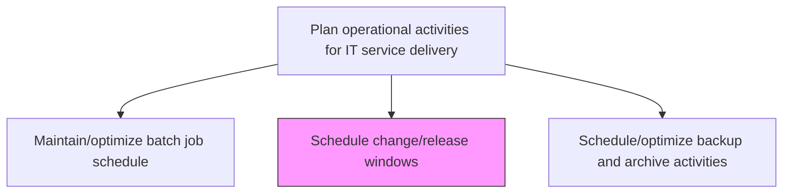
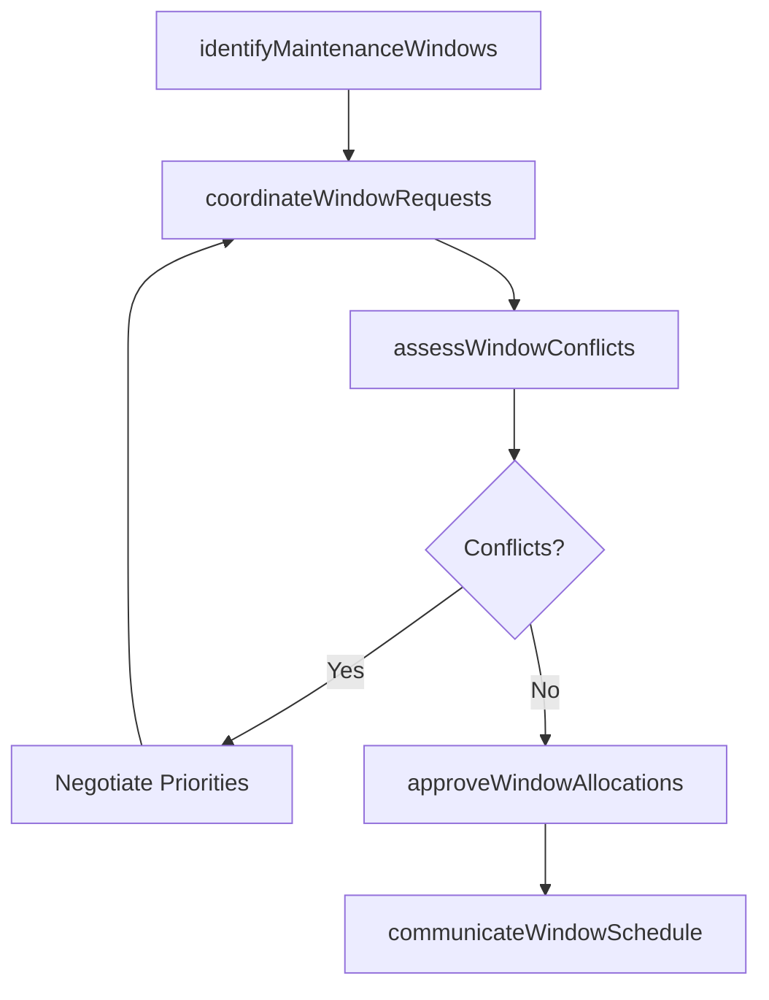

# Schedule change/release windows

> Business-as-Code definition for scheduling maintenance windows and change/release deployment slots that minimize service disruption while ensuring timely delivery of approved changes to production environments.

## Overview

Determine the timely change or release of IT services or support. Assign periodic release/change to IT systems or services.

## Process Hierarchy



## GraphDL

```yaml
schedule:
  object: Change/release Windows
  actor: ChangeWindowScheduler
  result: ChangeWindowCalendar
```

## Actions

| Action | Description |
|--------|-------------|
| identifyMaintenanceWindows | Determine available time slots for changes based on service usage patterns and SLAs |
| coordinateWindowRequests | Consolidate change window requests from multiple teams into a unified calendar |
| assessWindowConflicts | Evaluate scheduling conflicts between overlapping change requests and blackout periods |
| approveWindowAllocations | Finalize and approve change window assignments based on risk and priority |
| communicateWindowSchedule | Distribute the approved change window calendar to all stakeholders |

## Events

| Event | Description |
|-------|-------------|
| maintenanceWindowsIdentified | Available change deployment time slots determined |
| windowRequestsCoordinated | Change window requests consolidated into unified calendar |
| windowConflictsAssessed | Scheduling conflicts between change requests evaluated |
| windowAllocationsApproved | Change window assignments finalized and approved |
| windowScheduleCommunicated | Approved change window calendar distributed to stakeholders |

## Searches

| Search | Description |
|--------|-------------|
| getChangeWindows | Retrieve scheduled change windows filtered by date, environment, or team |
| getBlackoutPeriods | List blackout periods when changes are prohibited |
| getWindowUtilization | Get utilization metrics for allocated change windows |

## Process Flow



## RACI Matrix

| Activity | Responsible | Accountable | Consulted | Informed |
|----------|-------------|-------------|-----------|----------|
| identifyMaintenanceWindows | ChangeWindowScheduler | ChangeManager | ServiceLevelManager | BusinessUnitLeads |
| assessWindowConflicts | ChangeWindowScheduler | ChangeManager | ReleaseManagers | ITOperations |
| approveWindowAllocations | ChangeManager | ChangeAdvisoryBoard | ChangeWindowScheduler | ITDirector |

## Related Processes

| Process | Relationship |
|---------|-------------|
| 8.6.3.5 Create and communicate deployment schedule | Upstream - deployment schedule drives window requests |
| 8.7.3.1.1 Schedule service delivery resources | Related - resource scheduling aligns with change windows |
| 8.6.3.6 Approve change/release deployment | Related - approved changes require scheduled windows |

## Related Departments

| Department | Role |
|-----------|------|
| Change Management | Coordinates change window scheduling and approval |
| IT Operations | Manages maintenance window execution |
| Service Level Management | Ensures change windows comply with SLA commitments |

## Related Occupations

| Occupation | Involvement |
|-----------|-------------|
| Change Window Scheduler | Plans and coordinates change deployment windows |
| Change Manager | Approves window allocations and resolves conflicts |
| Service Level Manager | Validates windows against SLA requirements |

## KPIs

| KPI | Description | Unit |
|-----|-------------|------|
| Window Utilization Rate | Percentage of allocated change windows actually used | % |
| Change Window Adherence | Percentage of changes deployed within scheduled windows | % |
| Blackout Violation Rate | Number of unauthorized changes during blackout periods | Count |
| Window Conflict Rate | Percentage of window requests requiring conflict resolution | % |

## Usage

```typescript
import { scheduleChangeReleaseWindows } from '@headlessly/schedule-change-release-windows'

const changeWindows = scheduleChangeReleaseWindows()

// Get change windows
const windows = await changeWindows.getChangeWindows({
  environment: 'production',
  dateRange: { start: '2024-12-01', end: '2024-12-31' }
})

// Check blackout periods
const blackouts = await changeWindows.getBlackoutPeriods({
  environment: 'production',
  quarter: 'Q4-2024'
})
```
