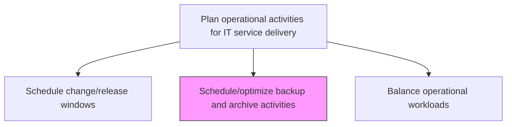
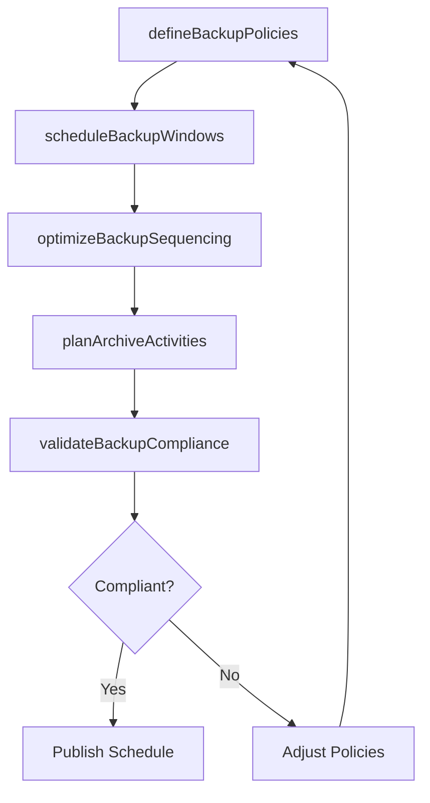

# Schedule/optimize backup and archive activities

> Business-as-Code definition for scheduling and optimizing backup and data archive activities to ensure data protection, regulatory compliance, and efficient use of storage resources across the IT environment.

## Overview

Schedule or optimize backup and archive activities for IT services and solutions. Use a backup system or application and archive operations data for future retrieval.

## Process Hierarchy



## GraphDL

```yaml
schedule/optimize:
  object: Backup And Archive Activities
  actor: BackupScheduleManager
  result: BackupArchiveSchedule
```

## Actions

| Action | Description |
|--------|-------------|
| defineBackupPolicies | Establish backup frequency, retention periods, and data classification rules |
| scheduleBackupWindows | Allocate time windows for backup operations minimizing impact on production workloads |
| optimizeBackupSequencing | Order backup jobs to prioritize critical data and reduce total backup duration |
| planArchiveActivities | Schedule data archival to cold storage based on retention policies and access patterns |
| validateBackupCompliance | Verify backup schedules meet regulatory and business continuity requirements |

## Events

| Event | Description |
|-------|-------------|
| backupPoliciesDefined | Backup frequency, retention, and classification rules established |
| backupWindowsScheduled | Backup time windows allocated with minimal production impact |
| backupSequencingOptimized | Backup jobs ordered for priority and efficiency |
| archiveActivitiesPlanned | Data archival schedules aligned with retention policies |
| backupComplianceValidated | Backup schedules verified against regulatory requirements |

## Searches

| Search | Description |
|--------|-------------|
| getBackupSchedule | Retrieve backup schedules filtered by system, data class, or time window |
| getArchiveSchedule | Access archive activity schedules with retention policy details |
| getBackupComplianceStatus | Get compliance status for backup policies against regulatory requirements |

## Process Flow



## RACI Matrix

| Activity | Responsible | Accountable | Consulted | Informed |
|----------|-------------|-------------|-----------|----------|
| defineBackupPolicies | BackupScheduleManager | DataProtectionOfficer | ComplianceTeam | StorageAdmin |
| scheduleBackupWindows | BackupScheduleManager | ITOperationsManager | InfrastructureTeam | DatabaseAdmin |
| validateBackupCompliance | ComplianceAnalyst | DataProtectionOfficer | BackupScheduleManager | AuditTeam |

## Related Processes

| Process | Relationship |
|---------|-------------|
| 8.7.6.8 Manage IT infrastructure data recovery | Downstream - backup schedules enable data recovery operations |
| 8.7.3.1.1 Schedule service delivery resources | Related - backup operations consume scheduled resources |
| 8.7.6.4 Manage infrastructure performance and capacity | Related - backup operations impact storage capacity |

## Related Departments

| Department | Role |
|-----------|------|
| IT Operations | Manages backup scheduling and execution |
| Data Protection | Defines backup policies and compliance requirements |
| Storage Management | Manages storage infrastructure for backups and archives |

## Related Occupations

| Occupation | Involvement |
|-----------|-------------|
| Backup Schedule Manager | Plans and optimizes backup and archive schedules |
| Storage Administrator | Manages backup storage infrastructure and capacity |
| Compliance Analyst | Validates backup compliance with regulations |

## KPIs

| KPI | Description | Unit |
|-----|-------------|------|
| Backup Success Rate | Percentage of scheduled backups completing successfully | % |
| Backup Window Efficiency | Percentage of backup window utilized for active operations | % |
| Regulatory Compliance Rate | Percentage of backup policies meeting regulatory requirements | % |
| Archive Timeliness | Percentage of data archived within scheduled timeframes | % |

## Usage

```typescript
import { scheduleOptimizeBackupAndArchiveActivities } from '@headlessly/schedule-optimize-backup-and-archive-activities'

const backupSchedule = scheduleOptimizeBackupAndArchiveActivities()

// Get backup schedule
const schedule = await backupSchedule.getBackupSchedule({
  system: 'production-database',
  dataClass: 'critical'
})

// Check compliance status
const compliance = await backupSchedule.getBackupComplianceStatus({
  regulation: 'GDPR',
  region: 'EU'
})
```
