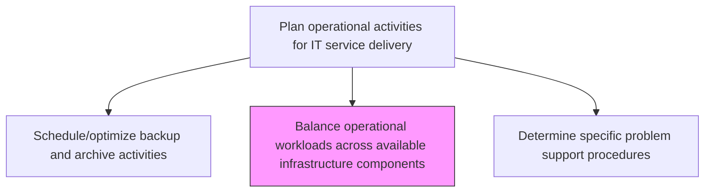
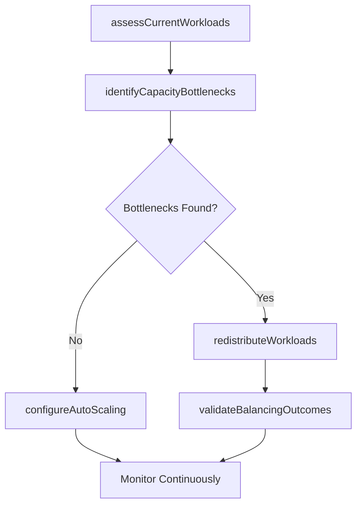

# Balance operational workloads across available infrastructure components

> Business-as-Code definition for distributing and balancing operational workloads across available infrastructure components to optimize resource utilization, maintain performance, and prevent capacity bottlenecks.

## Overview

Balancing workloads of all the processes and services that are provisioned to their internal or external clients, across available components of IT infrastructure. No component should be over or under utilized with the workflow of the IT operations.

## Process Hierarchy



## GraphDL

```yaml
balance:
  object: Operational Workloads Across Available Infrastructure Components
  actor: WorkloadBalancingEngineer
  result: WorkloadDistributionPlan
```

## Actions

| Action | Description |
|--------|-------------|
| assessCurrentWorkloads | Measure current workload distribution and resource utilization across infrastructure |
| identifyCapacityBottlenecks | Detect infrastructure components approaching or exceeding capacity thresholds |
| redistributeWorkloads | Move workloads between infrastructure components to balance utilization |
| configureAutoScaling | Set up automated scaling policies to handle demand fluctuations dynamically |
| validateBalancingOutcomes | Confirm workload redistribution achieved target utilization and performance levels |

## Events

| Event | Description |
|-------|-------------|
| currentWorkloadsAssessed | Workload distribution and utilization measured across infrastructure |
| capacityBottlenecksIdentified | Components approaching capacity thresholds detected |
| workloadsRedistributed | Workloads moved between components to balance utilization |
| autoScalingConfigured | Automated scaling policies set up for demand fluctuations |
| balancingOutcomesValidated | Redistribution confirmed to meet target performance levels |

## Searches

| Search | Description |
|--------|-------------|
| getWorkloadDistribution | Retrieve workload distribution across infrastructure components |
| getCapacityUtilization | Access utilization metrics for infrastructure components |
| getBottleneckAlerts | List active capacity bottleneck alerts by severity |

## Process Flow



## RACI Matrix

| Activity | Responsible | Accountable | Consulted | Informed |
|----------|-------------|-------------|-----------|----------|
| assessCurrentWorkloads | WorkloadBalancingEngineer | InfrastructureManager | CapacityPlanner | ITOperations |
| redistributeWorkloads | WorkloadBalancingEngineer | InfrastructureManager | ApplicationTeams | NetworkTeam |
| configureAutoScaling | WorkloadBalancingEngineer | CloudArchitect | SecurityTeam | FinanceTeam |

## Related Processes

| Process | Relationship |
|---------|-------------|
| 8.7.3.1.1 Schedule service delivery resources | Upstream - scheduled resources define available capacity for balancing |
| 8.7.6.4 Manage infrastructure performance and capacity | Related - performance management triggers workload rebalancing |
| 8.7.4.3 Determine ongoing IT infrastructure capabilities | Upstream - infrastructure capabilities define balancing options |

## Related Departments

| Department | Role |
|-----------|------|
| Infrastructure Engineering | Manages workload distribution and auto-scaling configuration |
| Capacity Management | Provides utilization data and capacity forecasts |
| Cloud Operations | Manages cloud-based workload balancing and scaling |

## Related Occupations

| Occupation | Involvement |
|-----------|-------------|
| Workload Balancing Engineer | Distributes workloads across infrastructure components |
| Capacity Planner | Forecasts demand and identifies bottleneck risks |
| Cloud Architect | Designs auto-scaling and load distribution strategies |

## KPIs

| KPI | Description | Unit |
|-----|-------------|------|
| Resource Utilization Balance | Standard deviation of utilization across components | % |
| Bottleneck Incident Rate | Number of capacity bottleneck events per month | Count/Month |
| Auto-Scaling Efficiency | Percentage of demand spikes handled by auto-scaling without manual intervention | % |
| Workload Migration Time | Average time to redistribute workloads between components | Minutes |

## Usage

```typescript
import { balanceOperationalWorkloadsAcrossAvailableInfrastructureComponents } from '@headlessly/balance-operational-workloads-across-available-infrastructure-components'

const workloadBalancer = balanceOperationalWorkloadsAcrossAvailableInfrastructureComponents()

// Get workload distribution
const distribution = await workloadBalancer.getWorkloadDistribution({
  cluster: 'production-east',
  metric: 'cpu-utilization'
})

// Get bottleneck alerts
const alerts = await workloadBalancer.getBottleneckAlerts({
  severity: 'critical',
  status: 'active'
})
```
