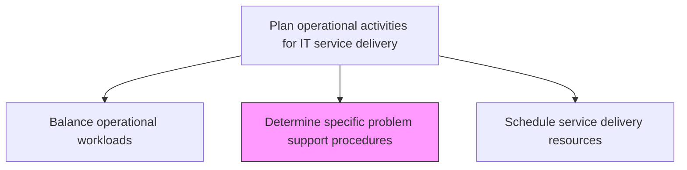
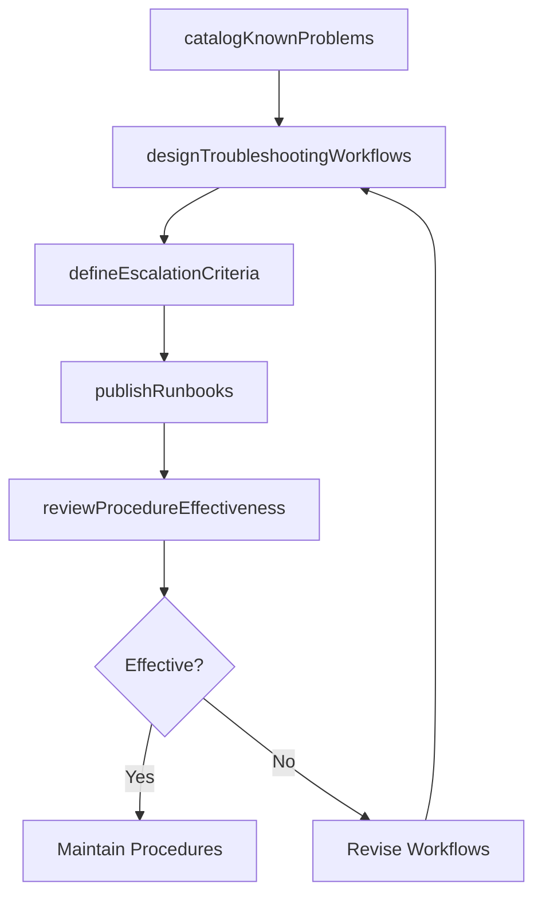

# Determine specific problem support procedures

> Business-as-Code definition for defining specific problem support procedures that guide operations teams through standardized troubleshooting workflows for known and recurring IT infrastructure issues.

## Overview

Determining process and procedure to provide support for specific IT service problems.

## Process Hierarchy



## GraphDL

```yaml
determine:
  object: Specific Problem Support Procedures
  actor: ProblemProcedureAnalyst
  result: ProblemSupportProcedure
```

## Actions

| Action | Description |
|--------|-------------|
| catalogKnownProblems | Document recurring IT problems with symptoms, root causes, and resolution steps |
| designTroubleshootingWorkflows | Create step-by-step diagnostic workflows for each known problem category |
| defineEscalationCriteria | Establish criteria for when support teams should escalate to specialist groups |
| publishRunbooks | Make standardized runbooks available to operations and support teams |
| reviewProcedureEffectiveness | Evaluate procedure usage and resolution success rates for continuous improvement |

## Events

| Event | Description |
|-------|-------------|
| knownProblemsCataloged | Recurring problems documented with symptoms and resolutions |
| troubleshootingWorkflowsDesigned | Step-by-step diagnostic workflows created |
| escalationCriteriaDefined | Escalation thresholds and criteria established |
| runbooksPublished | Standardized runbooks made available to teams |
| procedureEffectivenessReviewed | Procedure usage and success rates evaluated |

## Searches

| Search | Description |
|--------|-------------|
| getProblemProcedures | Retrieve problem support procedures filtered by category, symptom, or component |
| getRunbooks | Access published runbooks for specific problem types |
| getProcedureMetrics | Get effectiveness metrics for problem support procedures |

## Process Flow



## RACI Matrix

| Activity | Responsible | Accountable | Consulted | Informed |
|----------|-------------|-------------|-----------|----------|
| catalogKnownProblems | ProblemProcedureAnalyst | ProblemManager | TierLeads | ServiceDeskManager |
| designTroubleshootingWorkflows | ProblemProcedureAnalyst | ProblemManager | SubjectMatterExperts | QATeam |
| publishRunbooks | ProblemProcedureAnalyst | ProblemManager | KnowledgeManager | AllSupportStaff |

## Related Processes

| Process | Relationship |
|---------|-------------|
| 8.7.5.3 Maintain service support knowledge repository | Related - procedures stored in knowledge repository |
| 8.7.5.5 Define IT escalation mechanisms | Related - escalation criteria align with escalation mechanisms |
| 8.7.8.4 Resolve IT issues/requests | Downstream - procedures used during issue resolution |

## Related Departments

| Department | Role |
|-----------|------|
| Problem Management | Develops and maintains problem support procedures |
| IT Operations | Executes procedures during incident and problem resolution |
| Knowledge Management | Publishes and maintains runbook documentation |

## Related Occupations

| Occupation | Involvement |
|-----------|-------------|
| Problem Procedure Analyst | Designs troubleshooting workflows and runbooks |
| Problem Manager | Oversees problem procedure development and effectiveness |
| Knowledge Manager | Manages publication and accessibility of runbooks |

## KPIs

| KPI | Description | Unit |
|-----|-------------|------|
| Procedure Coverage | Percentage of recurring problems with documented procedures | % |
| Runbook Usage Rate | Percentage of incidents where runbooks were consulted | % |
| First-Time Resolution Rate | Percentage of issues resolved using procedures without escalation | % |
| Procedure Update Frequency | Average time between procedure reviews and updates | Days |

## Usage

```typescript
import { determineSpecificProblemSupportProcedures } from '@headlessly/determine-specific-problem-support-procedures'

const procedures = determineSpecificProblemSupportProcedures()

// Get problem procedures
const procs = await procedures.getProblemProcedures({
  category: 'network-connectivity',
  component: 'firewall'
})

// Get runbooks
const runbooks = await procedures.getRunbooks({
  type: 'troubleshooting',
  status: 'published'
})
```
