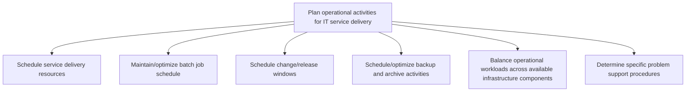
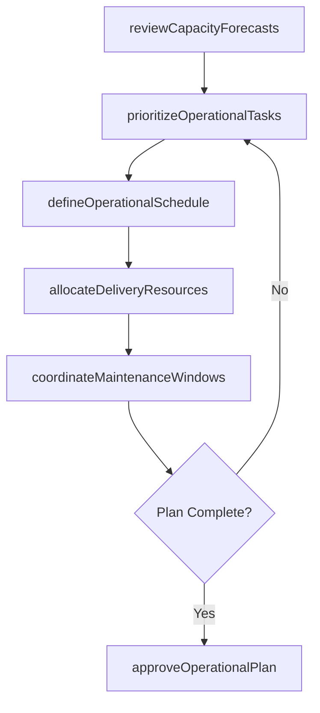

# Plan operational activities for IT service delivery

> Business-as-Code definition for orchestrating the scheduling, resource allocation, and procedural planning required to deliver reliable IT services across the operational environment.

## Overview

Planning different delivery services for operational activities within the IT function. Use service delivery systems to manage the IT service delivery services.

## Process Hierarchy



## GraphDL

```yaml
plan:
  object: Operational Activities For IT Service Delivery
  actor: ITOperationsPlanner
  result: OperationalActivityPlan
```

## Actions

| Action | Description |
|--------|-------------|
| defineOperationalSchedule | Establish the master schedule for all recurring IT operational activities |
| allocateDeliveryResources | Assign personnel, infrastructure, and tooling to planned service delivery tasks |
| prioritizeOperationalTasks | Rank operational activities by business criticality and SLA requirements |
| coordinateMaintenanceWindows | Align planned maintenance periods across dependent services and teams |
| reviewCapacityForecasts | Analyze projected workload demands against available operational capacity |
| approveOperationalPlan | Formally approve the consolidated operational activity plan for execution |

## Events

| Event | Description |
|-------|-------------|
| operationalScheduleDefined | Master operational schedule established and published |
| deliveryResourcesAllocated | Resources assigned to planned service delivery activities |
| operationalTasksPrioritized | Operational activities ranked and sequenced by priority |
| maintenanceWindowsCoordinated | Maintenance periods aligned across all dependent services |
| capacityForecastsReviewed | Workload projections analyzed against available capacity |
| operationalPlanApproved | Consolidated operational plan formally approved for execution |

## Searches

| Search | Description |
|--------|-------------|
| findOperationalActivities | List planned operational activities filtered by service, date range, or priority |
| getResourceAllocation | Retrieve current resource assignments for a given operational period |
| getCapacityForecast | Get projected capacity utilization for upcoming operational windows |
| findMaintenanceWindows | List scheduled maintenance windows filtered by service or infrastructure tier |

## Process Flow



## RACI Matrix

| Activity | Responsible | Accountable | Consulted | Informed |
|----------|-------------|-------------|-----------|----------|
| defineOperationalSchedule | ITOperationsPlanner | ITOperationsManager | ServiceDeliveryLeads | ApplicationTeams |
| allocateDeliveryResources | ITOperationsPlanner | ITOperationsManager | HRResourceManager | FinanceTeam |
| prioritizeOperationalTasks | ServiceDeliveryLead | ITOperationsManager | BusinessRelationshipManagers | EndUsers |
| coordinateMaintenanceWindows | ITOperationsPlanner | ITOperationsManager | ChangeManager | ServiceDeskManager |

## Sub-Processes

| ID | Name | Description |
|----|------|-------------|
| 8.7.3.1.1 | Schedule service delivery resources | Scheduling resources to provide service delivery to IT users. Ensure design, development, deployment |
| 8.7.3.1.2 | Maintain/optimize batch job schedule | Maintaining and scheduling batch jobs to run in the background at a certain date and time. |
| 8.7.3.1.3 | Schedule change/release windows | Determine the timely change or release of IT services or support. Assign periodic release/change to  |
| 8.7.3.1.4 | Schedule/optimize backup and archive activities | Schedule or optimize backup and archive activities for IT services and solutions. Use a backup syste |
| 8.7.3.1.5 | Balance operational workloads across available infrastructure components | Balancing workloads of all the processes and services that are provisioned to their internal or exte |
| 8.7.3.1.6 | Determine specific problem support procedures | Determining process and procedure to provide support for specific IT service problems. |

## Related Processes

| Process | Relationship |
|---------|-------------|
| 8.7.4 Develop and manage infrastructure resource planning | Upstream - infrastructure capacity informs operational planning |
| 8.7.6 Develop and manage service delivery operations | Downstream - operational plans drive daily delivery execution |
| 8.7.5 Define service support planning | Parallel - support planning aligns with operational scheduling |

## Related Departments

| Department | Role |
|-----------|------|
| IT Operations | Primary owner of operational activity planning |
| Infrastructure Services | Provides capacity and availability data for planning |
| Service Delivery Management | Coordinates SLA-aligned scheduling priorities |
| Change Management | Aligns change windows with operational schedules |

## Related Occupations

| Occupation | Involvement |
|-----------|-------------|
| IT Operations Planner | Primary executor of operational scheduling and resource allocation |
| Service Delivery Manager | Ensures plans meet SLA commitments |
| Capacity Planner | Provides workload forecasts and capacity analysis |

## KPIs

| KPI | Description | Unit |
|-----|-------------|------|
| Schedule Adherence | Percentage of operational activities executed on schedule | % |
| Resource Utilization | Ratio of allocated resources to available capacity | % |
| Plan Approval Cycle Time | Average time from plan draft to formal approval | Days |
| Unplanned Work Ratio | Percentage of operational effort consumed by unplanned activities | % |

## Usage

```typescript
import { planOperationalActivitiesForItServiceDelivery } from '@headlessly/plan-operational-activities-for-it-service-delivery'

const planner = planOperationalActivitiesForItServiceDelivery()

// Review capacity forecasts for the next quarter
const forecast = await planner.getCapacityForecast({
  period: 'Q2-2025',
  infrastructureTier: 'production'
})

// Find scheduled maintenance windows
const windows = await planner.findMaintenanceWindows({
  service: 'core-banking-platform',
  dateRange: { start: '2025-04-01', end: '2025-06-30' }
})
```
