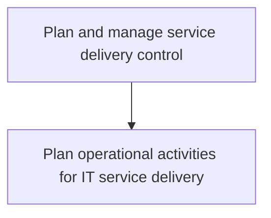
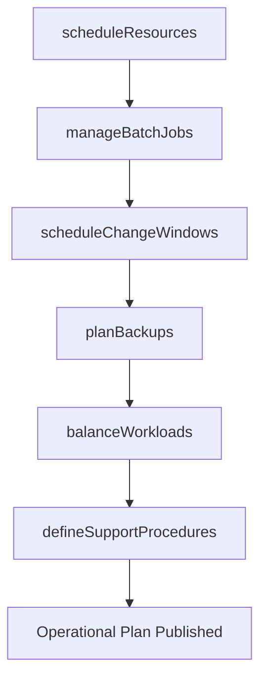

# Plan and manage service delivery control

> Business-as-Code definition for planning and managing IT service delivery control, including operational activity scheduling, resource allocation, batch job management, change windows, backup planning, and workload balancing.

## Overview

Determine and manage service delivery flow across different business functions. Understand the level of services needed by different stakeholders. Identify major service delivery touch points and criticality associated. Ensure timely communication with users.

## Process Hierarchy



## GraphDL

```yaml
plan:
  object: Service Delivery Control
  actor: OperationsPlanner
  result: OperationalSchedule
```

## Actions

| Action | Description |
|--------|-------------|
| scheduleResources | Allocate personnel and infrastructure for service delivery operations |
| manageBatchJobs | Maintain and optimize batch job schedules for automated processing |
| scheduleChangeWindows | Define maintenance windows for changes and releases |
| planBackups | Schedule and optimize backup and archive activities |
| balanceWorkloads | Distribute operational workloads across available infrastructure |
| defineSupportProcedures | Establish procedures for handling specific problem types |

## Events

| Event | Description |
|-------|-------------|
| resourcesScheduled | Service delivery resources allocated and scheduled |
| batchJobsManaged | Batch job schedule optimized and updated |
| changeWindowsScheduled | Maintenance windows defined and communicated |
| backupsPlanned | Backup and archive schedule established |
| workloadsBalanced | Operational workloads distributed across infrastructure |
| supportProceduresDefined | Problem-specific support procedures documented |

## Searches

| Search | Description |
|--------|-------------|
| getOperationalSchedule | Retrieve the current operational activity schedule |
| getBatchJobStatus | List batch jobs by status, schedule, or priority |
| getChangeWindows | Get scheduled maintenance windows and their allocations |
| getWorkloadDistribution | View current workload distribution across infrastructure |

## Process Flow



## RACI Matrix

| Activity | Responsible | Accountable | Consulted | Informed |
|----------|-------------|-------------|-----------|----------|
| scheduleResources | OperationsPlanner | OperationsManager | ServiceOwners | ServiceDesk |
| manageBatchJobs | BatchScheduler | OperationsManager | DevelopmentTeam | InfrastructureTeam |
| balanceWorkloads | CapacityPlanner | OperationsManager | InfrastructureTeam | Finance |
| defineSupportProcedures | OperationsPlanner | OperationsManager | TechnicalLeads | SupportStaff |

## Sub-Processes

| ID | Name | Description |
|----|------|-------------|
| 8.7.3.1 | Plan operational activities for IT service delivery | Planning different delivery services for operational activities within the IT function. Use service  |

## Related Processes

| Process | Relationship |
|---------|-------------|
| 8.7.1 Define and establish service delivery strategy | Upstream - delivery strategy governs control planning |
| 8.7.6 Develop and manage service delivery operations | Downstream - operational plans guide day-to-day operations |
| 8.7.4 Develop and manage infrastructure resource planning | Parallel - infrastructure capacity informs workload balancing |

## Related Departments

| Department | Role |
|-----------|------|
| IT Operations | Executes scheduled operational activities |
| Infrastructure Engineering | Provides capacity data for workload balancing |
| Database Administration | Manages batch job schedules and backup operations |

## Related Occupations

| Occupation | Involvement |
|-----------|-------------|
| Operations Planner | Schedules resources and defines operational activities |
| Batch Scheduler | Maintains and optimizes batch job schedules |
| Capacity Planner | Balances workloads across infrastructure |

## KPIs

| KPI | Description | Unit |
|-----|-------------|------|
| Schedule Adherence | Percentage of operational activities executed on schedule | % |
| Batch Job Success Rate | Percentage of batch jobs completing without errors | % |
| Backup Completion Rate | Percentage of backups completing within the scheduled window | % |
| Workload Utilization | Average infrastructure utilization during peak hours | % |

## Usage

```typescript
import { planAndManageServiceDeliveryControl } from '@headlessly/plan-and-manage-service-delivery-control'

const control = planAndManageServiceDeliveryControl()

// Schedule resources for the week
const schedule = await control.scheduleResources({
  period: '2025-07-14/2025-07-20',
  teams: ['operations', 'database-admin'],
  coverageRequired: '24x7'
})

// Balance workloads across infrastructure
await control.balanceWorkloads({
  strategy: 'round-robin',
  thresholds: { cpu: 0.75, memory: 0.80, disk: 0.85 }
})

// Get batch job status
const jobs = await control.getBatchJobStatus({
  status: 'failed',
  since: '2025-07-14'
})
```
