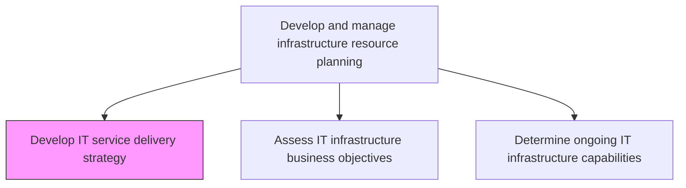
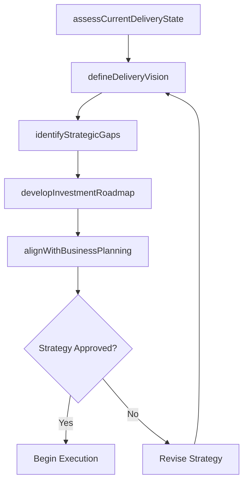

# Develop IT service delivery strategy

> Business-as-Code definition for developing the comprehensive IT service delivery strategy that defines how infrastructure resources are planned, provisioned, and managed to meet current and future business demands.

## Overview

Creating a strategy for delivering IT services and solutions. Establish the sourcing strategy. Establish the delivery process procedures and tools. Examine and choose the most effective methodologies and tools.

## Process Hierarchy



## GraphDL

```yaml
develop:
  object: IT Service Delivery Strategy
  actor: InfrastructureStrategist
  result: ServiceDeliveryStrategyPlan
```

## Actions

| Action | Description |
|--------|-------------|
| assessCurrentDeliveryState | Evaluate the current state of IT service delivery infrastructure and performance |
| defineDeliveryVision | Articulate the target state vision for IT service delivery aligned with business goals |
| identifyStrategicGaps | Analyze gaps between current capabilities and target delivery state |
| developInvestmentRoadmap | Create a phased investment plan for infrastructure improvements |
| alignWithBusinessPlanning | Synchronize infrastructure strategy with enterprise business planning cycles |

## Events

| Event | Description |
|-------|-------------|
| currentDeliveryStateAssessed | Current infrastructure delivery state and performance evaluated |
| deliveryVisionDefined | Target state vision for service delivery articulated |
| strategicGapsIdentified | Gaps between current and target delivery capabilities analyzed |
| investmentRoadmapDeveloped | Phased infrastructure investment plan created |
| businessPlanningAligned | Infrastructure strategy synchronized with business planning |

## Searches

| Search | Description |
|--------|-------------|
| getDeliveryStrategy | Retrieve the current IT service delivery strategy document and roadmap |
| getStrategicGaps | List identified gaps between current and target delivery state |
| getInvestmentRoadmap | Access the phased infrastructure investment plan |

## Process Flow



## RACI Matrix

| Activity | Responsible | Accountable | Consulted | Informed |
|----------|-------------|-------------|-----------|----------|
| assessCurrentDeliveryState | InfrastructureStrategist | CIO | ITOperationsManager | EnterpriseArchitect |
| developInvestmentRoadmap | InfrastructureStrategist | CIO | ITFinanceManager | ProcurementManager |
| alignWithBusinessPlanning | InfrastructureStrategist | CIO | BusinessPlanningTeam | CFO |

## Related Processes

| Process | Relationship |
|---------|-------------|
| 8.7.4.2 Assess IT infrastructure business objectives | Downstream - strategy guides infrastructure objectives assessment |
| 8.7.1.1 Assess business objectives and IT service delivery | Upstream - business alignment informs delivery strategy |
| 8.7.4.4 Plan IT infrastructure change | Downstream - strategy drives infrastructure change planning |

## Related Departments

| Department | Role |
|-----------|------|
| IT Strategy | Develops infrastructure delivery strategy and investment roadmaps |
| IT Finance | Provides financial planning and budget allocation for investments |
| Enterprise Architecture | Ensures strategy aligns with enterprise technology direction |

## Related Occupations

| Occupation | Involvement |
|-----------|-------------|
| Infrastructure Strategist | Develops IT service delivery strategy and roadmaps |
| Enterprise Architect | Validates strategy alignment with enterprise architecture |
| IT Finance Manager | Plans investment budgets for infrastructure initiatives |

## KPIs

| KPI | Description | Unit |
|-----|-------------|------|
| Strategy Execution Rate | Percentage of strategic initiatives completed on schedule | % |
| Investment ROI | Return on investment for infrastructure improvements | % |
| Business Alignment Score | Score measuring infrastructure strategy alignment with business goals | Score (1-10) |

## Usage

```typescript
import { developItServiceDeliveryStrategy } from '@headlessly/develop-it-service-delivery-strategy'

const strategy = developItServiceDeliveryStrategy()

// Get delivery strategy
const plan = await strategy.getDeliveryStrategy({
  version: 'current',
  section: 'investment-roadmap'
})

// Get strategic gaps
const gaps = await strategy.getStrategicGaps({
  priority: 'high',
  domain: 'cloud-infrastructure'
})
```
