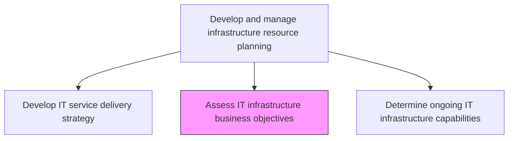
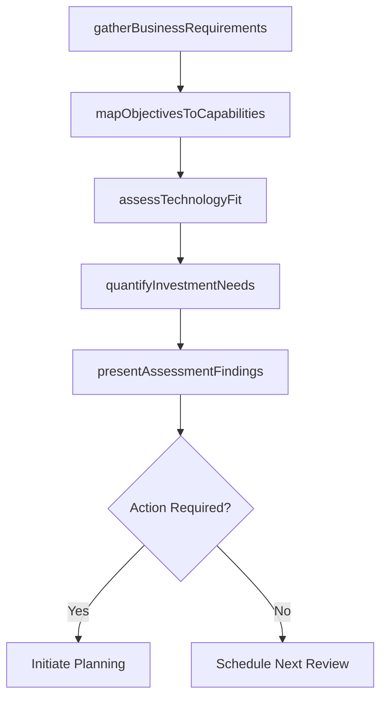

# Assess IT infrastructure business objectives

> Business-as-Code definition for assessing how IT infrastructure capabilities align with business objectives, ensuring technology investments support organizational priorities and growth targets.

## Overview

Assessing the goals and objectives of IT infrastructure and how it contributes to the overall business objectives.

## Process Hierarchy



## GraphDL

```yaml
assess:
  object: IT Infrastructure Business Objectives
  actor: InfrastructureBusinessAnalyst
  result: InfrastructureObjectivesAssessment
```

## Actions

| Action | Description |
|--------|-------------|
| gatherBusinessRequirements | Collect infrastructure-related requirements from business units and stakeholders |
| mapObjectivesToCapabilities | Align business objectives with specific infrastructure capabilities needed |
| assessTechnologyFit | Evaluate whether current technology stack supports stated business objectives |
| quantifyInvestmentNeeds | Estimate investment required to close infrastructure-business alignment gaps |
| presentAssessmentFindings | Deliver assessment results and recommendations to leadership |

## Events

| Event | Description |
|-------|-------------|
| businessRequirementsGathered | Infrastructure requirements collected from business stakeholders |
| objectivesMappedToCapabilities | Business objectives aligned with infrastructure capabilities |
| technologyFitAssessed | Current technology stack evaluated against business objectives |
| investmentNeedsQuantified | Investment estimates prepared for alignment gap closure |
| assessmentFindingsPresented | Assessment results delivered to leadership |

## Searches

| Search | Description |
|--------|-------------|
| getBusinessRequirements | Retrieve infrastructure requirements gathered from business units |
| getObjectiveAlignmentMap | Access mapping between business objectives and infrastructure capabilities |
| getInvestmentEstimates | Get investment estimates for infrastructure improvements by objective |

## Process Flow



## RACI Matrix

| Activity | Responsible | Accountable | Consulted | Informed |
|----------|-------------|-------------|-----------|----------|
| gatherBusinessRequirements | InfrastructureBusinessAnalyst | InfrastructureManager | BusinessUnitLeads | CIO |
| assessTechnologyFit | InfrastructureBusinessAnalyst | EnterpriseArchitect | InfrastructureTeam | SecurityTeam |
| presentAssessmentFindings | InfrastructureBusinessAnalyst | CIO | InfrastructureManager | ExecutiveTeam |

## Related Processes

| Process | Relationship |
|---------|-------------|
| 8.7.4.1 Develop IT service delivery strategy | Upstream - strategy provides context for objectives assessment |
| 8.7.4.3 Determine ongoing IT infrastructure capabilities | Downstream - objectives assessment feeds capabilities review |
| 8.7.4.4 Plan IT infrastructure change | Downstream - assessment findings drive change planning |

## Related Departments

| Department | Role |
|-----------|------|
| IT Planning | Conducts infrastructure-business alignment assessments |
| Enterprise Architecture | Evaluates technology fit against business objectives |
| IT Finance | Quantifies investment needs for infrastructure improvements |

## Related Occupations

| Occupation | Involvement |
|-----------|-------------|
| Infrastructure Business Analyst | Gathers requirements and assesses alignment |
| Enterprise Architect | Evaluates technology stack fitness for objectives |
| IT Planning Manager | Coordinates assessment activities and presents findings |

## KPIs

| KPI | Description | Unit |
|-----|-------------|------|
| Objective Coverage | Percentage of business objectives with supporting infrastructure capabilities | % |
| Technology Fit Score | Score measuring how well current infrastructure supports objectives | Score (1-10) |
| Assessment Cycle Time | Time to complete a full infrastructure-business alignment assessment | Weeks |

## Usage

```typescript
import { assessItInfrastructureBusinessObjectives } from '@headlessly/assess-it-infrastructure-business-objectives'

const infraAssessment = assessItInfrastructureBusinessObjectives()

// Get objective alignment map
const alignment = await infraAssessment.getObjectiveAlignmentMap({
  businessUnit: 'digital-commerce',
  status: 'gap-identified'
})

// Get investment estimates
const investment = await infraAssessment.getInvestmentEstimates({
  objective: 'cloud-migration',
  timeframe: 'FY2025'
})
```
