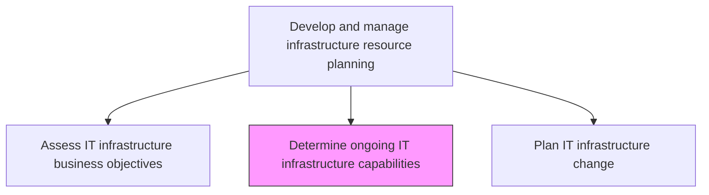
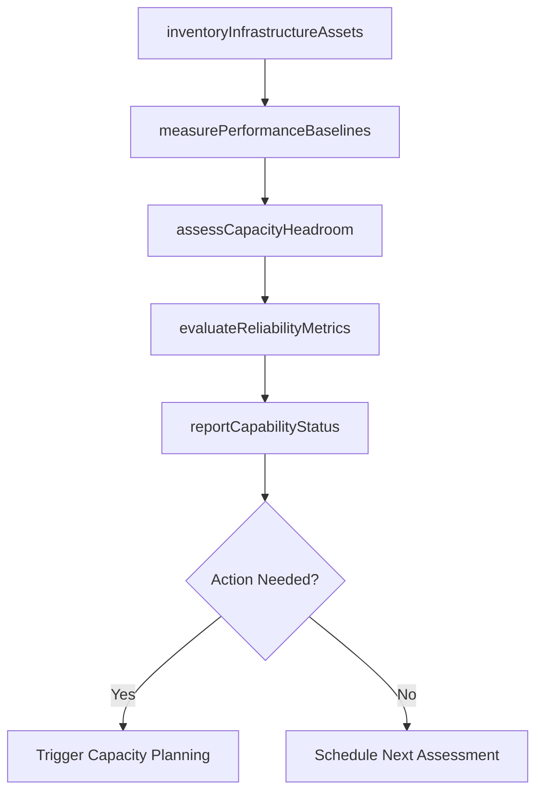

# Determine ongoing IT infrastructure capabilities

> Business-as-Code definition for assessing and documenting the ongoing capabilities of IT infrastructure, including capacity, performance, reliability, and security posture, to support infrastructure planning decisions.

## Overview

Determining existing IT infrastructure capabilities. Identify the gaps and needs in order to enhance the existing IT infrastructure to meet growth objectives.

## Process Hierarchy



## GraphDL

```yaml
determine:
  object: Ongoing IT Infrastructure Capabilities
  actor: InfrastructureCapabilityAnalyst
  result: InfrastructureCapabilityReport
```

## Actions

| Action | Description |
|--------|-------------|
| inventoryInfrastructureAssets | Catalog all hardware, software, and cloud resources with current specifications |
| measurePerformanceBaselines | Establish and track performance baselines for key infrastructure components |
| assessCapacityHeadroom | Calculate remaining capacity and projected time to exhaustion for each component |
| evaluateReliabilityMetrics | Analyze uptime, failover success, and mean time between failures |
| reportCapabilityStatus | Produce comprehensive capability reports for infrastructure planning teams |

## Events

| Event | Description |
|-------|-------------|
| infrastructureAssetsInventoried | Hardware, software, and cloud resources cataloged |
| performanceBaselinesMeasured | Performance baselines established and tracked |
| capacityHeadroomAssessed | Remaining capacity and exhaustion projections calculated |
| reliabilityMetricsEvaluated | Uptime and failover metrics analyzed |
| capabilityStatusReported | Comprehensive capability reports produced |

## Searches

| Search | Description |
|--------|-------------|
| getInfrastructureInventory | Retrieve infrastructure asset inventory filtered by type, location, or age |
| getPerformanceBaselines | Access performance baseline data for infrastructure components |
| getCapacityProjections | Get capacity headroom and exhaustion projections by component |

## Process Flow



## RACI Matrix

| Activity | Responsible | Accountable | Consulted | Informed |
|----------|-------------|-------------|-----------|----------|
| inventoryInfrastructureAssets | InfrastructureCapabilityAnalyst | InfrastructureManager | AssetManager | CloudArchitect |
| assessCapacityHeadroom | InfrastructureCapabilityAnalyst | CapacityPlanner | InfrastructureTeam | ITFinanceManager |
| reportCapabilityStatus | InfrastructureCapabilityAnalyst | InfrastructureManager | CIO | ITOperationsManager |

## Related Processes

| Process | Relationship |
|---------|-------------|
| 8.7.4.2 Assess IT infrastructure business objectives | Upstream - business objectives define capability assessment scope |
| 8.7.4.4 Plan IT infrastructure change | Downstream - capability reports inform change planning |
| 8.7.7.4 Maintain IT asset records | Related - asset records provide inventory data |

## Related Departments

| Department | Role |
|-----------|------|
| Infrastructure Engineering | Assesses infrastructure capabilities and performance |
| Capacity Management | Projects capacity needs and identifies headroom issues |
| Asset Management | Provides infrastructure inventory and lifecycle data |

## Related Occupations

| Occupation | Involvement |
|-----------|-------------|
| Infrastructure Capability Analyst | Assesses and reports on infrastructure capabilities |
| Capacity Planner | Projects capacity utilization and exhaustion timelines |
| Asset Manager | Maintains infrastructure inventory and specifications |

## KPIs

| KPI | Description | Unit |
|-----|-------------|------|
| Inventory Accuracy | Percentage of infrastructure assets accurately documented | % |
| Capacity Headroom | Average remaining capacity across critical infrastructure components | % |
| Infrastructure Reliability | Average uptime across all infrastructure components | % |
| Assessment Frequency | Number of capability assessments completed per year | Count/Year |

## Usage

```typescript
import { determineOngoingItInfrastructureCapabilities } from '@headlessly/determine-ongoing-it-infrastructure-capabilities'

const capabilities = determineOngoingItInfrastructureCapabilities()

// Get infrastructure inventory
const assets = await capabilities.getInfrastructureInventory({
  type: 'compute',
  location: 'us-east-1'
})

// Get capacity projections
const projections = await capabilities.getCapacityProjections({
  component: 'storage-cluster-primary',
  horizon: '12-months'
})
```
