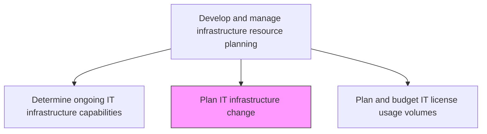
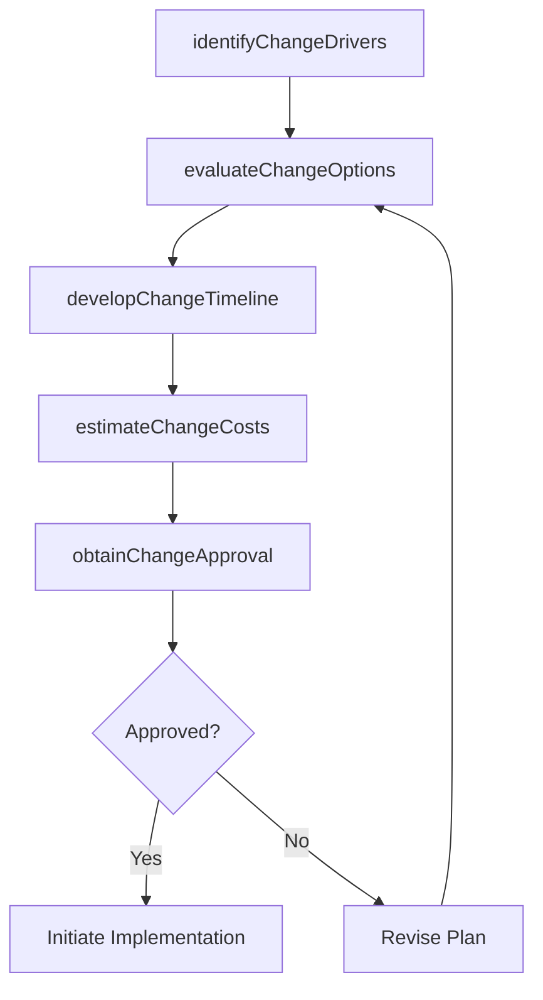

# Plan IT infrastructure change

> Business-as-Code definition for planning IT infrastructure changes including upgrades, expansions, migrations, and decommissions to maintain and improve the technology environment that supports business services.

## Overview

Identify the gaps and needs of existing IT infrastructure. Plan and develop strategies to upgrade/replace existing IT infrastructure.

## Process Hierarchy



## GraphDL

```yaml
plan:
  object: IT Infrastructure Change
  actor: InfrastructureChangePlanner
  result: InfrastructureChangePlan
```

## Actions

| Action | Description |
|--------|-------------|
| identifyChangeDrivers | Document business, technical, and compliance factors driving infrastructure change |
| evaluateChangeOptions | Assess upgrade, migration, replacement, and decommission options for each change |
| developChangeTimeline | Create a phased implementation timeline with milestones and dependencies |
| estimateChangeCosts | Calculate total cost of ownership including acquisition, migration, and operations |
| obtainChangeApproval | Present change plans to governance bodies for review and approval |

## Events

| Event | Description |
|-------|-------------|
| changeDriversIdentified | Business, technical, and compliance change drivers documented |
| changeOptionsEvaluated | Infrastructure change options assessed and compared |
| changeTimelineDeveloped | Phased implementation timeline created |
| changeCostsEstimated | Total cost of ownership calculated for proposed changes |
| changeApprovalObtained | Change plans reviewed and approved by governance |

## Searches

| Search | Description |
|--------|-------------|
| getInfrastructureChangePlans | Retrieve infrastructure change plans filtered by status, type, or timeline |
| getChangeDrivers | List documented change drivers by category or priority |
| getChangeCostEstimates | Access cost estimates for planned infrastructure changes |

## Process Flow



## RACI Matrix

| Activity | Responsible | Accountable | Consulted | Informed |
|----------|-------------|-------------|-----------|----------|
| identifyChangeDrivers | InfrastructureChangePlanner | InfrastructureManager | BusinessAnalysts | ComplianceTeam |
| evaluateChangeOptions | InfrastructureChangePlanner | EnterpriseArchitect | VendorManagement | SecurityTeam |
| obtainChangeApproval | InfrastructureChangePlanner | CIO | ITGovernance | FinanceDirector |

## Related Processes

| Process | Relationship |
|---------|-------------|
| 8.7.4.3 Determine ongoing IT infrastructure capabilities | Upstream - capability assessment identifies change needs |
| 8.7.7.3 Install/configure/upgrade infrastructure components | Downstream - change plans drive component installations |
| 8.7.4.5 Plan and budget IT license usage volumes | Related - infrastructure changes affect license requirements |

## Related Departments

| Department | Role |
|-----------|------|
| Infrastructure Planning | Develops and manages infrastructure change plans |
| Enterprise Architecture | Validates change options against architectural standards |
| IT Finance | Provides cost estimates and budget approvals for changes |

## Related Occupations

| Occupation | Involvement |
|-----------|-------------|
| Infrastructure Change Planner | Plans and coordinates infrastructure changes |
| Enterprise Architect | Evaluates change options against technology direction |
| IT Financial Analyst | Estimates costs and calculates ROI for changes |

## KPIs

| KPI | Description | Unit |
|-----|-------------|------|
| Change Plan Approval Rate | Percentage of change plans approved on first submission | % |
| Change Execution Timeliness | Percentage of changes implemented within planned timelines | % |
| Cost Estimate Accuracy | Deviation between estimated and actual change costs | % |
| Change Backlog Age | Average age of pending infrastructure change requests | Days |

## Usage

```typescript
import { planItInfrastructureChange } from '@headlessly/plan-it-infrastructure-change'

const changePlanner = planItInfrastructureChange()

// Get infrastructure change plans
const plans = await changePlanner.getInfrastructureChangePlans({
  status: 'approved',
  type: 'migration'
})

// Get change cost estimates
const costs = await changePlanner.getChangeCostEstimates({
  planId: 'infra-cloud-migration-2025',
  breakdown: 'category'
})
```
