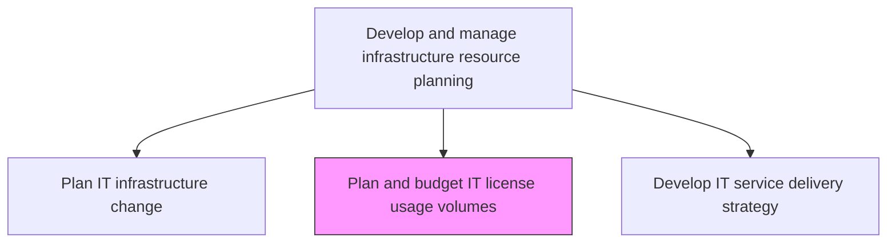
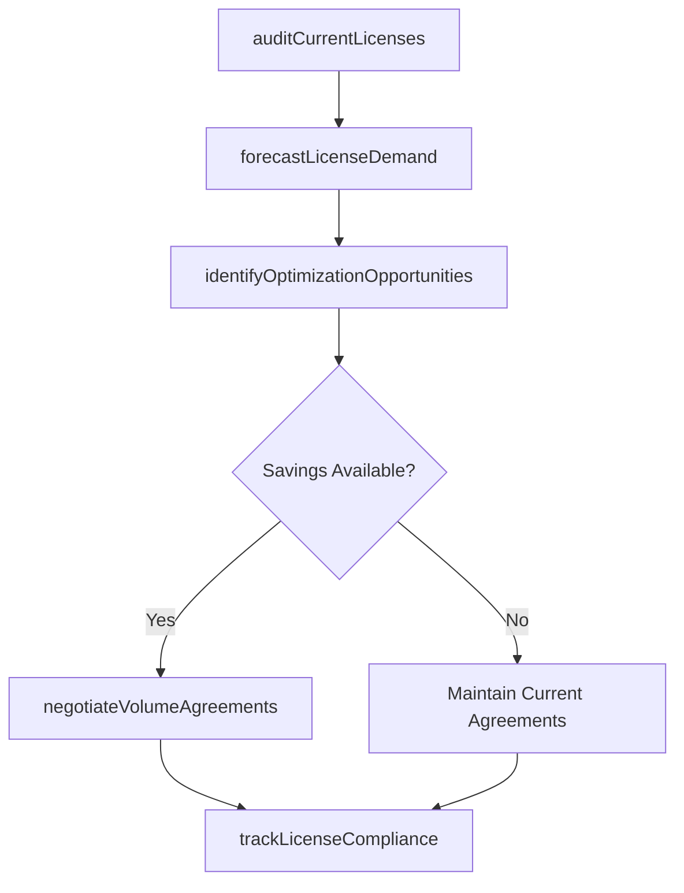

# Plan and budget IT license usage volumes

> Business-as-Code definition for planning and budgeting IT software license usage volumes, ensuring adequate license coverage while minimizing costs through optimization of license types, quantities, and agreements.

## Overview

Creating a plan associated with usage volumes of IT licenses. Develop a framework to govern the licensing of an IT services along with identified usage volumes. Determine the amount of investment in IT license usage volumes and how would the license volumes be financed.

## Process Hierarchy



## GraphDL

```yaml
plan:
  object: And Budget IT License Usage Volumes
  actor: LicenseManager
  result: LicenseUsagePlan
```

## Actions

| Action | Description |
|--------|-------------|
| auditCurrentLicenses | Inventory all active software licenses with usage data and entitlement details |
| forecastLicenseDemand | Project future license needs based on headcount, project plans, and growth targets |
| identifyOptimizationOpportunities | Find over-licensed, under-utilized, or redundant licenses for optimization |
| negotiateVolumeAgreements | Negotiate enterprise licensing agreements based on consolidated demand forecasts |
| trackLicenseCompliance | Monitor license usage against entitlements to prevent compliance violations |

## Events

| Event | Description |
|-------|-------------|
| currentLicensesAudited | Active software licenses inventoried with usage data |
| licenseDemandForecasted | Future license needs projected based on growth factors |
| optimizationOpportunitiesIdentified | Over-licensed and under-utilized licenses flagged |
| volumeAgreementsNegotiated | Enterprise licensing agreements established |
| licenseComplianceTracked | License usage monitored against entitlements |

## Searches

| Search | Description |
|--------|-------------|
| getLicenseInventory | Retrieve active licenses filtered by vendor, product, or license type |
| getLicenseUsageMetrics | Access usage data showing actual versus entitled license consumption |
| getComplianceStatus | Get license compliance status highlighting over or under usage |

## Process Flow



## RACI Matrix

| Activity | Responsible | Accountable | Consulted | Informed |
|----------|-------------|-------------|-----------|----------|
| auditCurrentLicenses | LicenseManager | ITAssetManager | ProcurementTeam | ComplianceTeam |
| forecastLicenseDemand | LicenseManager | ITFinanceManager | BusinessPlanningTeam | HRDepartment |
| negotiateVolumeAgreements | ProcurementManager | LicenseManager | LegalTeam | VendorManagement |

## Related Processes

| Process | Relationship |
|---------|-------------|
| 8.7.7.5 Administer IT licenses/user agreements | Downstream - plans guide license administration activities |
| 8.7.4.4 Plan IT infrastructure change | Related - infrastructure changes affect license requirements |
| 8.7.7.4 Maintain IT asset records | Related - asset records include license data |

## Related Departments

| Department | Role |
|-----------|------|
| IT Asset Management | Manages software license inventory and compliance |
| Procurement | Negotiates license agreements and manages vendor relationships |
| IT Finance | Budgets for license costs and tracks spending |

## Related Occupations

| Occupation | Involvement |
|-----------|-------------|
| License Manager | Plans license usage and identifies optimization opportunities |
| Procurement Manager | Negotiates volume agreements with software vendors |
| IT Asset Analyst | Audits license inventories and tracks compliance |

## KPIs

| KPI | Description | Unit |
|-----|-------------|------|
| License Utilization Rate | Percentage of purchased licenses actively in use | % |
| License Cost per User | Average software license cost per end user | Cost/User |
| Compliance Violation Count | Number of license compliance violations detected | Count |
| License Optimization Savings | Annual cost savings from license optimization activities | Currency |

## Usage

```typescript
import { planAndBudgetItLicenseUsageVolumes } from '@headlessly/plan-and-budget-it-license-usage-volumes'

const licenseManager = planAndBudgetItLicenseUsageVolumes()

// Get license inventory
const licenses = await licenseManager.getLicenseInventory({
  vendor: 'microsoft',
  type: 'enterprise-agreement'
})

// Get compliance status
const compliance = await licenseManager.getComplianceStatus({
  product: 'office-365',
  status: 'over-deployed'
})
```
