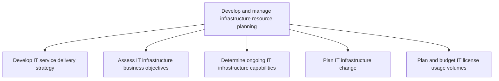
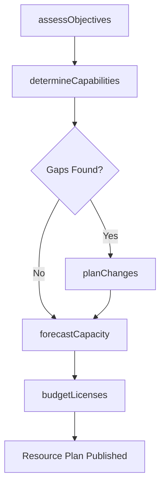

# Develop and manage infrastructure resource planning

> Business-as-Code definition for planning and managing IT infrastructure resources, including delivery strategy development, business objective assessment, capability determination, infrastructure change planning, and license budget management.

## Overview

Developing and managing the resources required for administration of infrastructure. Manage the IT inventory and assets to meet organization's IT resource capacity.

## Process Hierarchy



## GraphDL

```yaml
develop:
  object: Infrastructure Resource Planning
  actor: InfrastructurePlanner
  result: InfrastructureResourcePlan
```

## Actions

| Action | Description |
|--------|-------------|
| assessObjectives | Evaluate business objectives for IT infrastructure alignment |
| determineCapabilities | Assess existing infrastructure capabilities and identify gaps |
| planChanges | Develop plans to upgrade, replace, or expand infrastructure |
| budgetLicenses | Forecast and budget software license usage volumes |
| forecastCapacity | Project future infrastructure capacity requirements |

## Events

| Event | Description |
|-------|-------------|
| objectivesAssessed | Business objectives evaluated for infrastructure alignment |
| capabilitiesDetermined | Existing infrastructure capabilities assessed with gap analysis |
| changesPlanned | Infrastructure change plans developed and approved |
| licensesBudgeted | License usage volumes forecasted and budgets allocated |
| capacityForecasted | Future infrastructure capacity projections completed |

## Searches

| Search | Description |
|--------|-------------|
| getCapabilityAssessment | Retrieve the current infrastructure capability assessment |
| getInfrastructurePlan | Get the infrastructure change and upgrade roadmap |
| getLicenseBudget | Retrieve license usage forecasts and budget allocations |
| getCapacityForecast | Get infrastructure capacity projections by resource type |

## Process Flow



## RACI Matrix

| Activity | Responsible | Accountable | Consulted | Informed |
|----------|-------------|-------------|-----------|----------|
| assessObjectives | InfrastructurePlanner | VP IT Operations | BusinessUnitLeads | Finance |
| determineCapabilities | InfrastructureEngineer | InfrastructurePlanner | CapacityPlanner | OperationsTeam |
| planChanges | InfrastructurePlanner | VP IT Operations | EnterpriseArchitect | Procurement |
| budgetLicenses | ITFinancialAnalyst | InfrastructurePlanner | VendorManagement | Finance |

## Sub-Processes

| ID | Name | Description |
|----|------|-------------|
| 8.7.4.1 | Develop IT service delivery strategy | Creating a strategy for delivering IT services and solutions. Establish the sourcing strategy. Estab |
| 8.7.4.2 | Assess IT infrastructure business objectives | Assessing the goals and objectives of IT infrastructure and how it contributes to the overall busine |
| 8.7.4.3 | Determine ongoing IT infrastructure capabilities | Determining existing IT infrastructure capabilities. Identify the gaps and needs in order to enhance |
| 8.7.4.4 | Plan IT infrastructure change | Identify the gaps and needs of existing IT infrastructure. Plan and develop strategies to upgrade/re |
| 8.7.4.5 | Plan and budget IT license usage volumes | Creating a plan associated with usage volumes of IT licenses. Develop a framework to govern the lice |

## Related Processes

| Process | Relationship |
|---------|-------------|
| 8.7.7 Manage infrastructure resource administration | Downstream - resource plan guides administration activities |
| 8.7.6 Develop and manage service delivery operations | Parallel - operations depend on infrastructure capacity |
| 8.7.3 Plan and manage service delivery control | Parallel - infrastructure capacity informs delivery control |

## Related Departments

| Department | Role |
|-----------|------|
| Infrastructure Engineering | Assesses capabilities and plans infrastructure changes |
| IT Finance | Manages budgets for infrastructure and licenses |
| Procurement | Sources infrastructure hardware and software |
| Capacity Planning | Forecasts future infrastructure requirements |

## Related Occupations

| Occupation | Involvement |
|-----------|-------------|
| Infrastructure Planner | Develops and manages infrastructure resource plans |
| Capacity Planner | Forecasts future infrastructure capacity needs |
| IT Financial Analyst | Budgets license volumes and infrastructure spend |

## KPIs

| KPI | Description | Unit |
|-----|-------------|------|
| Infrastructure Utilization | Average utilization of deployed infrastructure resources | % |
| License Compliance Rate | Percentage of software deployments within licensed limits | % |
| Capacity Forecast Accuracy | Variance between forecasted and actual capacity needs | % |
| Infrastructure Change Plan Completion | Percentage of planned changes completed on schedule | % |

## Usage

```typescript
import { developAndManageInfrastructureResourcePlanning } from '@headlessly/develop-and-manage-infrastructure-resource-planning'

const infra = developAndManageInfrastructureResourcePlanning()

// Determine current infrastructure capabilities
const capabilities = await infra.determineCapabilities({
  scope: 'data-center-east',
  resources: ['compute', 'storage', 'network']
})

// Plan infrastructure changes
const plan = await infra.planChanges({
  gaps: capabilities.gaps,
  budget: 500000,
  timeline: '2025-H2'
})

// Budget licenses
await infra.budgetLicenses({
  fiscalYear: 2026,
  products: ['windows-server', 'sql-server', 'office-365'],
  growthRate: 0.1
})
```
