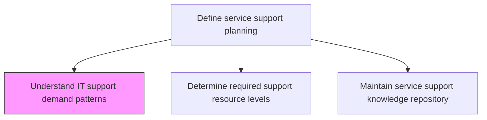
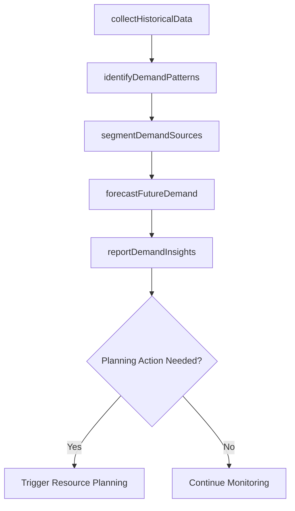

# Understand IT support demand patterns

> Business-as-Code definition for analyzing IT support demand patterns to understand ticket volumes, peak periods, common issue types, and seasonal trends that drive support resource planning and capacity decisions.

## Overview

Evaluate criticality catered by the IT support and expectations to resolve raised or identified issues. Determine the usual requests received for IT support for each area of IT operations. Ensure resolution to every identified or reported issue within specified SLAs.

## Process Hierarchy



## GraphDL

```yaml
understand:
  object: IT Support Demand Patterns
  actor: SupportDemandAnalyst
  result: DemandPatternAnalysis
```

## Actions

| Action | Description |
|--------|-------------|
| collectHistoricalData | Gather historical ticket volumes, resolution times, and category breakdowns |
| identifyDemandPatterns | Analyze trends including seasonal peaks, day-of-week patterns, and growth rates |
| segmentDemandSources | Break down demand by business unit, service, geography, and user segment |
| forecastFutureDemand | Project future support demand based on historical patterns and planned changes |
| reportDemandInsights | Present demand analysis findings to support planning and management teams |

## Events

| Event | Description |
|-------|-------------|
| historicalDataCollected | Historical ticket and resolution data gathered for analysis |
| demandPatternsIdentified | Seasonal, weekly, and growth trends analyzed |
| demandSourcesSegmented | Demand broken down by business unit, service, and geography |
| futureDemandForecasted | Future support demand projected from patterns and plans |
| demandInsightsReported | Demand analysis findings presented to management |

## Searches

| Search | Description |
|--------|-------------|
| getDemandPatterns | Retrieve demand pattern analysis filtered by period, service, or segment |
| getDemandForecast | Access future demand projections by service or time period |
| getDemandBySegment | Get demand breakdown by business unit, geography, or user group |

## Process Flow



## RACI Matrix

| Activity | Responsible | Accountable | Consulted | Informed |
|----------|-------------|-------------|-----------|----------|
| collectHistoricalData | SupportDemandAnalyst | ServiceDeskManager | ITOperations | DataAnalyticsTeam |
| forecastFutureDemand | SupportDemandAnalyst | ITServiceDirector | CapacityPlanner | ChangeManager |
| reportDemandInsights | SupportDemandAnalyst | ITServiceDirector | ServiceDeskManager | CIO |

## Related Processes

| Process | Relationship |
|---------|-------------|
| 8.7.5.2 Determine required support resource levels | Downstream - demand patterns drive resource level decisions |
| 8.7.5.10 Monitor IT service support performance | Related - performance data feeds demand analysis |
| 8.7.2.1 Assess business objectives and IT service support delivery | Upstream - business objectives contextualize demand patterns |

## Related Departments

| Department | Role |
|-----------|------|
| Service Desk | Provides ticket data and front-line demand observations |
| IT Analytics | Performs statistical analysis of demand patterns |
| IT Service Management | Uses demand insights for support planning |

## Related Occupations

| Occupation | Involvement |
|-----------|-------------|
| Support Demand Analyst | Analyzes demand patterns and produces forecasts |
| Data Analyst | Performs statistical modeling of support trends |
| Service Desk Manager | Provides operational demand context and validation |

## KPIs

| KPI | Description | Unit |
|-----|-------------|------|
| Forecast Accuracy | Deviation between forecasted and actual support demand | % |
| Demand Growth Rate | Year-over-year change in support ticket volume | % |
| Peak Demand Ratio | Ratio of peak period demand to average demand | Ratio |
| Demand Segmentation Coverage | Percentage of demand attributed to specific segments | % |

## Usage

```typescript
import { understandItSupportDemandPatterns } from '@headlessly/understand-it-support-demand-patterns'

const demandAnalysis = understandItSupportDemandPatterns()

// Get demand patterns
const patterns = await demandAnalysis.getDemandPatterns({
  period: 'last-12-months',
  service: 'email-support'
})

// Get demand forecast
const forecast = await demandAnalysis.getDemandForecast({
  horizon: '6-months',
  segment: 'north-america'
})
```
