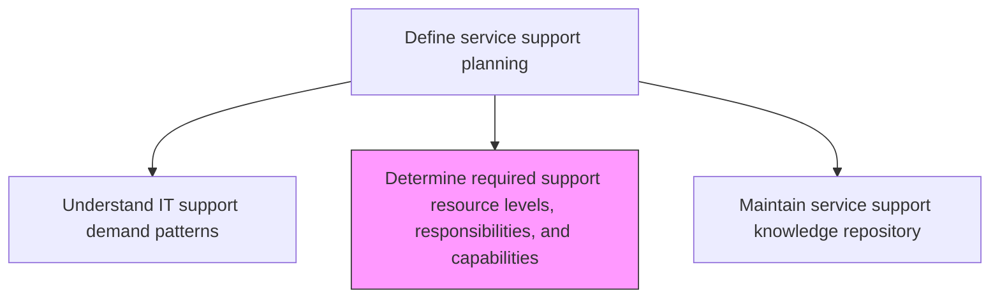
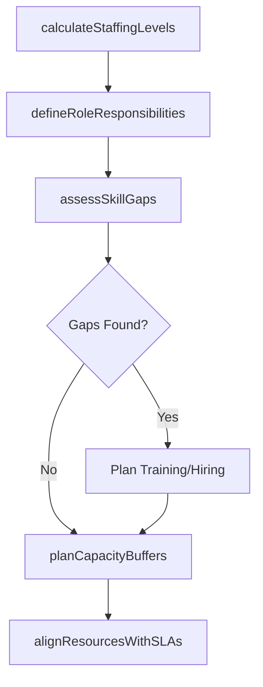

# Determine required support resource levels, responsibilities, and capabilities

> Business-as-Code definition for determining the required support resource levels, role responsibilities, and technical capabilities needed to meet IT service support demand and service level targets.

## Overview

Determining levels of required support resources along with their responsibilities, and capabilities to resolve IT issues. Evaluate and ensure that support resources are fulfilling their responsibilities n a timely manner.

## Process Hierarchy



## GraphDL

```yaml
determine:
  object: Required Support Resource Levels, Responsibilities, And Capabilities
  actor: SupportResourcePlanner
  result: SupportResourcePlan
```

## Actions

| Action | Description |
|--------|-------------|
| calculateStaffingLevels | Determine headcount requirements per tier based on demand forecasts and SLA targets |
| defineRoleResponsibilities | Document roles, responsibilities, and required competencies for each support position |
| assessSkillGaps | Identify gaps between current staff capabilities and required competencies |
| planCapacityBuffers | Determine contingency staffing levels for demand spikes and attrition |
| alignResourcesWithSLAs | Map resource allocations to ensure each service level target can be met |

## Events

| Event | Description |
|-------|-------------|
| staffingLevelsCalculated | Headcount requirements determined per support tier |
| roleResponsibilitiesDefined | Roles and competency requirements documented |
| skillGapsAssessed | Gaps between current and required capabilities identified |
| capacityBuffersPlanned | Contingency staffing levels determined |
| resourcesAlignedWithSLAs | Resource allocations mapped to service level targets |

## Searches

| Search | Description |
|--------|-------------|
| getResourcePlan | Retrieve support resource plans filtered by tier, skill, or role |
| getSkillGaps | List skill gaps by role or support tier |
| getStaffingLevels | Access current versus required staffing levels by team |

## Process Flow



## RACI Matrix

| Activity | Responsible | Accountable | Consulted | Informed |
|----------|-------------|-------------|-----------|----------|
| calculateStaffingLevels | SupportResourcePlanner | ServiceDeskDirector | SupportDemandAnalyst | HRDirector |
| assessSkillGaps | SupportResourcePlanner | ServiceDeskDirector | TrainingManager | TeamLeads |
| alignResourcesWithSLAs | SupportResourcePlanner | ServiceLevelManager | ServiceDeskDirector | CIO |

## Related Processes

| Process | Relationship |
|---------|-------------|
| 8.7.5.1 Understand IT support demand patterns | Upstream - demand patterns drive resource level calculations |
| 8.7.5.7 Manage IT service support resources | Downstream - resource plan guides ongoing resource management |
| 8.7.5.4 Maintain service support learning | Related - skill gaps inform training programs |

## Related Departments

| Department | Role |
|-----------|------|
| IT Service Management | Plans support resource levels and capabilities |
| Human Resources | Supports hiring plans and role definition |
| IT Training | Addresses identified skill gaps through training programs |

## Related Occupations

| Occupation | Involvement |
|-----------|-------------|
| Support Resource Planner | Calculates staffing needs and plans resource allocation |
| Service Level Manager | Validates resource plans against SLA targets |
| HR Business Partner | Supports hiring and role definition activities |

## KPIs

| KPI | Description | Unit |
|-----|-------------|------|
| Staffing Adequacy Rate | Percentage of shifts meeting target staffing levels | % |
| Skill Gap Closure Rate | Percentage of identified skill gaps addressed per quarter | % |
| Resource-SLA Alignment | Percentage of SLAs with adequate resource coverage | % |
| Attrition Rate | Annual support staff turnover rate | % |

## Usage

```typescript
import { determineRequiredSupportResourceLevelsResponsibilitiesAndCapabilities } from '@headlessly/determine-required-support-resource-levels-responsibilities-and-capabilities'

const resourcePlanner = determineRequiredSupportResourceLevelsResponsibilitiesAndCapabilities()

// Get resource plan
const plan = await resourcePlanner.getResourcePlan({
  tier: 'tier-2',
  quarter: 'Q1-2025'
})

// Get skill gaps
const gaps = await resourcePlanner.getSkillGaps({
  role: 'network-support-engineer',
  severity: 'critical'
})
```
