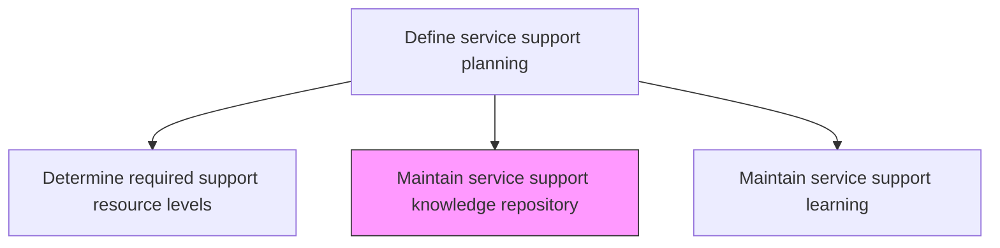
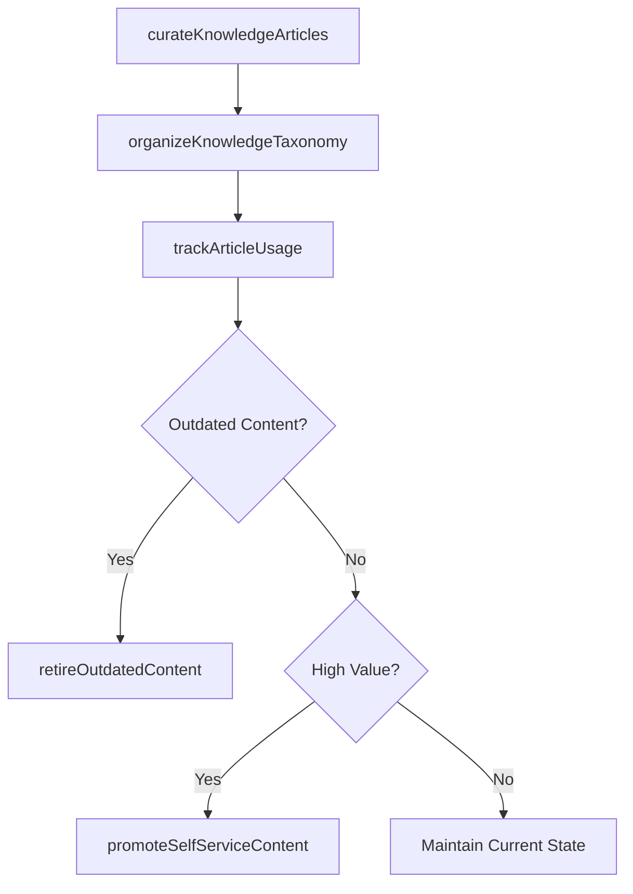

# Maintain service support knowledge repository

> Business-as-Code definition for maintaining the IT service support knowledge repository that contains solutions, workarounds, known errors, and troubleshooting guides used by support teams to resolve incidents efficiently.

## Overview

Create and maintain service support knowledge repository. Store, maintain, access, revise, and use knowledge for IT services. Review knowledge trends and implement knowledge transfer methodologies for competitive advantage.

## Process Hierarchy



## GraphDL

```yaml
maintain:
  object: Service Support Knowledge Repository
  actor: KnowledgeBaseManager
  result: KnowledgeRepositoryStatus
```

## Actions

| Action | Description |
|--------|-------------|
| curateKnowledgeArticles | Create, review, and approve knowledge articles for accuracy and completeness |
| organizeKnowledgeTaxonomy | Maintain the categorization structure for easy article discovery and navigation |
| retireOutdatedContent | Identify and archive articles that are no longer relevant or accurate |
| trackArticleUsage | Monitor which articles are accessed, rated, and linked to resolved incidents |
| promoteSelfServiceContent | Identify high-value articles for publication in self-service portals |

## Events

| Event | Description |
|-------|-------------|
| knowledgeArticlesCurated | Articles created, reviewed, and approved for publication |
| knowledgeTaxonomyOrganized | Categorization structure maintained for navigation |
| outdatedContentRetired | Irrelevant or inaccurate articles archived |
| articleUsageTracked | Article access, ratings, and incident linkages monitored |
| selfServiceContentPromoted | High-value articles published to self-service portals |

## Searches

| Search | Description |
|--------|-------------|
| searchKnowledgeBase | Search knowledge articles by keyword, category, or related service |
| getArticleMetrics | Access usage metrics including views, ratings, and linked resolutions |
| getStaleArticles | List articles flagged as outdated or requiring review |

## Process Flow



## RACI Matrix

| Activity | Responsible | Accountable | Consulted | Informed |
|----------|-------------|-------------|-----------|----------|
| curateKnowledgeArticles | KnowledgeBaseManager | KnowledgeDirector | SubjectMatterExperts | ServiceDeskTeam |
| organizeKnowledgeTaxonomy | KnowledgeBaseManager | KnowledgeDirector | InformationArchitect | SearchTeam |
| promoteSelfServiceContent | KnowledgeBaseManager | SelfServiceManager | CommunicationsTeam | ServiceDeskManager |

## Related Processes

| Process | Relationship |
|---------|-------------|
| 8.7.3.1.6 Determine specific problem support procedures | Upstream - problem procedures feed knowledge articles |
| 8.7.5.4 Maintain service support learning | Related - knowledge repository supports learning programs |
| 8.7.8.4 Resolve IT issues/requests | Downstream - knowledge articles used during issue resolution |

## Related Departments

| Department | Role |
|-----------|------|
| Knowledge Management | Maintains the knowledge repository and content quality |
| Service Desk | Creates and consumes knowledge articles during support |
| IT Communications | Publishes self-service content from the knowledge base |

## Related Occupations

| Occupation | Involvement |
|-----------|-------------|
| Knowledge Base Manager | Curates content and manages the knowledge repository |
| Knowledge Author | Creates and updates knowledge articles based on resolutions |
| Information Architect | Designs taxonomy and navigation structures |

## KPIs

| KPI | Description | Unit |
|-----|-------------|------|
| Knowledge Base Coverage | Percentage of common issues with published knowledge articles | % |
| Article Reuse Rate | Percentage of incidents resolved using knowledge articles | % |
| Content Freshness | Percentage of articles reviewed within their review cycle | % |
| Self-Service Deflection Rate | Percentage of user issues resolved via self-service knowledge | % |

## Usage

```typescript
import { maintainServiceSupportKnowledgeRepository } from '@headlessly/maintain-service-support-knowledge-repository'

const knowledgeBase = maintainServiceSupportKnowledgeRepository()

// Search knowledge base
const articles = await knowledgeBase.searchKnowledgeBase({
  keyword: 'VPN connection timeout',
  category: 'network'
})

// Get article metrics
const metrics = await knowledgeBase.getArticleMetrics({
  articleId: 'KB-20241103',
  period: 'last-90-days'
})
```
