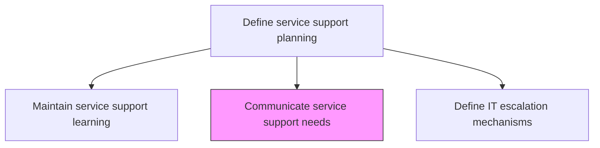
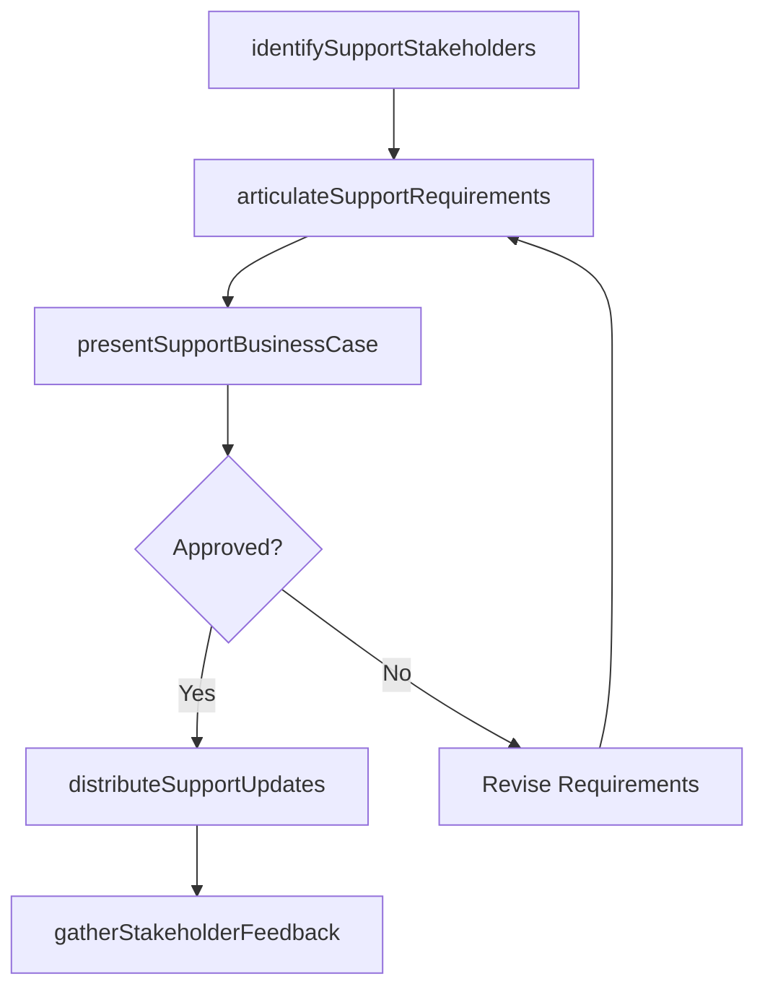

# Communicate service support needs

> Business-as-Code definition for communicating IT service support needs, requirements, and changes to stakeholders, ensuring alignment between support teams, business units, and management on support expectations.

## Overview

Conveying service support needs within the organization, with the objective of providing required support services. Define processes and procedures needed to support users of IT services and solutions. Convey these procedures to appropriate governing authority.

## Process Hierarchy



## GraphDL

```yaml
communicate:
  object: Service Support Needs
  actor: SupportCommunicationsLead
  result: SupportNeedsCommunication
```

## Actions

| Action | Description |
|--------|-------------|
| identifySupportStakeholders | Map stakeholder groups who need to understand support capabilities and limitations |
| articulateSupportRequirements | Document support resource needs, budget requirements, and capability gaps |
| presentSupportBusinessCase | Build and present business cases for support investments to leadership |
| distributeSupportUpdates | Communicate changes to support coverage, processes, or staffing to affected parties |
| gatherStakeholderFeedback | Collect feedback from stakeholders on support communication effectiveness |

## Events

| Event | Description |
|-------|-------------|
| supportStakeholdersIdentified | Stakeholder groups mapped for support communications |
| supportRequirementsArticulated | Resource needs and capability gaps documented |
| supportBusinessCasePresented | Business cases for support investments presented |
| supportUpdatesDistributed | Changes to support coverage communicated to stakeholders |
| stakeholderFeedbackGathered | Feedback on support communications collected |

## Searches

| Search | Description |
|--------|-------------|
| getSupportCommunications | Retrieve support communications filtered by audience, topic, or date |
| getStakeholderFeedback | Access stakeholder feedback on support needs and communications |
| getSupportRequirements | List documented support requirements and business cases |

## Process Flow



## RACI Matrix

| Activity | Responsible | Accountable | Consulted | Informed |
|----------|-------------|-------------|-----------|----------|
| articulateSupportRequirements | SupportCommunicationsLead | ServiceDeskDirector | ITFinanceManager | BusinessAnalysts |
| presentSupportBusinessCase | ServiceDeskDirector | CIO | SupportCommunicationsLead | FinanceDirector |
| distributeSupportUpdates | SupportCommunicationsLead | ServiceDeskDirector | CorporateCommunications | AllStakeholders |

## Related Processes

| Process | Relationship |
|---------|-------------|
| 8.7.5.2 Determine required support resource levels | Upstream - resource requirements feed communications |
| 8.7.2.1 Assess business objectives and IT service support delivery | Related - alignment assessment informs communications |
| 8.7.5.7 Manage IT service support resources | Related - resource changes trigger stakeholder communications |

## Related Departments

| Department | Role |
|-----------|------|
| IT Service Management | Articulates support needs and coordinates stakeholder communications |
| Corporate Communications | Provides communication channels and messaging standards |
| IT Finance | Supports business case development with cost data |

## Related Occupations

| Occupation | Involvement |
|-----------|-------------|
| Support Communications Lead | Coordinates support needs communications to stakeholders |
| IT Business Analyst | Documents requirements and builds business cases |
| Stakeholder Relations Manager | Manages feedback collection and stakeholder engagement |

## KPIs

| KPI | Description | Unit |
|-----|-------------|------|
| Communication Reach | Percentage of stakeholders receiving support needs updates | % |
| Business Case Approval Rate | Percentage of support investment business cases approved | % |
| Stakeholder Awareness Score | Stakeholder understanding of current support capabilities | Score (1-5) |

## Usage

```typescript
import { communicateServiceSupportNeeds } from '@headlessly/communicate-service-support-needs'

const supportComms = communicateServiceSupportNeeds()

// Get support communications
const comms = await supportComms.getSupportCommunications({
  audience: 'business-unit-leads',
  topic: 'resource-changes'
})

// Get stakeholder feedback
const feedback = await supportComms.getStakeholderFeedback({
  period: 'last-quarter',
  sentiment: 'negative'
})
```
