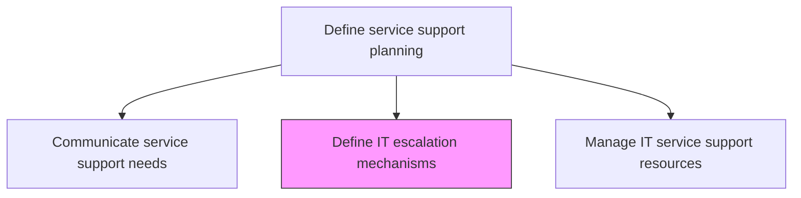
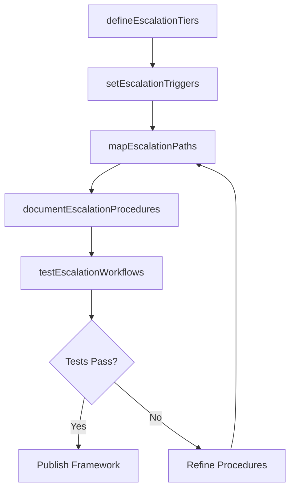

# Define IT escalation mechanisms

> Business-as-Code definition for defining IT escalation mechanisms that establish clear paths, criteria, and procedures for escalating incidents, problems, and requests to higher support tiers or specialist teams.

## Overview

Determining mechanisms to report for a higher degree of decision making depending on the criticality of IT escalations. Define the processes and procedures needed to follow for IT escalation at different levels. Convey the mechanisms within the organization.

## Process Hierarchy



## GraphDL

```yaml
define:
  object: IT Escalation Mechanisms
  actor: EscalationDesigner
  result: EscalationFramework
```

## Actions

| Action | Description |
|--------|-------------|
| defineEscalationTiers | Establish support tier hierarchy and the scope of responsibility at each level |
| setEscalationTriggers | Define criteria that automatically trigger escalation including time, severity, and impact |
| mapEscalationPaths | Create routing rules that direct escalations to the appropriate specialist teams |
| documentEscalationProcedures | Write step-by-step procedures for executing escalations at each tier |
| testEscalationWorkflows | Validate escalation mechanisms through simulated scenarios and tabletop exercises |

## Events

| Event | Description |
|-------|-------------|
| escalationTiersDefined | Support tier hierarchy and responsibilities established |
| escalationTriggersSet | Automatic escalation criteria configured |
| escalationPathsMapped | Routing rules to specialist teams created |
| escalationProceduresDocumented | Step-by-step escalation procedures written |
| escalationWorkflowsTested | Escalation mechanisms validated through simulations |

## Searches

| Search | Description |
|--------|-------------|
| getEscalationPaths | Retrieve escalation paths filtered by service, tier, or issue type |
| getEscalationTriggers | List configured escalation triggers with threshold values |
| getEscalationMetrics | Access escalation frequency and accuracy metrics by tier |

## Process Flow



## RACI Matrix

| Activity | Responsible | Accountable | Consulted | Informed |
|----------|-------------|-------------|-----------|----------|
| defineEscalationTiers | EscalationDesigner | ServiceDeskDirector | TierLeads | ITServiceDirector |
| mapEscalationPaths | EscalationDesigner | ServiceDeskDirector | SpecialistTeamLeads | IncidentManager |
| testEscalationWorkflows | EscalationDesigner | ServiceDeskDirector | QATeam | AllSupportTiers |

## Related Processes

| Process | Relationship |
|---------|-------------|
| 8.7.2.3 Create and maintain IT support model | Upstream - support model defines escalation requirements |
| 8.7.8.3 Escalate IT requests | Downstream - defined mechanisms used to escalate requests |
| 8.7.3.1.6 Determine specific problem support procedures | Related - escalation criteria embedded in support procedures |

## Related Departments

| Department | Role |
|-----------|------|
| IT Service Management | Designs and governs escalation mechanisms |
| Service Desk | Executes escalation procedures at tier-1 level |
| Specialist Support Teams | Receive escalated issues at higher tiers |

## Related Occupations

| Occupation | Involvement |
|-----------|-------------|
| Escalation Designer | Creates escalation paths and trigger criteria |
| Incident Manager | Oversees major incident escalation execution |
| Service Desk Team Lead | Executes tier-1 escalation decisions |

## KPIs

| KPI | Description | Unit |
|-----|-------------|------|
| Escalation Accuracy Rate | Percentage of escalations routed to correct team on first attempt | % |
| Escalation Response Time | Average time from escalation to acknowledgment by receiving team | Minutes |
| Unnecessary Escalation Rate | Percentage of escalations that could have been resolved at lower tier | % |
| Escalation Framework Coverage | Percentage of services with defined escalation paths | % |

## Usage

```typescript
import { defineItEscalationMechanisms } from '@headlessly/define-it-escalation-mechanisms'

const escalation = defineItEscalationMechanisms()

// Get escalation paths
const paths = await escalation.getEscalationPaths({
  service: 'network-connectivity',
  tier: 'tier-1-to-tier-2'
})

// Get escalation metrics
const metrics = await escalation.getEscalationMetrics({
  period: 'last-quarter',
  metric: 'accuracy'
})
```
