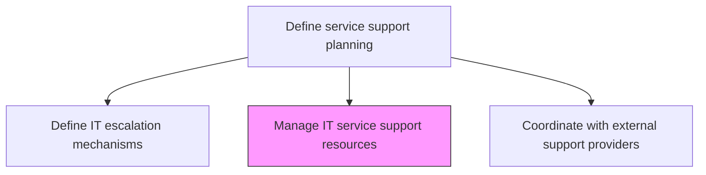
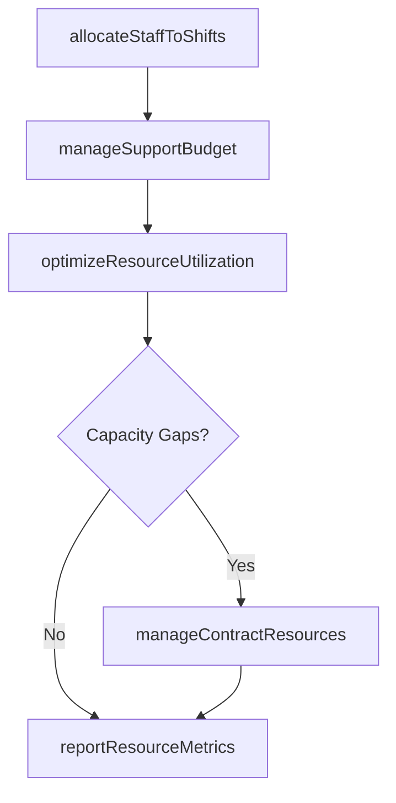

# Manage IT service support resources

> Business-as-Code definition for managing the allocation, scheduling, and optimization of IT service support resources including personnel, tools, and budget to meet operational demands and service level commitments.

## Overview

Managing resources required for administration of IT service support. Establish sources that will make use of e-mail, live support software online, or a tool where users can log a call or incident in order to retrieve IT support.

## Process Hierarchy



## GraphDL

```yaml
manage:
  object: IT Service Support Resources
  actor: SupportResourceManager
  result: ResourceManagementReport
```

## Actions

| Action | Description |
|--------|-------------|
| allocateStaffToShifts | Assign support staff to shifts and on-call rotations based on demand forecasts |
| manageSupportBudget | Track and optimize support operational budget including staffing, tools, and training |
| optimizeResourceUtilization | Balance workloads across teams to maximize productivity and minimize burnout |
| manageContractResources | Coordinate temporary and contract support staff to fill capacity gaps |
| reportResourceMetrics | Produce regular reports on resource utilization, costs, and capacity status |

## Events

| Event | Description |
|-------|-------------|
| staffAllocatedToShifts | Support staff assigned to shifts and on-call rotations |
| supportBudgetManaged | Operational budget tracked and spending optimized |
| resourceUtilizationOptimized | Workloads balanced across teams |
| contractResourcesManaged | Temporary staff coordinated for capacity gaps |
| resourceMetricsReported | Utilization and cost reports produced |

## Searches

| Search | Description |
|--------|-------------|
| getStaffSchedule | Retrieve support staff schedules and on-call rotations |
| getBudgetStatus | Access support budget spend versus allocation data |
| getUtilizationMetrics | Get resource utilization rates by team and individual |

## Process Flow



## RACI Matrix

| Activity | Responsible | Accountable | Consulted | Informed |
|----------|-------------|-------------|-----------|----------|
| allocateStaffToShifts | SupportResourceManager | ServiceDeskDirector | TeamLeads | HRDepartment |
| manageSupportBudget | SupportResourceManager | ITFinanceManager | ServiceDeskDirector | CIO |
| optimizeResourceUtilization | SupportResourceManager | ServiceDeskDirector | WorkforceAnalyst | TeamLeads |

## Related Processes

| Process | Relationship |
|---------|-------------|
| 8.7.5.2 Determine required support resource levels | Upstream - resource plans guide ongoing resource management |
| 8.7.5.8 Coordinate with external support providers | Related - external providers supplement internal resources |
| 8.7.5.10 Monitor IT service support performance | Downstream - performance data informs resource adjustments |

## Related Departments

| Department | Role |
|-----------|------|
| IT Service Management | Manages support resource allocation and optimization |
| IT Finance | Provides budget management and cost reporting |
| Human Resources | Supports staffing processes and contract management |

## Related Occupations

| Occupation | Involvement |
|-----------|-------------|
| Support Resource Manager | Allocates resources and optimizes utilization |
| Workforce Analyst | Analyzes utilization patterns and recommends adjustments |
| IT Finance Analyst | Tracks budget spend and produces financial reports |

## KPIs

| KPI | Description | Unit |
|-----|-------------|------|
| Resource Utilization Rate | Percentage of available support capacity actively utilized | % |
| Budget Variance | Deviation between planned and actual support budget spend | % |
| Staff Satisfaction Score | Support staff satisfaction with scheduling and workload | Score (1-5) |
| Contract Staff Ratio | Percentage of support capacity provided by contract resources | % |

## Usage

```typescript
import { manageItServiceSupportResources } from '@headlessly/manage-it-service-support-resources'

const resources = manageItServiceSupportResources()

// Get staff schedule
const schedule = await resources.getStaffSchedule({
  team: 'tier-1-support',
  week: '2024-W48'
})

// Get utilization metrics
const utilization = await resources.getUtilizationMetrics({
  team: 'application-support',
  period: 'last-30-days'
})
```
