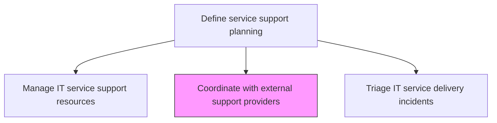
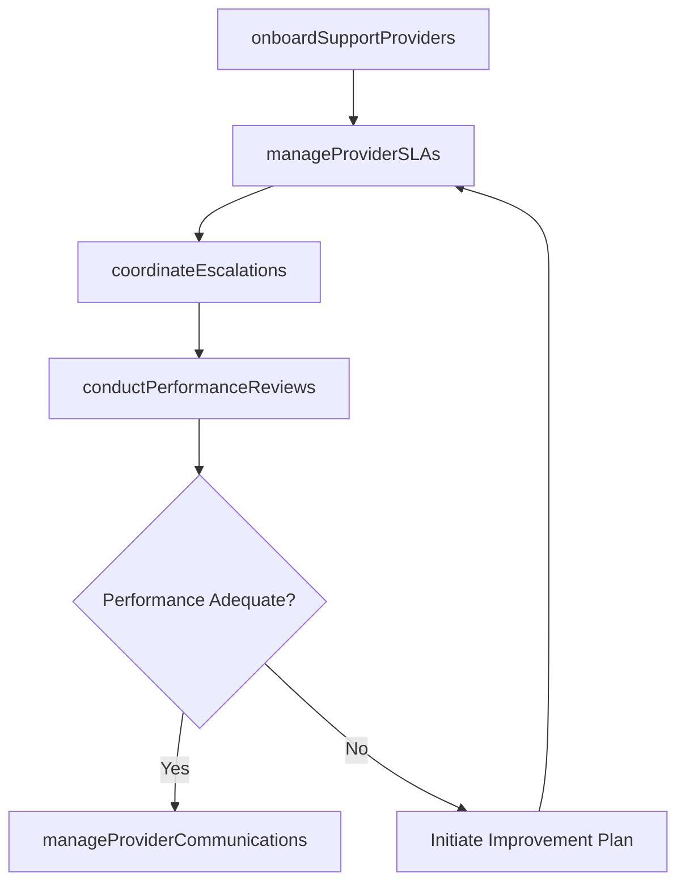

# Coordinate with external support providers

> Business-as-Code definition for coordinating with external IT support providers including managed service providers, vendor support teams, and third-party specialists to deliver integrated support services.

## Overview

Developing a strategy that will make use of multiple resources to coordinate with external support providers in order to make the support services work more smoother.

## Process Hierarchy



## GraphDL

```yaml
coordinate:
  object: With External Support Providers
  actor: ExternalProviderCoordinator
  result: ProviderCoordinationRecord
```

## Actions

| Action | Description |
|--------|-------------|
| onboardSupportProviders | Integrate external providers into support workflows with access, tools, and procedures |
| manageProviderSLAs | Monitor external provider performance against contracted service level agreements |
| coordinateEscalations | Route escalated issues to appropriate external providers and track resolution |
| conductPerformanceReviews | Perform regular reviews of provider performance and relationship health |
| manageProviderCommunications | Maintain regular communication channels with external support teams |

## Events

| Event | Description |
|-------|-------------|
| supportProvidersOnboarded | External providers integrated into support workflows |
| providerSLAsManaged | Provider performance monitored against SLAs |
| escalationsCoordinated | Issues routed to providers and resolution tracked |
| performanceReviewsConducted | Regular provider performance reviews completed |
| providerCommunicationsManaged | Communication channels with providers maintained |

## Searches

| Search | Description |
|--------|-------------|
| getProviderPerformance | Retrieve external provider performance data against SLA targets |
| getProviderEscalations | List escalations to external providers with resolution status |
| getProviderContracts | Access active provider contracts with terms and expiration dates |

## Process Flow



## RACI Matrix

| Activity | Responsible | Accountable | Consulted | Informed |
|----------|-------------|-------------|-----------|----------|
| onboardSupportProviders | ExternalProviderCoordinator | VendorManager | SecurityTeam | ServiceDeskManager |
| manageProviderSLAs | ExternalProviderCoordinator | ServiceLevelManager | ProcurementTeam | ITServiceDirector |
| conductPerformanceReviews | ExternalProviderCoordinator | VendorManager | ServiceDeskDirector | CIO |

## Related Processes

| Process | Relationship |
|---------|-------------|
| 8.7.2.4 Develop IT support service sourcing strategy | Upstream - sourcing strategy determines provider relationships |
| 8.7.5.6 Define IT escalation mechanisms | Related - escalation paths include external provider routes |
| 8.7.5.7 Manage IT service support resources | Related - external providers supplement internal resources |

## Related Departments

| Department | Role |
|-----------|------|
| Vendor Management | Manages provider relationships and contract compliance |
| IT Service Management | Coordinates support activities with external providers |
| Procurement | Manages contracts and commercial terms with providers |

## Related Occupations

| Occupation | Involvement |
|-----------|-------------|
| External Provider Coordinator | Manages day-to-day coordination with support providers |
| Vendor Manager | Oversees provider relationships and performance reviews |
| Service Level Manager | Monitors provider SLA compliance |

## KPIs

| KPI | Description | Unit |
|-----|-------------|------|
| Provider SLA Compliance | Percentage of external providers meeting SLA targets | % |
| Escalation Resolution Time | Average time for external providers to resolve escalated issues | Hours |
| Provider Satisfaction Score | Internal team satisfaction with external provider performance | Score (1-5) |
| Contract Renewal Rate | Percentage of provider contracts renewed at term end | % |

## Usage

```typescript
import { coordinateWithExternalSupportProviders } from '@headlessly/coordinate-with-external-support-providers'

const providerCoord = coordinateWithExternalSupportProviders()

// Get provider performance
const performance = await providerCoord.getProviderPerformance({
  providerId: 'network-msp',
  metric: 'slaCompliance'
})

// Get escalations to providers
const escalations = await providerCoord.getProviderEscalations({
  providerId: 'network-msp',
  status: 'open'
})
```
