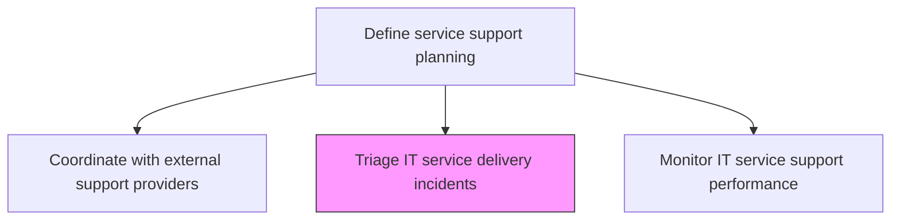
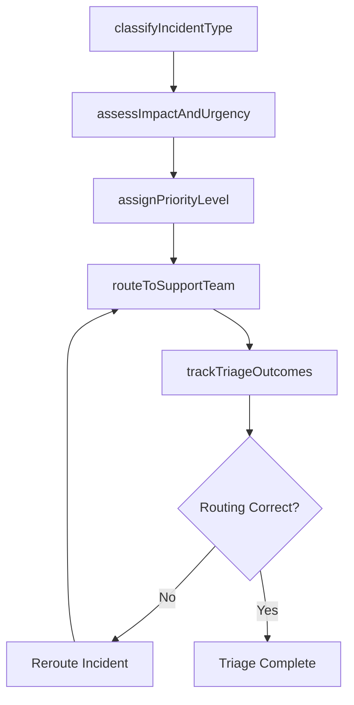

# Triage IT service delivery incidents

> Business-as-Code definition for triaging IT service delivery incidents by classifying, prioritizing, and routing them to appropriate support teams based on severity, impact, and urgency criteria.

## Overview

Sorting the incidents of IT service delivery in certain order so that the services could be delivered based on the criticality.

## Process Hierarchy



## GraphDL

```yaml
triage:
  object: IT Service Delivery Incidents
  actor: IncidentTriageAnalyst
  result: TriageDecisionRecord
```

## Actions

| Action | Description |
|--------|-------------|
| classifyIncidentType | Categorize incoming incidents by type, affected service, and technical domain |
| assessImpactAndUrgency | Evaluate business impact and urgency to determine incident priority level |
| assignPriorityLevel | Apply priority matrix to set resolution targets and resource allocation |
| routeToSupportTeam | Direct incidents to the appropriate support tier or specialist team |
| trackTriageOutcomes | Monitor triage accuracy and identify patterns for process improvement |

## Events

| Event | Description |
|-------|-------------|
| incidentTypeClassified | Incident categorized by type, service, and domain |
| impactAndUrgencyAssessed | Business impact and urgency evaluated |
| priorityLevelAssigned | Priority set based on impact-urgency matrix |
| incidentRoutedToTeam | Incident directed to appropriate support team |
| triageOutcomesTracked | Triage accuracy and patterns monitored |

## Searches

| Search | Description |
|--------|-------------|
| getTriageQueue | Retrieve incidents awaiting triage filtered by status, type, or source |
| getTriageMetrics | Access triage accuracy, speed, and routing metrics |
| getPriorityDistribution | Get distribution of incidents across priority levels |

## Process Flow



## RACI Matrix

| Activity | Responsible | Accountable | Consulted | Informed |
|----------|-------------|-------------|-----------|----------|
| classifyIncidentType | IncidentTriageAnalyst | ServiceDeskManager | ServiceDeskAgents | IncidentManager |
| assessImpactAndUrgency | IncidentTriageAnalyst | IncidentManager | BusinessLiaison | ServiceLevelManager |
| routeToSupportTeam | IncidentTriageAnalyst | ServiceDeskManager | TierLeads | SpecialistTeamLeads |

## Related Processes

| Process | Relationship |
|---------|-------------|
| 8.7.5.6 Define IT escalation mechanisms | Upstream - escalation mechanisms guide triage routing decisions |
| 8.7.8.1 Triage IT issues/requests | Related - user support triage follows similar patterns |
| 8.7.6.5 Respond to unplanned operational issues | Downstream - triaged incidents trigger operational response |

## Related Departments

| Department | Role |
|-----------|------|
| Service Desk | Performs initial incident triage and routing |
| Incident Management | Oversees triage quality and major incident classification |
| IT Operations | Receives triaged incidents for investigation and resolution |

## Related Occupations

| Occupation | Involvement |
|-----------|-------------|
| Incident Triage Analyst | Classifies, prioritizes, and routes incidents |
| Incident Manager | Oversees triage process and handles major incidents |
| Service Desk Agent | Performs initial triage on incoming contacts |

## KPIs

| KPI | Description | Unit |
|-----|-------------|------|
| Triage Accuracy Rate | Percentage of incidents correctly routed on first attempt | % |
| Average Triage Time | Mean time from incident receipt to triage completion | Minutes |
| Priority Accuracy | Percentage of incidents with correct priority assignment | % |
| Reroute Rate | Percentage of triaged incidents requiring rerouting | % |

## Usage

```typescript
import { triageItServiceDeliveryIncidents } from '@headlessly/triage-it-service-delivery-incidents'

const triage = triageItServiceDeliveryIncidents()

// Get triage queue
const queue = await triage.getTriageQueue({
  status: 'awaiting-triage',
  source: 'monitoring-alert'
})

// Get triage metrics
const metrics = await triage.getTriageMetrics({
  period: 'last-7-days',
  metric: 'accuracy'
})
```
