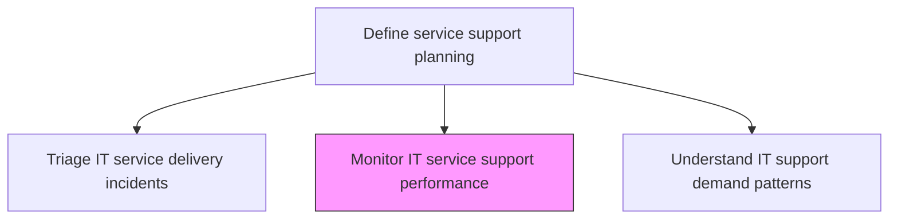
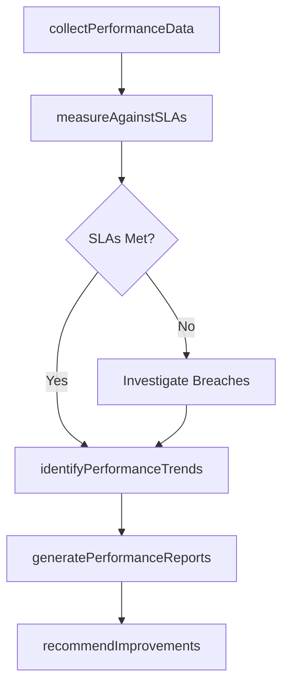

# Monitor IT service support performance

> Business-as-Code definition for monitoring IT service support performance against service level targets, tracking key performance indicators, and identifying trends that inform support improvement initiatives.

## Overview

Defining methodology and frequency of assessment for measuring and monitoring performance of various processes and activities of IT service support against standard set goals.

## Process Hierarchy



## GraphDL

```yaml
monitor:
  object: IT Service Support Performance
  actor: SupportPerformanceAnalyst
  result: PerformanceMonitoringReport
```

## Actions

| Action | Description |
|--------|-------------|
| collectPerformanceData | Gather resolution times, satisfaction scores, and SLA compliance data from support tools |
| measureAgainstSLAs | Compare actual support performance against defined service level targets |
| identifyPerformanceTrends | Analyze trends in support metrics to detect improvements or degradation |
| generatePerformanceReports | Produce dashboards and reports for management and stakeholders |
| recommendImprovements | Propose targeted improvements based on performance analysis findings |

## Events

| Event | Description |
|-------|-------------|
| performanceDataCollected | Resolution times, satisfaction scores, and SLA data gathered |
| performanceMeasuredAgainstSLAs | Actual performance compared to service level targets |
| performanceTrendsIdentified | Improvement or degradation trends detected |
| performanceReportsGenerated | Dashboards and reports produced for stakeholders |
| improvementsRecommended | Targeted improvement proposals developed |

## Searches

| Search | Description |
|--------|-------------|
| getPerformanceDashboard | Retrieve real-time performance dashboard with SLA compliance status |
| getPerformanceTrends | Access performance trend data over specified time periods |
| getSLABreaches | List SLA breaches filtered by service, period, or severity |

## Process Flow



## RACI Matrix

| Activity | Responsible | Accountable | Consulted | Informed |
|----------|-------------|-------------|-----------|----------|
| collectPerformanceData | SupportPerformanceAnalyst | ServiceDeskManager | ITToolsAdmin | DataAnalyticsTeam |
| measureAgainstSLAs | SupportPerformanceAnalyst | ServiceLevelManager | ServiceDeskDirector | BusinessUnitLeads |
| generatePerformanceReports | SupportPerformanceAnalyst | ITServiceDirector | CIO | AllStakeholders |

## Related Processes

| Process | Relationship |
|---------|-------------|
| 8.7.5.1 Understand IT support demand patterns | Related - performance data feeds demand analysis |
| 8.7.5.7 Manage IT service support resources | Related - performance trends inform resource adjustments |
| 8.7.2.1 Assess business objectives and IT service support delivery | Upstream - objectives define performance targets |

## Related Departments

| Department | Role |
|-----------|------|
| IT Service Management | Monitors performance and produces reports |
| Service Level Management | Defines targets and investigates SLA breaches |
| IT Analytics | Provides data analysis and trend identification |

## Related Occupations

| Occupation | Involvement |
|-----------|-------------|
| Support Performance Analyst | Collects data, measures performance, and produces reports |
| Service Level Manager | Defines SLA targets and manages breach investigations |
| Data Analyst | Performs statistical analysis of performance trends |

## KPIs

| KPI | Description | Unit |
|-----|-------------|------|
| Overall SLA Compliance | Percentage of services meeting all SLA targets | % |
| First Contact Resolution Rate | Percentage of incidents resolved at first contact | % |
| Mean Time to Resolve | Average time from incident creation to resolution | Hours |
| Customer Satisfaction Score | Average satisfaction rating from post-resolution surveys | Score (1-5) |

## Usage

```typescript
import { monitorItServiceSupportPerformance } from '@headlessly/monitor-it-service-support-performance'

const perfMonitor = monitorItServiceSupportPerformance()

// Get performance dashboard
const dashboard = await perfMonitor.getPerformanceDashboard({
  service: 'all',
  period: 'current-month'
})

// Get SLA breaches
const breaches = await perfMonitor.getSLABreaches({
  service: 'email-support',
  severity: 'critical'
})
```
